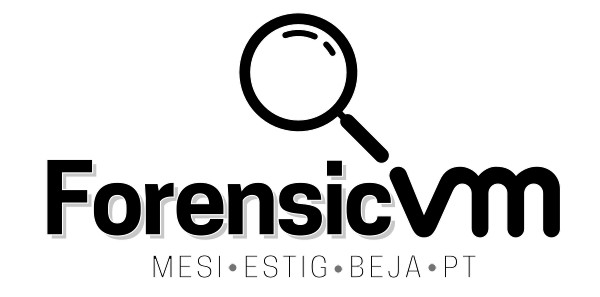

.. raw:: latex

   \coverpage

Welcome to ForensicVM documentation!
===================================
.. raw:: latex

   \FloatBarrier

   Forensic VM logo

.. raw:: latex

   \FloatBarrier

.. image:: https://zenodo.org/badge/675339901.svg
   :target: https://zenodo.org/badge/latestdoi/675339901

**ForensicVM** is a comprehensive project designed to assist forensic investigators in the virtualization of forensic images. By utilizing advanced technologies and tools, ForensicVM simplifies the process of analyzing and examining digital evidence in a virtualized environment.

The project consists of two essential components: the ForensicVM client, which is an Autopsy plugin, and the ForensicVM server. These components work seamlessly together to provide a powerful and efficient forensic virtualization solution.

The ForensicVM server, developed using Django and Python, serves as the backbone of the system. It is recommended to install the server on Debian 11, which in turn should be set up on a dedicated bare metal server. This configuration ensures optimal performance and stability for your forensic investigations.

Please note that installing the ForensicVM server on a hypervisor is not recommended. The ForensicVM server itself acts as the hypervisor, and running it within a nested setup may result in unpredictable behavior and performance issues. To maintain the integrity and reliability of your forensic analysis, it is advised to adhere to the recommended server installation setup.

To get started with ForensicVM, your first step is to install the server. For detailed instructions, please refer to the :ref:`installation` section, where you will find step-by-step guidance on setting up the server environment correctly.

Once the server is up and running, you can explore the various capabilities and features of ForensicVM by diving into the :doc:`usage` section. This section provides comprehensive information on how to make the most out of the project, including tips, best practices, and real-world scenarios.

Additionally, if you require a deeper understanding of the technical aspects and functionalities of ForensicVM, the :doc:`api` section is available. It offers an in-depth exploration of the project's application programming interface, empowering advanced users to leverage the full potential of the platform.

I would like to emphasize that ForensicVM is an actively developed project. I'm continuously working on enhancing its capabilities, improving performance, and adding new features. Stay tuned for updates and exciting developments as I strive to deliver the most effective and reliable forensic virtualization solution available.

Thank you for choosing ForensicVM. I am confident that it will greatly streamline your forensic investigations and contribute to the success of your work.
The first step is to install the server. Head to :ref:`installation`

Check out the :doc:`usage` section for further information, including how to :ref:`installation` the project.

.. image:: https://zenodo.org/badge/675339901.svg
   :target: https://zenodo.org/badge/latestdoi/675339901

.. toctree::
   :maxdepth: 3
   :caption: ForensicVM Plugin Manual

   Introduction <user/introduction>
   Citation Guidelines <user/citation>
   System Requirements <user/system_requirements>    
   Installation and Setup <user/installation_and_setup>
   Getting Started <user/getting_started>
   Product Overview <user/product_overview/product_overview>     
   Using ForensicVM <user/using_forensicvm>
   Troubleshooting Guide <troubleshooting>
   Glossary <glossary>
   List of Figures <figures>

