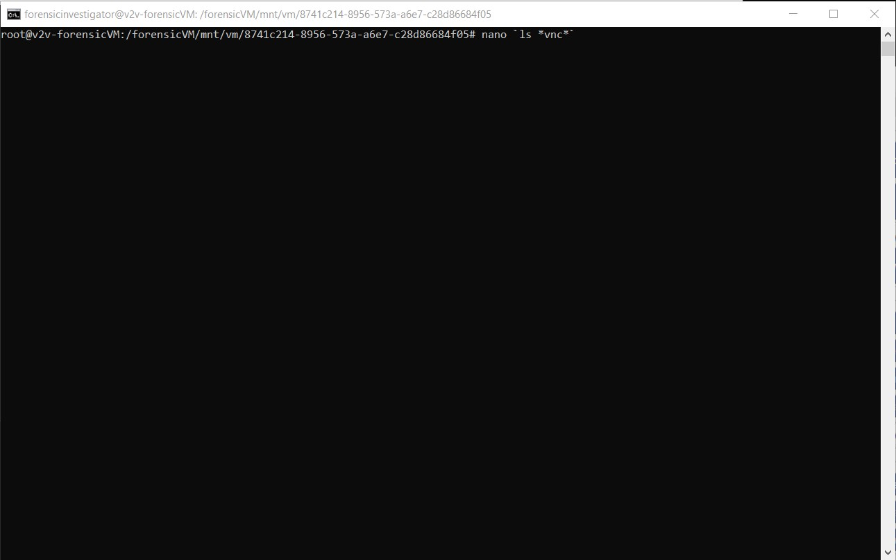
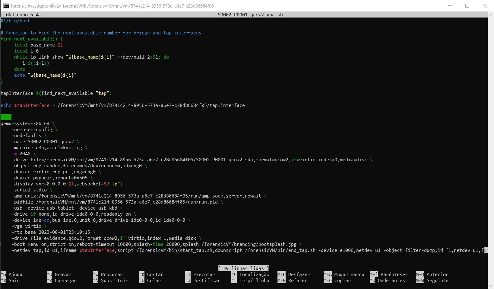

Troubleshooting
===============

Booting without signed drivers
------------------------------

If your machine cannot boot due to the virtio drivers installed during the automatic driver installation in the virtualization phase being unsigned or having an invalid signature for your operating system, the machine may enter a recovery boot loop. To address this issue, follow these steps:

- **1. Advanced options in the Automatic Repair boot screen**:
  Press the "Advanced options" button.

  .. raw:: latex

     \FloatBarrier

  .. figure:: user/img/troubleshoot_0001.jpg
     :name: advanced-options
     :alt: Advanced options in the Automatic Repair boot screen
     :width: 600

     Advanced options in the Automatic Repair boot screen

  .. raw:: latex

     \FloatBarrier

- **2. Troubleshoot**:
  Select the "Troubleshoot" option.

  .. raw:: latex

     \FloatBarrier

  .. figure:: user/img/troubleshoot_0002.jpg
     :name: troubleshoot
     :alt: Troubleshoot option
     :width: 300

     Troubleshoot option

  .. raw:: latex

     \FloatBarrier

- **3. Advanced options**:
  Choose the "Advanced options".

  .. raw:: latex

     \FloatBarrier

  .. figure:: user/img/troubleshoot_0003.jpg
     :name: advanced-options-selection
     :alt: Choosing Advanced options
     :width: 300

     Choosing Advanced options

  .. raw:: latex

     \FloatBarrier

- **4. Startup Settings**:
  Within the Advanced options, select the "Startup Settings" to change Windows startup behavior.

  .. raw:: latex

     \FloatBarrier

  .. figure:: user/img/troubleshoot_0004.jpg
     :name: startup-settings
     :alt: Startup Settings option
     :width: 500

     Startup Settings option

  .. raw:: latex

     \FloatBarrier

- **5. Restart**:
  Press the "Restart" button and await the system restart.

  .. raw:: latex

     \FloatBarrier

  .. figure:: user/img/troubleshoot_0005.jpg
     :name: restart-option
     :alt: Restart option
     :width: 500

     Restart option

  .. raw:: latex

     \FloatBarrier

- **6. Press F7**:
  Once the system restarts, press the **F7** key to choose "Disable driver signature enforcement".

  .. raw:: latex

     \FloatBarrier

  .. figure:: user/img/troubleshoot_0006.jpg
     :name: disable-driver-signature-enforcement
     :alt: Pressing F7 for Disable driver signature enforcement
     :width: 300

     Pressing F7 for Disable driver signature enforcement

  .. raw:: latex

     \FloatBarrier

- **7. Windows normal boot**:
  Your Windows should now boot normally.

  .. raw:: latex

     \FloatBarrier

  .. figure:: user/img/troubleshoot_0007.jpg
     :name: windows-normal-boot
     :alt: Windows booting normally
     :width: 600

     Windows booting normally

  .. raw:: latex

     \FloatBarrier

.. note::

   This behavior has been observed in older Windows versions, such as Windows 8.1. Mismatches or odd dates in the driver certificate can lead to this issue.
 
DEBUG: Remote ssh to folder
------------------------------

If you encounter issues with the forensicVM, you might need to directly edit its configuration files or control its state (start/stop). Below is a step-by-step guide on how to perform these actions:

1. In the Autopsy ForensicVM Client Plugin, select **DEBUG: Remote ssh to folder**.

   .. raw:: latex

      \FloatBarrier

   .. figure:: user/img/troubleshoot_0008.jpg
      :name: debug_remote_ssh
      :alt: DEBUG: Remote ssh to folder option in the Autopsy ForensicVM Client Plugin.
      :width: 600

      DEBUG: Remote ssh to folder option in the Autopsy ForensicVM Client Plugin.

   .. raw:: latex

      \FloatBarrier

2. Elevate to root permissions. Enter the `su` command and provide the root password when prompted.

   .. raw:: latex

      \FloatBarrier

   .. figure:: user/img/troubleshoot_0009.jpg
      :name: su_command
      :alt: Elevating to root using the su command.
      :width: 600

      Elevating to root using the su command.

   .. raw:: latex

      \FloatBarrier

3. Input the following command to edit the configuration file associated with the forensicVM: 

.. code-block:: bash

   nano `ls *vnc*`

.. raw:: latex

   \FloatBarrier

   Editing the forensicVM configuration file with nano.

.. raw:: latex

   \FloatBarrier

4. Inside the editor, modify the configuration file as needed. Adjust the relevant parameters to your requirements.

.. raw:: latex

   \FloatBarrier

   The configuration file open in nano for editing.

.. raw:: latex

   \FloatBarrier

5. Once done, exit the remote shell. Now, you can start the forensicVM as you typically would.

.. note::

   It's essential to ensure that the configurations are correct to prevent any unexpected behaviors.

.. tip::

For advanced techniques and in-depth configurations for the forensicVM, consider referring to the official QEMU documentation: `QEMU Documentation <https://qemu.readthedocs.io/en/latest/index.html>`_.
