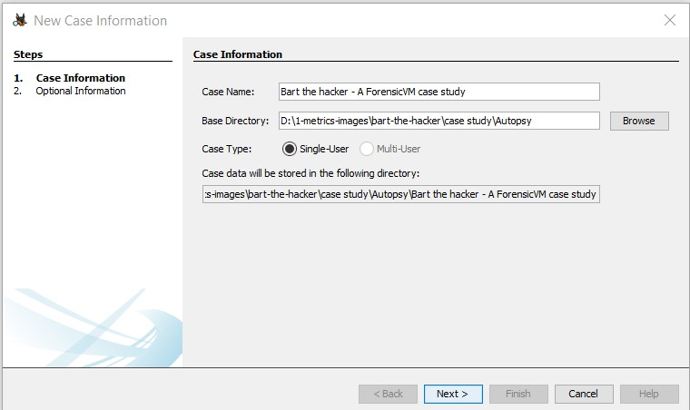
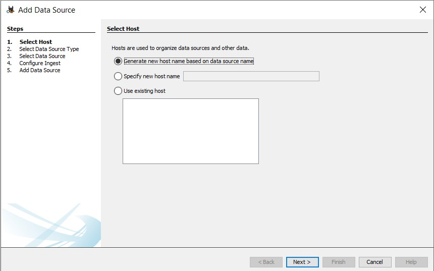
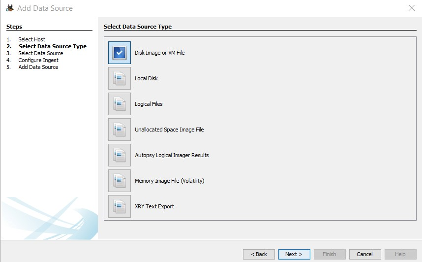
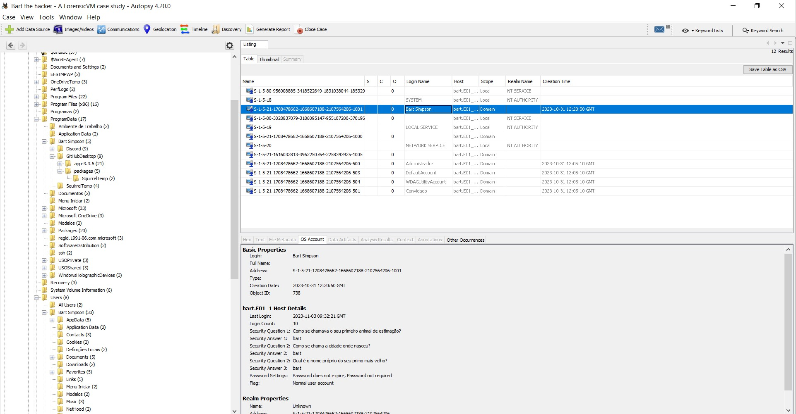
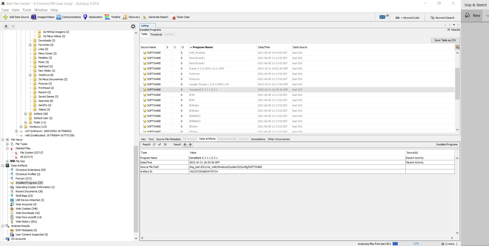

ForensicVM Case Study - Bart the hacker
=======================================

.. _case_study:

Challenge Description
---------------------
This appendix details the ForensicVM Case Study and Challenge, which is designed to highlight the differences between the evidence collected by dead-box forensics and live-forensics in a virtualized environment. The data set was created with VirtualBox and features a Windows 11 Pro environment equipped with various local and cloud applications. The image was captured using the FTK Imager in Expert Witness Format (EWF).

- Virtualisation is required to extract vital evidence.
- Bypassing the 'Bart' password is necessary to access the applications.
- Existing passwords within the data set must remain unchanged to maintain the integrity of the challenge.
- The Bart windows password is simple, but the challenge encourages ethical hacking skills to bypass or decrypt it.

Steps to Solve the Challenge
----------------------------
The following steps provide a structured approach to tackle the ForensicVM challenge:

#. Utilise dead box forensics techniques in autopsy software to attempt full data retrieval from cloud applications and local applications. Document all findings.
#. Virtualize the forensic image using the autopsy ForensicVM plugin.
#. Attempt to identify and bypass the Bart password to gain access to the applications.
#. Run the ForensicVM
#. Without internet access, systematically extract information from each application cloud and local application. Document all findings.
#. Enable internet access and repeat the information extraction process, noting any differences.
#. Record any additional information obtained after establishing an Internet connection.
#. Identify and document information related to the two financial applications present in the environment.
#. Extract and analyse data related to cryptocurrency.
#. Create a comprehensive chain of custody for all investigative actions taken.
#. Conduct and document a memory dump and network traffic dump.
#. Capture all investigative actions via video and take screenshots for evidence support.

.. _further_information:

For further information, refer to the ForensicVM Autopsy Plugin User Manual available at:

`ForensicVM Autopsy Plugin User Manual <https://forensicvm-autopsy-plugin-user-manual.readthedocs.io/en/latest/>`_

The complete dataset can be accessed via the following links:

* `Google Drive Dataset <https://drive.google.com/drive/folders/1ecGvwAToAfSRmCDmtVesrEhP7uMFh2M6>`
* `Zenodo Dataset <https://zenodo.org/doi/10.5281/zenodo.10070981>`
* `NIST CFReDS Dataset <https://cfreds.nist.gov/all/NunoMourinho%2FEstigBeja/BartthehackerForensicVMshowcase2023>`

Challenge Solution
==================

Dead box forensics
------------------

The resolution of the digital forensic challenge began with the establishment of a new case within the forensic autopsy software. The initial phase involved the creation of a case as captured in Figure~\ref{fig:autopsy_001}.

.. _FloatBarrier:

.. figure:: apendices/img/autopsy_0001.jpg
   :width: 50%
   :align: center
   :alt: Creation of a New Case

   Creation of a New Case
   :label: fig:autopsy_001

Subsequently, the case details were entered as demonstrated in Figure~\ref{fig:autopsy_0002}, ensuring that all pertinent information was correctly documented.

   Entering Case Information
   :label: fig:autopsy_0002

Optional case information was also provided to provide additional context and metadata for the investigation, as shown in Figure~\ref{fig:autopsy_0003}.

.. figure:: apendices/img/autopsy_0003.jpg
   :width: 50%
   :align: center
   :alt: Providing Optional Case Information

   Providing Optional Case Information
   :label: fig:autopsy_0003

To facilitate analysis, host information was generated as shown in Figure~\ref{fig:autopsy_0004}, which helps align the investigative environment with the specifics of the case.

   Generating Host Information
   :label: fig:autopsy_0004

The subsequent step was to select the disk image or VM file that contained the forensic evidence, ensuring that the correct data source was incorporated into the investigation (Figure~\ref{fig:autopsy_0005}).

   Disk Image or VM File Selection
   :label: fig:autopsy_0005

The timezone configuration is critical for accurate timestamp analysis; therefore, the forensic image path was established and the timezone was adjusted to Europe/Lisbon as part of the configuration process (Figure~\ref{fig:autopsy_0006}).

.. figure:: apendices/img/autopsy_0006.jpg
   :width: 50%
   :align: center
   :alt: Configuring the Forensic Image Path and Timezone

   Configuring the Forensic Image Path and Timezone
   :label: fig:autopsy_0006

For initial data processing, ingest plugins were selected, specifically 'Recent Activity' and 'Picture Analyser', to extract relevant user activities and image-related evidence (Figure~\ref{fig:autopsy_0007}).

.. figure:: apendices/img/autopsy_0007.jpg
   :width: 50%
   :align: center
   :alt: Selection of Initial Ingest Plugins

   Selection of Initial Ingest Plugins
   :label: fig:autopsy_0007

The investigator then waited for the completion of the addition of the data source, monitoring the progress to ensure successful incorporation into the case (Figure~\ref{fig:autopsy_0008}).

.. figure:: apendices/img/autopsy_0008.jpg
   :width: 50%
   :align: center
   :alt: Monitoring Data Source Addition

   Monitoring Data Source Addition
   :label: fig:autopsy_0008

Upon successful addition of the data source, as confirmed by the software, the evidence was ready for a thorough examination (Figure~\ref{fig:autopsy_0009}).

.. figure:: apendices/img/autopsy_0009.jpg
   :width: 50%
   :align: center
   :alt: Confirmation of Data Source Addition

   Confirmation of Data Source Addition
   :label: fig:autopsy_0009

Exploration within the "Os accounts" section yielded security answers that were potential avenues for password bypass efforts, with all answers being "\textbf{bart}", which could provide a breakthrough in the case (Figure~\ref{fig:autopsy_0010}).

   OS Accounts and Security Answers
   :label: fig:autopsy_0010

In the process of forensic analysis, the discovery of the password '\textbf{Lisa@Springfield}' via the Autofill feature in the Autopsy Web form represents a pivotal development. This password is a critical piece of evidence for the case, as it could potentially grant access to restricted areas that may contain further information or clues. The uncovering of this password, as displayed in Figure~\ref{fig:autopsy_0011}, underscores the importance of thorough examination of digital artefacts which may hold vital information within a forensic investigation.

.. figure:: apendices/img/autopsy_0011.jpg
   :width: 50%
   :align: center
   :alt: Discovery of a Password via Web Form Autofill

   Discovery of a Password via Web Form Autofill
   :label: fig:autopsy_0011

Moreover, the identification of specific applications such as Eraser 6.2.0.2993, which is designed for secure file deletion, and HomeBank 5.7.1, a personal finance application, can offer valuable insights into the suspect's actions and intents. As depicted in Figure~\ref{fig:autopsy_0012}, the presence of these applications may suggest attempts to conceal activities or manage finances in a way that is pertinent to the investigation.

   Applications Identification
   :label: fig:autopsy_0012

