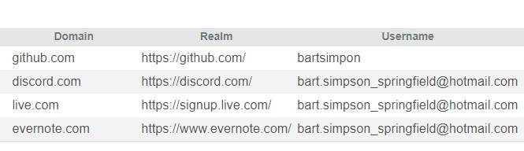
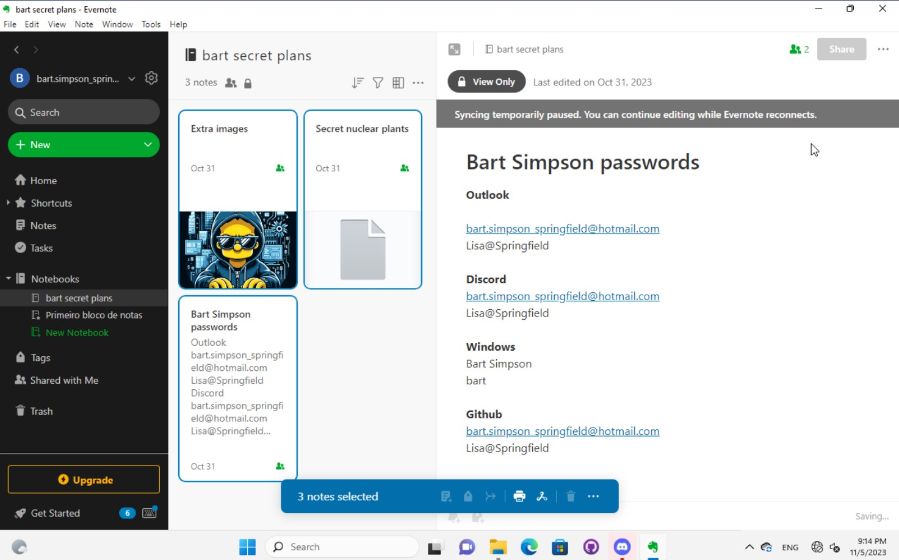
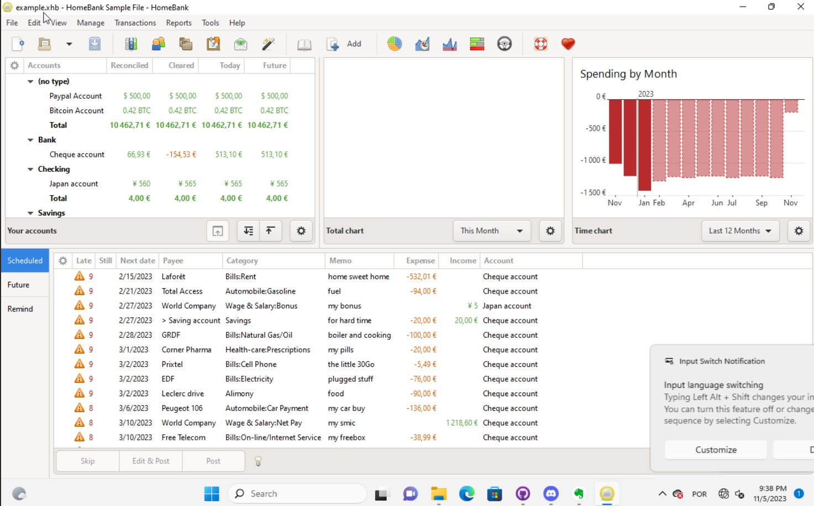

ForensicVM Case Study - Bart the hacker
=======================================

.. _case_study:

Challenge Description
---------------------
This appendix details the ForensicVM Case Study and Challenge, which is designed to highlight the differences between the evidence collected by dead-box forensics and live-forensics in a virtualized environment. The data set was created with VirtualBox and features a Windows 11 Pro environment equipped with various local and cloud applications. The image was captured using the FTK Imager in Expert Witness Format (EWF).

- Virtualisation is required to extract vital evidence.
- Bypassing the 'Bart' password is necessary to access the applications.
- Existing passwords within the data set must remain unchanged to maintain the integrity of the challenge.
- The Bart windows password is simple, but the challenge encourages ethical hacking skills to bypass or decrypt it.

Steps to Solve the Challenge
----------------------------
The following steps provide a structured approach to tackle the ForensicVM challenge:

#. Utilise dead box forensics techniques in autopsy software to attempt full data retrieval from cloud applications and local applications. Document all findings.
#. Virtualize the forensic image using the autopsy ForensicVM plugin.
#. Attempt to identify and bypass the Bart password to gain access to the applications.
#. Run the ForensicVM
#. Without internet access, systematically extract information from each application cloud and local application. Document all findings.
#. Enable internet access and repeat the information extraction process, noting any differences.
#. Record any additional information obtained after establishing an Internet connection.
#. Identify and document information related to the two financial applications present in the environment.
#. Extract and analyse data related to cryptocurrency.
#. Create a comprehensive chain of custody for all investigative actions taken.
#. Conduct and document a memory dump and network traffic dump.
#. Capture all investigative actions via video and take screenshots for evidence support.

.. _further_information:

For further information, refer to the ForensicVM Autopsy Plugin User Manual available at:

`ForensicVM Autopsy Plugin User Manual <https://forensicvm-autopsy-plugin-user-manual.readthedocs.io/en/latest/>`_

The complete dataset can be accessed via the following links:

* `Google Drive Dataset <https://drive.google.com/drive/folders/1ecGvwAToAfSRmCDmtVesrEhP7uMFh2M6>`_
* `Zenodo Dataset <https://zenodo.org/doi/10.5281/zenodo.10070981>`_
* `NIST CFReDS Dataset <https://cfreds.nist.gov/all/NunoMourinho%2FEstigBeja/BartthehackerForensicVMshowcase2023>`_

Challenge Solution
==================

Dead box forensics
------------------

The resolution of the digital forensic challenge began with the establishment of a new case within the forensic autopsy software. The initial phase involved the creation of a case as captured in Figure autopsy_001_.

.. _FloatBarrier:

.. _autopsy_001:

   Creation of a New Case   

Subsequently, the case details were entered as demonstrated in Figure :numref:`autopsy_002`, ensuring that all pertinent information was correctly documented.

.. _autopsy_002:
.. figure:: apendices/img/autopsy_0002.jpg
   :width: 50%
   :align: center
   :alt: Entering Case Information

   Entering Case Information
   :label: fig:autopsy_0002

Optional case information was also provided to provide additional context and metadata for the investigation, as shown in Figure \ref{fig:autopsy_0003}.

.. _autopsy_003:

   :label: fig:autopsy_0003

   Providing Optional Case Information

To facilitate analysis, host information was generated as shown in Figure~\ref{fig:autopsy_0004}, which helps align the investigative environment with the specifics of the case.

.. _autopsy_004:

.. figure:: apendices/img/autopsy_0004.jpg
   :width: 50%
   :align: center
   :alt: Generating Host Information

   Generating Host Information
   :label: fig:autopsy_0004

The subsequent step was to select the disk image or VM file that contained the forensic evidence, ensuring that the correct data source was incorporated into the investigation (Figure~\ref{fig:autopsy_0005}).

.. _autopsy_005:

.. figure:: apendices/img/autopsy_0005.jpg
   :width: 50%
   :align: center
   :alt: Disk Image or VM File Selection

   Disk Image or VM File Selection
   :label: fig:autopsy_0005

The timezone configuration is critical for accurate timestamp analysis; therefore, the forensic image path was established and the timezone was adjusted to Europe/Lisbon as part of the configuration process (Figure~\ref{fig:autopsy_0006}).

.. _autopsy_006:

   Configuring the Forensic Image Path and Timezone
   :label: fig:autopsy_0006

For initial data processing, ingest plugins were selected, specifically 'Recent Activity' and 'Picture Analyser', to extract relevant user activities and image-related evidence (Figure~\ref{fig:autopsy_0007}).

.. _autopsy_007:

   Selection of Initial Ingest Plugins
   :label: fig:autopsy_0007

The investigator then waited for the completion of the addition of the data source, monitoring the progress to ensure successful incorporation into the case (Figure~\ref{fig:autopsy_0008}).

.. _autopsy_008:

   Monitoring Data Source Addition
   :label: fig:autopsy_0008

Upon successful addition of the data source, as confirmed by the software, the evidence was ready for a thorough examination (Figure~\ref{fig:autopsy_0009}).

.. _autopsy_009:

   Confirmation of Data Source Addition
   :label: fig:autopsy_0009

Exploration within the "Os accounts" section yielded security answers that were potential avenues for password bypass efforts, with all answers being "\textbf{bart}", which could provide a breakthrough in the case (Figure~\ref{fig:autopsy_0010}).

.. _autopsy_010:

.. figure:: apendices/img/autopsy_0010.jpg
   :width: 50%
   :align: center
   :alt: OS Accounts and Security Answers

   OS Accounts and Security Answers
   :label: fig:autopsy_0010

In the process of forensic analysis, the discovery of the password '\textbf{Lisa@Springfield}' via the Autofill feature in the Autopsy Web form represents a pivotal development. This password is a critical piece of evidence for the case, as it could potentially grant access to restricted areas that may contain further information or clues. The uncovering of this password, as displayed in Figure~\ref{fig:autopsy_0011}, underscores the importance of thorough examination of digital artefacts which may hold vital information within a forensic investigation.

.. _autopsy_011:

   Discovery of a Password via Web Form Autofill
   :label: fig:autopsy_0011

Moreover, the identification of specific applications such as Eraser 6.2.0.2993, which is designed for secure file deletion, and HomeBank 5.7.1, a personal finance application, can offer valuable insights into the suspect's actions and intents. As depicted in Figure~\ref{fig:autopsy_0012}, the presence of these applications may suggest attempts to conceal activities or manage finances in a way that is pertinent to the investigation.

.. _autopsy_012:

.. figure:: apendices/img/autopsy_0012.jpg
   :width: 50%
   :align: center
   :alt: Applications Identification

   Applications Identification
   :label: fig:autopsy_0012

.. _FloatBarrier:

.. _autopsy_012:

.. figure:: apendices/img/autopsy_0012.jpg
   :width: 50%
   :align: center
   :alt: Applications of Interest Including Secure File Deletion and Personal Finance Management Tools

   Applications of Interest Including Secure File Deletion and Personal Finance Management Tools
   :label: fig:autopsy_0012

The further discovery of Money Manager Ex v.1.6.4, another financial management tool, as indicated in Figure~\ref{fig:autopsy_0013}, reinforces the financial angle of the user's activity profile. This could be integral to constructing a narrative regarding the suspect's financial dealings or motivations.

.. _autopsy_013:

   Additional Financial Application Money Manager Ex Indicating In-Depth Financial Activities
   :label: fig:autopsy_0013

Lastly, the opening of a financial database named example.xhb from the HomeBank files, as shown in Figure~\ref{fig:autopsy_0014}, further corroborates the financial dimension of the investigation. This particular file may contain transaction records, budgets, or other financial data which could be analysed to provide a clearer understanding of the suspect's financial behaviour or potential illicit activities.

.. _autopsy_014:

   Opened Financial Database example.xhb Revealing Recent User Activities with Financial Data
   :label: fig:autopsy_0014

The discovery of the example.xhb database in XML format, as depicted in Figure~\ref{fig:autopsy_0015}, adds a layer of complexity due to the proprietary structure of the file. This could imply that special attention must be paid to decipher the data structure to interpret the financial information contained within. The proprietary nature of the format might necessitate the use of specific tools or methods to extract and analyse the data accurately.

.. _autopsy_015:

   Proprietary XML Structure of the example.xhb Database
   :label: fig:autopsy_0015

The identification of cloud applications in the forensic investigation is critical as it may provide insight into data that is not stored locally on the device. The accounts discovered through the Autopsy software, including GitHub, live.com, discord.com, and evernote.com, extend the potential for finding evidence to the cloud. The presence of these services as shown in Figure~\ref{fig:autopsy_0016}, suggests a broad range of user activity, from software development and project management to personal communication and note-taking, which could be relevant to the case.

.. _autopsy_016:

   Overview of Cloud Applications Uncovered in Autopsy
   :label: fig:autopsy_0016

Tagging folders related to financial applications within Autopsy helps in organising evidence and highlights the importance of financial data in the investigation. As illustrated in Figure~\ref{fig:autopsy_0017}, tagging these folders ensures that relevant information is easily accessible and distinguishable from other unrelated data, facilitating a more efficient investigation process.

.. _autopsy_017:

.. figure:: apendices/img/autopsy_0017.jpg
   :width: 50%
   :align: center
   :alt: Tagging of Folders Pertaining to Financial Applications

   Tagging of Folders Pertaining to Financial Applications
   :label: fig:autopsy_0017

The creation of an Autopsy HTML report is a critical step for documenting the investigation, offering a comprehensive and accessible format for presenting the findings. The series of figures, from Figure~\ref{fig:autopsy_0018} to Figure~\ref{fig:autopsy_0022}, encapsulate various aspects of the report, from the general overview to specific details regarding data sources and tagged items.

.. _autopsy_018:

.. figure:: apendices/img/autopsy_0018.jpg
   :width: 50%
   :align: center
   :alt: Snapshot of the Autopsy HTML Report Interface

   Snapshot of the Autopsy HTML Report Interface
   :label: fig:autopsy_0018

.. _autopsy_019:

   Detailing the Data Source 'bart.E01' within the HTML Report
   :label: fig:autopsy_0019

.. _autopsy_020:

   Autopsy HTML Report Showing Tagged Items and Analysis Results
   :label: fig:autopsy_0020

.. _autopsy_021:

   Compilation of All Results in the Autopsy HTML Report
   :label: fig:autopsy_0021

.. _autopsy_022:

   Report Detailing Found Cloud Applications and Associated Usernames
   :label: fig:autopsy_0022

Local applications and those identified as relevant through tagging were systematically documented within the Autopsy report as well. This incorporation of tagged local and cloud applications allows for a more comprehensive review of the software environment of the system under investigation (Figure~\ref{fig:autopsy_0023}).

.. _FloatBarrier:

.. _autopsy_023:

   Tagged files depicting local and cloud applications within Autopsy
   :label: fig:autopsy_0023

Live forensic with ForensicVM - Phase 1: Network disabled
--------------------------------------------------------

The commencement of live forensics entails the virtualization of the forensic image, utilizing the capabilities of the ForensicVM server and client infrastructure.

The initial step involves initiating the ForensicVM client ingest module via Autopsy, as illustrated in Figure~\ref{fig:autopsy_0028}.

.. _autopsy_028:

   Run ingest modules: ForensicVM Client
   :label: fig:autopsy_0028

Subsequently, a comprehensive virtualization of the image was executed. Utilizing the command \textbf{Virtualize - a) Convert to VM}, a duplicate of the forensic image is created. This process entails altering the hardware abstraction layer by incorporating virtio optimized drivers, culminating in the creation of a ForensicVM, as depicted in Figure~\ref{fig:autopsy_0029}, Figure~\ref{fig:autopsy_0030}, and Figure~\ref{fig:autopsy_0031}.

.. _autopsy_029:

   ForensicVM client main form
   :label: fig:autopsy_0029

.. _autopsy_030:

   Forensic image to forensicVM Conversion progress
   :label: fig:autopsy_0030

.. _autopsy_031:

   ForensicVM First execution
   :label: fig:autopsy_0031

The recovery questions were noted to be identical (\textbf{bart}), prompting an attempt to use them as the password. This strategy proved effective due to the recovery questions being set identically to the password, as shown in Figure~\ref{fig:autopsy_0033}.

.. _autopsy_033:

   Password recovery utilizing identical security questions
   :label: fig:autopsy_0033

Access was successfully gained to the Bart desktop, which featured a wallpaper indicating potential malicious intent with the message "I will hack Springfield...," as seen in Figure~\ref{fig:autopsy_0034}.

.. _autopsy_034:

   Bart desktop with indicative wallpaper message
   :label: fig:autopsy_0034

The desktop was populated with numerous icons, one of which was for the Evernote cloud application. Activating this icon initiated Evernote, within which several recent notes were apparent: Extra images, Secret nuclear plants, Bart Simpson Passwords, and My pass, as illustrated in Figure~\ref{fig:autopsy_0035}.

.. _autopsy_035:

   Evernote application with recent notes
   :label: fig:autopsy_0035

In the forensic investigation within the Evernote application, a notebook titled \textbf{Bart secret plans} containing three notes was identified. The procedure to export these notes to the forensicVM evidence drive is crucial, as illustrated in Figure~\ref{fig:autopsy_0036}.

.. _autopsy_036:

   Evernote notebook 'Bart secret plans'
   :label: fig:autopsy_0036

To commence the note export process, the notes were first converted into PDF format as shown in Figure~\ref{fig:autopsy_0037}.

.. _autopsy_037:

   Exporting notes as PDF
   :label: fig:autopsy_0037

The notes were then methodically stored in a subfolder named Evernote, located within the Cloud\_applications tag in Autopsy. The \textbf{Bart secret plans} file was exported to this specific folder, detailed in Figure~\ref{fig:autopsy_0038}.

.. _autopsy_038:

   PDF export destination folder structure
   :label: fig:autopsy_0038

A verification step was conducted to ensure that the exported PDFs contained all potential evidence, as confirmed in Figure~\ref{fig:autopsy_0039}.

.. _autopsy_039:

   Verification of exported PDF content
   :label: fig:autopsy_0039

The export procedure was repeated for another notebook titled \textbf{Primeiro bloco de notas}, which was also moved to the Evernote folder on the evidence disk, as depicted in Figure~\ref{fig:autopsy_0040}.

.. _FloatBarrier:

.. _autopsy_040:

   Exporting 'Primeiro bloco de notas' from Evernote
   :label: fig:autopsy_0040

Investigation revealed that the **bart secret plans** notebook was shared by a user named **Nuno Mourinho**, which may indicate collaborative or shared use of the contents, as evidenced by Figures \ref{fig:autopsy_0041} and \ref{fig:autopsy_0042}.

.. _autopsy_041:

   Shared user detail for 'bart secret plans' notebook
   :label: fig:autopsy_0041

.. _autopsy_042:

   Notebook sharing information indicating 'Nuno Mourinho'
   :label: fig:autopsy_0042

Additionally, the Evernote trash was scrutinized, and it was confirmed that no notes had been deleted, as shown in Figure~\ref{fig:autopsy_0043}. The absence of deleted notes might suggest that the user did not attempt to remove evidence or considered the contents of the notes to be non-incriminating.

.. _autopsy_043:

   Checking Evernote trash for deleted notes
   :label: fig:autopsy_0043

The forensic analysis included the observation of software behavior in a controlled environment. The Discord application displayed a notification for an update, which could not be completed due to a lack of internet connectivity, leaving the application in a state of limbo as depicted in Figure~\ref{fig:autopsy_0044}.

.. _autopsy_044:

   Discord application unable to update without internet connection
   :label: fig:autopsy_0044

Subsequently, GitHub Desktop was launched, which is a graphical client interface for interacting with GitHub repositories. It attempted to locate a repository named hackSpringField, but without internet access, the search was unsuccessful, as demonstrated in Figure~\ref{fig:autopsy_0045}.

.. _autopsy_045:

   GitHub Desktop failing to find the 'hackSpringField' repository
   :label: fig:autopsy_0045

Due to the absence of an internet or local network connection, the content within the GitHub repository could not be retrieved or reviewed, which is an essential aspect to consider for future investigative steps. This scenario is highlighted in Figure~\ref{fig:autopsy_0046}.

.. _autopsy_046:

   Unreachable GitHub repository contents due to lack of network connectivity
   :label: fig:autopsy_0046

The investigation then moved to financial applications, with a specific focus on Homebank. An attempt to launch this application was made as indicated by the presence of its icon, and this is captured in Figure~\ref{fig:autopsy_0047}.

.. _autopsy_047:

   Locating the Homebank application
   :label: fig:autopsy_0047

Upon accessing Homebank, the last opened file named example.xhb was identified, suggesting a possible area of interest for the investigation. The examination of this file is depicted in Figure~\ref{fig:autopsy_0048}.

.. _autopsy_048:

   Opening the last accessed file in Homebank
   :label: fig:autopsy_0048

Within the example.xhb file, the existence of a Bitcoin account was noted. Even though the file bore the name 'example', it was considered worthy of detailed examination to discern any potential financial improprieties or to trace financial transactions, as shown in Figure~\ref{fig:autopsy_0049}.

.. _autopsy_049:

   Evidence of a Bitcoin account in the Homebank file 'example.xhb'
   :label: fig:autopsy_0049

So far, this analysis underscores the complexity of digital forensics, particularly when dealing with cloud-based services and financial software, where access to the content is often restricted without proper connectivity or credentials.

Upon uncovering Bitcoin-related transaction data within the Homebank application, steps were taken to document this information. The transactions were exported to a PDF file for ease of analysis and future reference, a process captured in Figures~\ref{fig:autopsy_0050} and \ref{fig:autopsy_0051}.

.. _autopsy_050:

   Exporting Bitcoin transaction data to PDF
   :label: fig:autopsy_0050

.. _autopsy_051:

   The process of printing transaction data to a PDF file
   :label: fig:autopsy_0051

.. _FloatBarrier:

The forensic examination then proceeded to another financial application, Money Manager Ex. Upon initiation, the application's dashboard revealed an account with the noteworthy title 'Springfield ransom', as displayed in Figure~\ref{fig:autopsy_0052}.

.. _autopsy_052:

   Dashboard of Money Manager Ex showing the 'Springfield ransom' account
   :label: fig:autopsy_0052

Within this application, two significant transactions were identified: a withdrawal of 222 million by a user named Homer, and a deposit of 100 million to a Mr. Burns. These transactions, detailed in Figure~\ref{fig:autopsy_0053}, could suggest a flow of funds that may be pertinent to the investigation.

.. _autopsy_053:

   Transactions in Money Manager Ex involving significant sums of money
   :label: fig:autopsy_0053

To collate the findings, a PDF document was created and stored on an evidence drive, ensuring the preservation of the data uncovered during the investigation. This step is illustrated in Figures~\ref{fig:autopsy_0055} and \ref{fig:autopsy_0056}.

.. _autopsy_055:

.. figure:: apendices/img/autopsy_0055.jpg
   :width: 50%
   :align: center
   :alt: Compiling findings into a PDF document

   Compiling findings into a PDF document
   :label: fig:autopsy_0055

.. _autopsy_056:

   Saving the PDF document to the evidence drive
   :label: fig:autopsy_0056

Finally, verification was carried out to ensure that the PDF created indeed contained the exported transaction data, as can be affirmed by Figure~\ref{fig:autopsy_0057}.

.. _autopsy_057:

.. figure:: apendices/img/autopsy_0057.jpg
   :width: 50%
   :align: center
   :alt: Confirmation of the exported transaction data within the PDF document

   Confirmation of the exported transaction data within the PDF document
   :label: fig:autopsy_0057

Live forensic with ForensicVM - Phase 2: Network enabled
--------------------------------------------------------

In the continuation of the live forensic analysis using ForensicVM, the investigation progressed to include cloud-based evidence following the activation of the network interface. This crucial step is depicted in Figure~\ref{fig:autopsy_0058}.

.. _autopsy_058:

   Enabling the network interface on the ForensicVM webscreen
   :label: fig:autopsy_0058

One of the primary cloud applications scrutinised was GitHub Desktop. This application was of particular interest as it may contain repositories that could provide evidence of illicit activity if the computer in question belonged to a potential hacker. The repository named **hackSpringField** was cloned as an initial step, a process illustrated in Figure~\ref{fig:autopsy_0059}.

.. _autopsy_059:

   Cloning the deleted repository 'hackSpringField' using GitHub Desktop
   :label: fig:autopsy_0059

Within the cloned repository, a README file disclosed Bart's likely malicious intent, containing the message "I will hack Springfield Buhahahahahaha!", as seen in Figure~\ref{fig:autopsy_0060}.

.. _autopsy_060:

   The README file within the 'hackSpringField' repository indicating potential malevolent intentions
   :label: fig:autopsy_0060

The exploration of Bart's GitHub repositories revealed several with names that suggest they could be tools for malicious purposes:

- RATreeViewSpringField
- StichRATSpringfield
- TheFatRatSpringField
- awesome-ratSpringField
- basicRATSpringField

These repositories were cloned as part of the investigatory process, as documented in Figures~\ref{fig:autopsy_0061}, \ref{fig:autopsy_0062}, and \ref{fig:autopsy_0063}.

.. _autopsy_061:

   Cloning of repositories suspected to be associated with malicious activities
   :label: fig:autopsy_0061

.. _autopsy_062:

   Acquiring repository content for further forensic analysis
   :label: fig:autopsy_0062

.. _autopsy_063:

   Documentation of the cloned repositories from the suspected hacker's GitHub account
   :label: fig:autopsy_0063

Subsequently, the cloned repositories were transferred to a specifically labelled folder 'Github-Internet On' within the cloud\_applications autopsy tag folder, with the process captured in Figures~\ref{fig:autopsy_0064}, \ref{fig:autopsy_0065}, and \ref{fig:autopsy_0066}.

.. _autopsy_064:

.. figure:: apendices/img/autopsy_0064.jpg
   :width: 50%
   :align: center
   :alt: Copying cloned repositories to the designated forensic analysis folder

   Copying cloned repositories to the designated forensic analysis folder
   :label: fig:autopsy_0064

.. _autopsy_065:

.. figure:: apendices/img/autopsy_0065.jpg
   :width: 50%
   :align: center
   :alt: Organising the collected repositories in the 'Github-Internet On' folder for detailed examination

   Organising the collected repositories in the 'Github-Internet On' folder for detailed examination
   :label: fig:autopsy_0065

.. _FloatBarrier:

The shared notebook named **bart secret plans** now has 14 notes, an increase of 11 notes from when the system was examined in offline mode. This surge in content could indicate active use or automated synchronization once the network was enabled. Among these notes, several are titled with 'Command and Control (C2C)', each followed by a sequence number, which suggests a structured approach to potentially illicit command sequences. Furthermore, the presence of Evernote Cloud API python guide notes could imply an intention to leverage Evernote as a platform for issuing commands to compromised systems or for managing a network of controlled devices. An illustrative note contains the command *sdelete -z c:*, which is known to overwrite free space on a drive with zeros, typically a method to prevent data recovery -- a concerning find, possibly indicative of attempts to obfuscate or destroy evidence. This detail is depicted in Figure~\ref{fig:autopsy_0066}.

.. _autopsy_066:

   Screenshot illustrating the use of 'sdelete' command within a note from the 'bart secret plans' notebook
   :label: fig:autopsy_0066

In a detailed examination, all notes from the **bart secret plans** notebook were exported as multiple webpages to be preserved as evidence, as shown in Figures~\ref{fig:autopsy_0067} and \ref{fig:autopsy_0068}.

.. _autopsy_067:

   Exporting the contents of 'bart secret plans' to webpages, part 1
   :label: fig:autopsy_0067

.. _autopsy_068:

.. figure:: apendices/img/autopsy_0068.jpg
   :width: 50%
   :align: center
   :alt: Exporting the contents of 'bart secret plans' to webpages, part 2

   Exporting the contents of 'bart secret plans' to webpages, part 2
   :label: fig:autopsy_0068

Similarly, the *Primeiro bloco de notas* (First Notebook) was exported, revealing an additional note not previously visible in offline mode. The findings are presented in Figure~\ref{fig:autopsy_0069}.

.. _autopsy_069:

.. figure:: apendices/img/autopsy_0069.jpg
   :width: 50%
   :align: center
   :alt: The export process of the 'Primeiro bloco de notas' indicating the presence of an additional note

   The export process of the 'Primeiro bloco de notas' indicating the presence of an additional note
   :label: fig:autopsy_0069

Upon inspecting the Discord application, which was set to the Portuguese language, we accessed the user bart.simpson's server. The server's activity log, accessed via the bart.simpson\_springfield login, can be observed in Figure~\ref{fig:autopsy_0070}.

.. _autopsy_070:

   Accessing Discord server with bart.simpson\_springfield user credentials
   :label: fig:autopsy_0070

Further investigation within the server revealed a channel named 'Servidor de bart.simpson' (bart.simpson's server), which contained an announcement seemingly related to the sale of data on the dark web, as captured in Figure~\ref{fig:autopsy_0072} after opening the server shown in Figure~\ref{fig:autopsy_0071}.

.. _autopsy_071:

   The Discord server 'Servidor de bart.simpson' accessed for investigation
   :label: fig:autopsy_0071

.. _autopsy_072:

   Announcement on 'Servidor de bart.simpson' revealing intentions to sell data on the dark web
   :label: fig:autopsy_0072

Within the Discord channel named cyber-security-bypass, the user 'bart' claimed to have *ex-filtrated data from the Springfield Nuclear Plant*. Evidence of such a breach was showcased in an Excel format, which was presented as a sample of the exfiltrated data. Additionally, 'bart' stipulated a ransom demand of 1000 dollars for the recovery of the data, directing the payment to be made to a specified Bitcoin wallet. This incriminating interaction, including the digital ransom note and the proof of the stolen data, is captured in Figure~\ref{fig:autopsy_0073}.

.. _autopsy_073:

.. figure:: apendices/img/autopsy_0073.jpg
   :width: 50%
   :align: center
   :alt: Screenshot displaying the ransom demand and sample of exfiltrated data from Springfield Nuclear Plant on Discord

   Screenshot displaying the ransom demand and sample of exfiltrated data from Springfield Nuclear Plant on Discord
   :label: fig:autopsy_0073

Subsequent to the discovery of the Discord communication, efforts were made to download the chain of custody report utilizing the ForensicVM webscreen interface. This procedure is critical for maintaining the integrity of the digital evidence and ensuring that all investigative actions are properly documented. The process of downloading this report is depicted in Figures~\ref{fig:autopsy_0074} and \ref{fig:autopsy_0075}.

.. _autopsy_074:

   Downloading the chain of custody report via the ForensicVM webscreen interface, part 1
   :label: fig:autopsy_0074

.. _autopsy_075:

   Downloading the chain of custody report via the ForensicVM webscreen interface, part 2
   :label: fig:autopsy_0075

The next phase in the investigative process involves exporting the ForensicVM evidence disk in the virtual machine disk (VMDK) format. This step is necessary to facilitate the importation of the disk into the Autopsy analysis tool for a comprehensive examination. The sequence of actions taken to halt the ForensicVM, followed by the initiation of the 'Import Evidence Disk' process, is sequentially illustrated in Figures~\ref{fig:autopsy_0076} through \ref{fig:autopsy_0079}.

.. _autopsy_076:

   Initiating the export of ForensicVM evidence disk from the Autopsy Forensic Client main interface
   :label: fig:autopsy_0076

.. _autopsy_077:

   Stopping the ForensicVM in preparation for exporting the evidence disk
   :label: fig:autopsy_0077

.. _autopsy_078:

   Selection of the 'Import Evidence Disk' option in the Autopsy Forensic Client
   :label: fig:autopsy_0078

.. _autopsy_079:

   Finalization of the ForensicVM evidence disk export in VMDK format.

.. |FloatBarrier| raw:: html

   

In the final step of the digital forensic analysis, a new data source was added to the Autopsy forensic software. This new data source was the VMDK disk which contained the evidence that had been previously gathered from ForensicVM. This action is paramount for enabling a detailed examination and analysis within the Autopsy environment. The step-by-step process of adding this new evidence source is captured in Figures :ref:`fig-autopsy_0080` through :ref:`fig-autopsy_0085`.

.. |FloatBarrier| raw:: html

   

.. _autopsy_080:

   Initiating the addition of a new data source in Autopsy.

.. autopsy_0081:

   Selecting the evidence disk for the new data source.

.. autopsy_0082:

   Confirming the selection of the VMDK disk file.

.. autopsy_0083:

   Setting up the data source parameters in Autopsy.

.. autopsy_0084:

   Progression of the data source addition process.

.. autopsy_0085:

   Completion of the new data source addition in Autopsy.

.. |FloatBarrier| raw:: html

   

Post-importation of the meticulously crafted evidence disk into Autopsy, the investigation is poised to enter a detailed examination phase. The evidence disk, structured with folders mirroring the tags utilized within Autopsy, allows for an organized and efficient review process. The subsequent investigative steps will leverage the logical structure and tagging system to ensure a comprehensive analysis of the data.

The primary step involves the cataloging and verification of the imported data against the original evidence tags. This ensures that the transfer has been successful and that the integrity of the data has been maintained during the process. The alignment of folders with Autopsy tags streamlines the verification process, allowing investigators to swiftly confirm the presence and accuracy of all tagged items.

Following this, a thorough content analysis within each tagged folder will be undertaken. Since these folders are organized based on the categorization relevant to the investigation, the analysis can be targeted and specific. Investigators will parse through each category, looking for suspicious patterns or incriminating evidence that correlates with the activities under investigation.

Subsequently, cross-referencing the extracted evidence with the case timeline will be imperative. The analysis will involve correlating timestamps of file creation, modification, and deletion with the case events. Such a timeline analysis can often unearth critical insights into the suspect's behavior and modus operandi.

The investigation will also include a thorough review of any executable files and scripts that were used or potentially created as part of the suspect's activities. The scripts found in the 'C2C' (Command and Control) folders, for example, will be scrutinized to understand the nature of the commands issued, their targets, and the extent of control exerted over compromised systems.

A meticulous examination of communication logs and metadata is also essential. This includes not only traditional system logs but also any extracted communication from applications such as Discord, as indicated by the presence of specific tags and folders. Insights gleaned from these sources can be invaluable in establishing the suspect's network of contacts and the breadth of the cyber-security breach.

In addition, a deep-dive analysis into the files marked for deletion or those found within the unallocated space of the file system will be conducted. Using file carving techniques, investigators aim to recover and reconstruct such files, as they may hold critical evidence that the suspect attempted to obscure or erase.

Finally, the entire investigation will be supported by a robust documentation process. Each step, discovery, and piece of evidence will be recorded with exacting detail. This ensures that the chain of custody is preserved and that all the investigative actions can withstand the rigorous scrutiny of legal proceedings.

