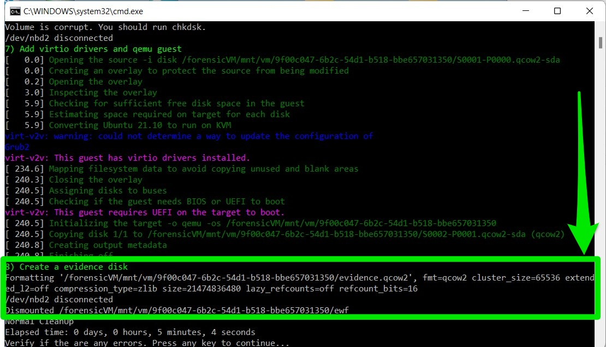

Gather Evidence Using the Evidence Disk
=======================================

The evidence disk is an automatically generated drive that materializes during the conversion of a forensic image to a ForensicVM. This utility drive is populated with directories that carry the same names as the Autopsy tags. These directories serve as designated containers, wherein the forensic investigator is expected to compile and organize evidence relevant to each tag. If ever the need arises, the investigator has the option to reset the evidence disk to its initial state. However, such an action should be approached with caution, as it would entail the deletion of all previously gathered evidence.

In the event that new tags are introduced in Autopsy, corresponding folders for these tags will be fashioned once the plugin is restarted.

.. tip::
   In order to fabricate any missing tag directories, it's essential to first halt the ForensicVM's operations. It's advised to shut down the ForensicVM, subsequently close the plugin, and then reopen it via the Autopsy ForensicVM Client Plugin. This procedure ensures that the environment is refreshed and ready to incorporate new changes.

Evidence Disk Creation
-----------------------

The creation of the evidence disk is an automated process. When you transition a forensic image into a ForensicVM, regardless of whether the method employed is virtualization copy or linking to the forensic image, the evidence disk is fashioned during the final phase of this procedure.

   Screenshot depicting the final phase of the ForensicVM conversion, showcasing the creation of the evidence disk.

Collecting Evidence: A Step-by-Step Guide
------------------------------------------

Collecting digital evidence is a meticulous process, demanding precision, patience, and an understanding of the system you are investigating. When using the ForensicVM, this process is facilitated, yet there are still specific steps to follow. Here's a comprehensive guide on how to go about it:

1. **Initiation of the ForensicVM**:

   Before you can begin your evidence collection, ensure that the ForensicVM is up and running. Start the virtual machine and patiently wait for it to boot up completely.

2. **Logging In**:

   Once the ForensicVM has completely loaded, proceed to log in using the credentials provided or set during the initial configuration. Remember, maintaining the security and integrity of the login process is crucial in a forensic investigation.

3. **System Exploration**:

   With access to the ForensicVM, you can now begin your deep dive into the system. Navigate through the directories, files, applications, and logs. Always keep an eye out for suspicious or relevant files, unusual patterns, or any anomalies that might serve as potential evidence.

4. **Copying Relevant Files to the Evidence Disk**:

   As you uncover potential pieces of evidence:

   - **For Windows Users**:
     
     The process is quite straightforward. Simply copy the relevant files or data and save them to the evidence disk, which is typically represented as the D: drive. This dedicated drive serves as a safe repository, ensuring that the original data remains uncompromised.
     
   - **For Linux Investigation**:
     
     Things might be quite different. Instead of having immediate access to the evidence disk, you might need to locate it first. Once found, proceed to mount the disk manually. After which, you can copy and save the necessary files or data to this disk.

.. note::
   Remember, while the process might seem technical, the key is to maintain the integrity of the evidence and ensure that all actions are documented and reproducible. It's not just about finding the evidence, but also about ensuring its admissibility in a court of law.

Collect Evidence on Windows
===========================

Log into Windows
----------------

Begin by logging into the operating system. Should there be a need, employ a plugin to either craft a **forensicAdministrator** user or reset an existing user's password.

.. figure:: img/evidence_disk_0002.jpg
   :alt: Login screen
   :align: center

   Windows login screen.

Identify Evidence and the Evidence Disk
---------------------------------------

Post login, your next objective is to pinpoint the evidence disk. This specific disk is marked with the label **possible evidence**. Conventionally, it's designated as drive **D:**. The very essence of this disk is a collection of folders; each bearing the name of tags available in Autopsy. Though investigators have the liberty to tailor-make folders or sub-folders as per the requirements of their investigation, a suggested practice is to either refine or instate new tags in Autopsy. Post this step, both the Autopsy Plugin and the ForensicVM should be restarted.

The succeeding image (see :numref:`evidence-windows`_) offers a visual guide: The evidence drive is demarcated by a green rectangle, while the Windows Explorer - which is in the process of identifying potential evidence - is enclosed within a red rectangle. The objective here is to locate and transfer the identified evidence into the "possible evidence" drive, ensuring they're nestled under the appropriate Autopsy Folder Tags.

.. figure:: img/evidence_disk_0003.jpg
   :alt: Locating evidence
   :align: center

   Identification and transfer of evidence.

.. _evidence-windows: Identification and transfer of evidence

.. figure:: img/evidence_disk_0004.jpg
   :alt: Change
   :align: center

   Change.

.. figure:: img/evidence_disk_0005.jpg
   :alt: Change
   :align: center

   Change.

Collect evidence on linux
***************************

.. figure:: img/evidence_disk_0006.jpg
   :alt: Change
   :align: center

   Change.

.. figure:: img/evidence_disk_0007.jpg
   :alt: Change
   :align: center

   Change.

.. figure:: img/evidence_disk_0008.jpg
   :alt: Change
   :align: center

   Change.

   Change.

.. figure:: img/evidence_disk_0010.jpg
   :alt: Change
   :align: center

   Change.

.. figure:: img/evidence_disk_0011.jpg
   :alt: Change
   :align: center

   Change.

   Change.

