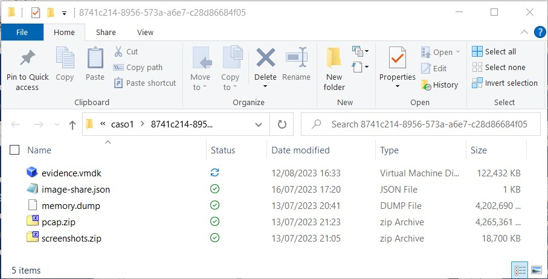
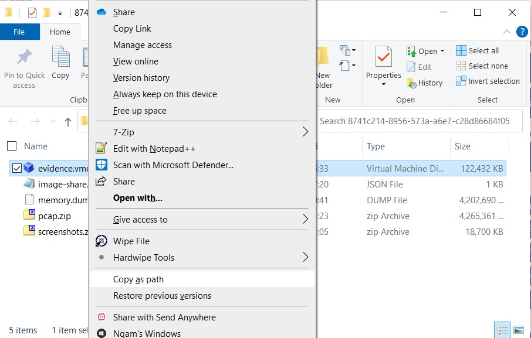
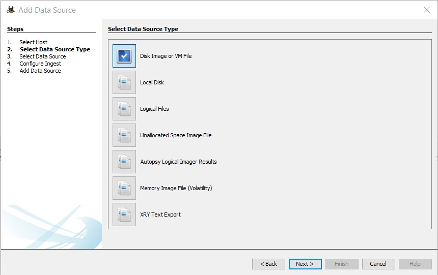
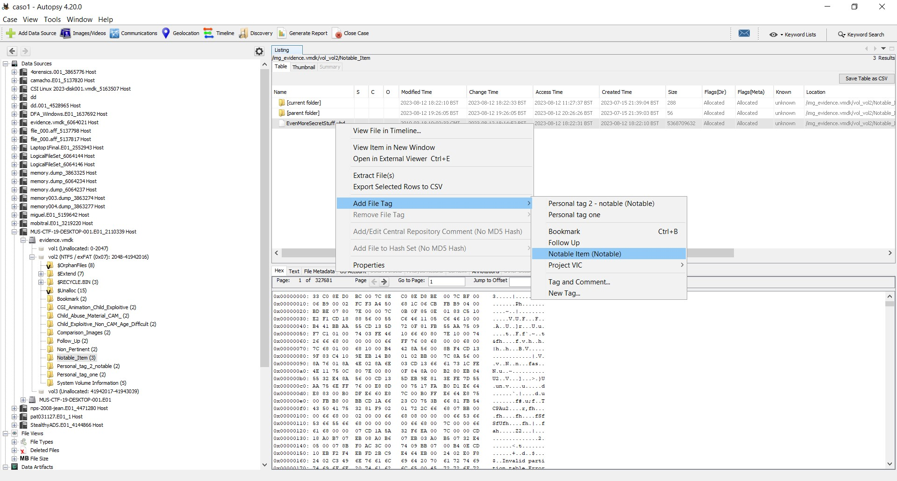
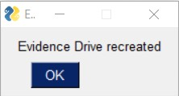

Gather Evidence Using the :term:`Evidence Disk`
=======================================

The evidence disk is an automatically generated drive that materializes during the conversion of a forensic image to a ForensicVM. This utility drive is populated with directories that carry the same names as the Autopsy tags. These directories serve as designated containers, wherein the forensic investigator is expected to compile and organize evidence relevant to each tag. If ever the need arises, the investigator has the option to reset the evidence disk to its initial state. However, such an action should be approached with caution, as it would entail the deletion of all previously gathered evidence.

In the event that new tags are introduced in Autopsy, corresponding folders for these tags will be fashioned once the plugin is restarted.

.. tip::
   In order to fabricate any missing tag directories, it's essential to first halt the ForensicVM's operations. It's advised to shut down the ForensicVM, subsequently close the plugin, and then reopen it via the Autopsy :term:`ForensicVM Client Plugin`. This procedure ensures that the environment is refreshed and ready to incorporate new changes.

:term:`Evidence Disk` Creation
--------------------------------

The creation of the evidence disk is an automated process. When you transition a forensic image into a ForensicVM, regardless of whether the method employed is virtualization copy or linking to the forensic image, the evidence disk is fashioned during the final phase of this procedure.

.. raw:: latex

   \FloatBarrier

.. figure:: img/evidence_disk_0001.jpg
   :alt: :term:`Evidence Disk` Creation Process
   :align: center
   :width: 600px

   Screenshot depicting the final phase of the ForensicVM conversion, showcasing the creation of the evidence disk.

.. raw:: latex

   \FloatBarrier

Collecting Evidence: A Step-by-Step Guide
------------------------------------------

Collecting digital evidence is a meticulous process, demanding precision, patience, and an understanding of the system you are investigating. When using the ForensicVM, this process is facilitated, yet there are still specific steps to follow. Here's a comprehensive guide on how to go about it:

1. **Initiation of the ForensicVM**:

   Before you can begin your evidence collection, ensure that the ForensicVM is up and running. Start the virtual machine and patiently wait for it to boot up completely.

2. **Logging In**:

   Once the ForensicVM has completely loaded, proceed to log in using the credentials provided or set during the initial configuration. Remember, maintaining the security and integrity of the login process is crucial in a forensic investigation.

3. **System Exploration**:

   With access to the ForensicVM, you can now begin your deep dive into the system. Navigate through the directories, files, applications, and logs. Always keep an eye out for suspicious or relevant files, unusual patterns, or any anomalies that might serve as potential evidence.

4. **Copying Relevant Files to the** :term:`Evidence Disk`:

   As you uncover potential pieces of evidence:

   - **For Windows Users**:
     
     The process is quite straightforward. Simply copy the relevant files or data and save them to the evidence disk, which is typically represented as the D: drive. This dedicated drive serves as a safe repository, ensuring that the original data remains uncompromised.
     
   - **For Linux Investigation**:
     
     Things might be quite different. Instead of having immediate access to the evidence disk, you might need to locate it first. Once found, proceed to mount the disk manually. After which, you can copy and save the necessary files or data to this disk.

.. note::
   Remember, while the process might seem technical, the key is to maintain the integrity of the evidence and ensure that all actions are documented and reproducible. It's not just about finding the evidence, but also about ensuring its admissibility in a court of law.

Collect Evidence on Windows
***************************

**Log into Windows**

Begin by logging into the operating system. Should there be a need, employ a plugin to either craft a **forensicAdministrator** user or reset an existing user's password.

.. raw:: latex

   \FloatBarrier

   Windows login screen.

.. raw:: latex

   \FloatBarrier

**Identify Evidence and the** :term:`Evidence Disk`

Post login, your next objective is to pinpoint the evidence disk. This specific disk is marked with the label **possible evidence**. Conventionally, it's designated as drive **D:**. The very essence of this disk is a collection of folders; each bearing the name of tags available in Autopsy. Though investigators have the liberty to tailor-make folders or sub-folders as per the requirements of their investigation, a suggested practice is to either refine or instate new tags in Autopsy. Post this step, both the :term:`Autopsy Plugin` and the ForensicVM should be restarted.

.. raw:: latex

   \FloatBarrier

   Identification and transfer of evidence.

.. raw:: latex

   \FloatBarrier

The :numref:`Fig. %s <evidence-windows>` offers a visual guide: The evidence drive is demarcated by a green rectangle, while the :term:`Windows Explorer` - which is in the process of identifying potential evidence - is enclosed within a red rectangle. The objective here is to locate and transfer the identified evidence into the "possible evidence" drive, ensuring they're nestled under the appropriate Autopsy Folder Tags.

**Example: Transferring the Entire Encrypted** :term:`BitLocker Drive`

The illustration below showcases the entirety of an encrypted BitLocker drive being transferred to the Autopsy 'Follow Up' tag. The foundational principle of this process lies in ensuring that the full, unaltered encrypted drive is copied, preserving its integrity for forensic examination. By copying the entire encrypted disk file, forensic analysts can ensure they are working with a complete and untampered set of data.

.. raw:: latex

   \FloatBarrier

   Transferring the full encrypted BitLocker drive to the Autopsy 'Follow Up' tag.

.. raw:: latex

   \FloatBarrier

**Pre-importing Considerations for Autopsy**

Before integrating the possible evidence drive into Autopsy, it's imperative to either shut down or stop the forensicVM. Opting for a shutdown is highly recommended. Choosing to merely stop the virtual machine introduces the risk of data corruption which could compromise the integrity of the evidence or render parts of it unusable.

.. raw:: latex

   \FloatBarrier

   Options available for safely preserving the BitLocker drive before importing to Autopsy.

.. raw:: latex

   \FloatBarrier

Collecting Evidence on Linux
*****************************

**Accessing the System**

To embark on evidence collection, the primary step involves gaining access to the Linux system. Knowledge of user credentials is essential. If you find yourself without the necessary credentials, consider utilizing available plugins to assist. Alternatively, developing and sharing a new plugin with the community could be a valuable contribution! The illustration below presents the login process for an :term:`Ubuntu 22.10` system featuring a comprehensive desktop environment.

.. raw:: latex

   \FloatBarrier

   :term:`Ubuntu 22.10` login screen with a full desktop.

.. raw:: latex

   \FloatBarrier

**Identifying the :term:`Evidence Disk`**

After successfully logging in, launch the file explorer to identify the evidence disk. In the given instance, one would navigate to "Other locations" and subsequently double-click on "possible evidence" to initiate its mounting.

.. raw:: latex

   \FloatBarrier

   Identifying the "possible evidence" disk in the file explorer.

.. raw:: latex

   \FloatBarrier

**Plan Evidence Gathering**

Once the evidence drive is appropriately mounted, you're primed to delve into your evidence search. Displayed in the subsequent figure are folders corresponding to various :term:`Autopsy Tags`, offering a structured approach to evidence organization.

.. raw:: latex

   \FloatBarrier

   :term:`Autopsy Tags` folders for structured evidence organization.

.. raw:: latex

   \FloatBarrier

**Explore and find possible evidence**

Navigating to the designated folder, we discern a hash dump file alongside potential evidence pointing to the deployment of a meterpreter.

.. raw:: latex

   \FloatBarrier

.. figure:: img/evidence_disk_0009.jpg
   :alt: Identifying potential evidence
   :align: center
   :width: 600px

   Highlighting a hash dump file and indications of meterpreter usage.

.. raw:: latex

   \FloatBarrier

**Organize and Transfer Potential Evidence to the Evidence Drive**

Now, to preserve this crucial data, ensure you copy the identified potential evidence to the designated "possible evidence" folder.

.. raw:: latex

   \FloatBarrier

   Transferring discovered evidence to the "possible evidence" folder.

.. raw:: latex

   \FloatBarrier

**Preparing for Autopsy Integration**

Before channeling the evidence disk into Autopsy, it's paramount to adopt one of two measures: either halt the forensicVM operations or completely shut it down. Favoring the shutdown route comes strongly advised, as a mere halt could inadvertently introduce data corruption. Such anomalies might jeopardize evidence integrity or entirely nullify certain data segments. In our context, you'd initiate this by selecting the power icon, followed by the "Power Off/Log Out" option from the ensuing menu.

.. raw:: latex

   \FloatBarrier

   Accessing the power options on :term:`Ubuntu 22.10`.

.. raw:: latex

   \FloatBarrier

**Concluding the Process**

To safeguard all collected evidence, conclude the procedure by opting for "Power Off", thereby initiating the system's shutdown.

.. raw:: latex

   \FloatBarrier

.. figure:: img/evidence_disk_0012.jpg
   :alt: Powering off the system
   :align: center
   :width: 600px

   Promptly shutting down the system to ensure evidence safety.

.. raw:: latex

   \FloatBarrier

.. _Import evidence disk:

Import Possible :term:`Evidence Disk` into Autopsy
----------------------------------------------------

Autopsy is a digital forensics platform. To import a :term:`qcow2` evidence disk, first convert it to :term:`vmdk`. Follow the guide below:

**Run the Autopsy ForensicVM plugin on the intended datasource**

#. Begin by launching the :term:`Autopsy Case`.
#. Execute the Autopsy ForensicVM plugin on the case datasource.

.. raw:: latex

   \FloatBarrier

   
   *Autopsy ForensicVM* :term:`Plugin Interface`

.. raw:: latex

   \FloatBarrier

**Securely Shutdown the forensicVM**

#. Ensure the forensicVM machine is shut down. 
#. If not, shut down using the "Shutdown VM" button in the Autopsy ForensicVM Client interface.

.. raw:: latex

   \FloatBarrier

   *Shutdown VM Interface*

.. raw:: latex

   \FloatBarrier

**Import evidence disk**

Click the "Import :term:`Evidence Disk`" button.

.. raw:: latex

   \FloatBarrier

   *Import* :term:`Evidence Disk` *Interface*

.. raw:: latex

   \FloatBarrier

**Save evidence disk to default path**

A :term:`Windows Explorer` "Save As" dialog will appear. Retain the suggested path.

.. raw:: latex

   \FloatBarrier

   *Save As Dialog*

.. raw:: latex

   \FloatBarrier

**Monitor the** :term:`Download Progress`

Wait for the evidence disk download to complete.

.. raw:: latex

   \FloatBarrier

   :term:`Download Progress` *Bar*

.. raw:: latex

   \FloatBarrier

:term:`Evidence Disk` **Informational Popup**

A notification popup will display the evidence path.

.. raw:: latex

   \FloatBarrier

   :term:`Evidence Disk` *Popup Notification*

.. raw:: latex

   \FloatBarrier

**Locate the Evidence in the Path**

:term:`Windows Explorer` will display the evidence.:term:`vmdk` path. Copy this path.

.. raw:: latex

   \FloatBarrier

   *Evidence.:term:`vmdk` in :term:`Windows Explorer`*

.. raw:: latex

   \FloatBarrier

**Copy evidence disk path**

Hold Shift, right-click on evidence.:term:`vmdk`, and select "Copy as path".

.. raw:: latex

   \FloatBarrier

   *Copying evidence.:term:`vmdk` Path*

.. raw:: latex

   \FloatBarrier

**Integrate a New :term:`Data Source` in Autopsy Software**

Click "Add :term:`Data Source`" in Autopsy.

.. raw:: latex

   \FloatBarrier

   *Add :term:`Data Source` Option in Autopsy*

.. raw:: latex

   \FloatBarrier

**Select the Appropriate Host**

Select the same host when importing the evidence disk.

.. raw:: latex

   \FloatBarrier

   *Selecting Host in Autopsy*

.. raw:: latex

   \FloatBarrier

**Specify :term:`Data Source` Type as :term:`VM Image`**

Choose ":term:`Disk Image or VM File`" as the data source type.

.. raw:: latex

   \FloatBarrier

   Selecting :term:`Data Source` *Type in Autopsy*

.. raw:: latex

   \FloatBarrier

**Enter the previously copied evidence.**:term:`vmdk` **path**

Paste the evidence.:term:`vmdk` path and set the "Time zone".

.. raw:: latex

   \FloatBarrier

   *Inputting evidence.:term:`vmdk` Path in Autopsy*

.. raw:: latex

   \FloatBarrier

**Deselect All Plugins**

Deselect all plugins and click "Next".

.. raw:: latex

   \FloatBarrier

   *Deselecting Plugins in Autopsy*

.. raw:: latex

   \FloatBarrier

**Conclude the** :term:`Data Source` **Addition**

Click "Finish".

.. raw:: latex

   \FloatBarrier

   *Finish Button in Autopsy*

.. raw:: latex

   \FloatBarrier

**Locate and Label Potential Evidence**

Navigate to each folder and assign the "Notable Item" tag.

.. raw:: latex

   \FloatBarrier

   :term:`Tagging` *Evidence in Autopsy*

.. raw:: latex

   \FloatBarrier

**Evidence Successfully Tagged**

Tagged evidence will be highlighted.

.. raw:: latex

   \FloatBarrier

   *Tagged Evidence Display in Autopsy*

.. raw:: latex

   \FloatBarrier

Update :term:`Evidence Disk` Tags
----------------------------------

During the course of a forensic investigation, there may be instances when you need to append additional tags. Ensuring that the "possible evidence disk" reflects these changes is crucial. The following steps guide you on making sure the tag folders are created on the evidence disk:

**Add a New Tag to Autopsy**

1. Navigate to the desired file in Autopsy.
2. Right-click on the file.
3. From the context menu, hover over "Add file tag".
4. Select the last sub-menu option "New tag...".

.. raw:: latex

   \FloatBarrier

   *Adding New Tag in Autopsy*

.. raw:: latex

   \FloatBarrier

**Define the New Tag Name and Type**

1. Input the desired "Tag Name".
2. If the new tag denotes something significant or noteworthy, ensure to check the box labeled "Tag indicates item is notable".

.. raw:: latex

   \FloatBarrier

   *Defining New Tag Name and Type in Autopsy*

.. raw:: latex

   \FloatBarrier

**Initiate** :term:`Ingest Modules`

1. Right-click within Autopsy.
2. Select "Run :term:`Ingest Modules`" from the dropdown menu.

.. raw:: latex

   \FloatBarrier

   *Running* :term:`Ingest Modules` *in Autopsy*

.. raw:: latex

   \FloatBarrier

**Activate the ForensicVM Client** :term:`Python` **Plugin**

1. Deselect all plugins within Autopsy.
2. Specifically select the "ForensicVM Client" plugin.
3. Click on "Finish".

.. raw:: latex

   \FloatBarrier

   *Selecting the* :term:`ForensicVM Client Plugin` *in Autopsy*

.. raw:: latex

   \FloatBarrier

**Boot up the ForensicVM**

Start the forensicVM system.

.. raw:: latex

   \FloatBarrier

   *Starting the ForensicVM System*

.. raw:: latex

   \FloatBarrier

**Access the ForensicVM Interface**

Click on "Open ForensicVM".

.. raw:: latex

   \FloatBarrier

   *Accessing the ForensicVM Interface*

.. raw:: latex

   \FloatBarrier

**Identify the New Folder Tag**

Log into the forensicVM and identify the freshly generated tag folder.

.. raw:: latex

   \FloatBarrier

   *Identify the New Folder Tag*

.. raw:: latex

   \FloatBarrier

.. tip::

   For users operating on Windows versions later than 8: If the evidence folder is elusive, ensure Windows is not in hibernation instead of being completely shut down. To bypass this, while shutting down the forensicVM, hold down the [Shift] key on your keyboard. This ensures the hibernation file is removed and the drive is primed to receive instructions. You can then retry the procedure.

Recreate :term:`Evidence Disk`
-----------------------

.. danger::

   Opting for this action will irrevocably erase all data on the evidence disk! Data recovery will not be possible afterward. Prior to initiating this, ensure to follow the guidelines to `Import evidence disk`_.

**Safely Shut Down Windows**

To ensure that the evidence.:term:`vmdk` disk is unlocked, shut down Windows while pressing and holding the [Shift] key. This action ensures the hibernation file is deleted.

.. raw:: latex

   \FloatBarrier

   *Safely Shutting Down Windows*

.. raw:: latex

   \FloatBarrier

**Initiate** :term:`Evidence Disk` **Recreation**

Once the machine is completely shut down, press the "Recreate :term:`Evidence Disk`" button found on the Autopsy :term:`ForensicVM Client Plugin` interface.

.. raw:: latex

   \FloatBarrier

.. figure:: img/evidence_disk_0037.jpg
   :alt: Recreate :term:`Evidence Disk` Button
   :align: center
   :width: 600px

   *Recreate* :term:`Evidence Disk` *Button*

.. raw:: latex

   \FloatBarrier

**First** :term:`Confirmation Dialog`

Recreating the evidence disk necessitates its deletion—a critical action. A prompt will appear asking for confirmation on this deletion.

.. raw:: latex

   \FloatBarrier

   *First :term:`Confirmation Dialog`*

**Final Confirmation Message**

.. raw:: latex

   \FloatBarrier

A subsequent confirmation dialog will be displayed. Click on "YES" only if you are absolutely certain about erasing the current evidence disk.

.. raw:: latex

   \FloatBarrier

   *Final Confirmation Message*

.. raw:: latex

   \FloatBarrier

**Confirmation of Successful Recreation**

Upon successful recreation of the evidence disk, a notification will appear to confirm the action.

.. raw:: latex

   \FloatBarrier

   *Successful Recreation Notification*

.. raw:: latex

   \FloatBarrier

**Boot Up the ForensicVM**

Proceed to start, access, and log into the forensicVM.

.. raw:: latex

   \FloatBarrier

   *Booting Up the ForensicVM*

.. raw:: latex

   \FloatBarrier

**Inspect the New** :term:`Evidence Disk`

A freshly recreated evidence disk will be generated with the current Autopsy evidence tags structured as folders. No previously acquired evidence will be included. As a crucial step, remember to `Import evidence disk`_ before recreating the evidence disk.

.. raw:: latex

   \FloatBarrier

   *New :term:`Evidence Disk` Overview*

.. raw:: latex

   \FloatBarrier
