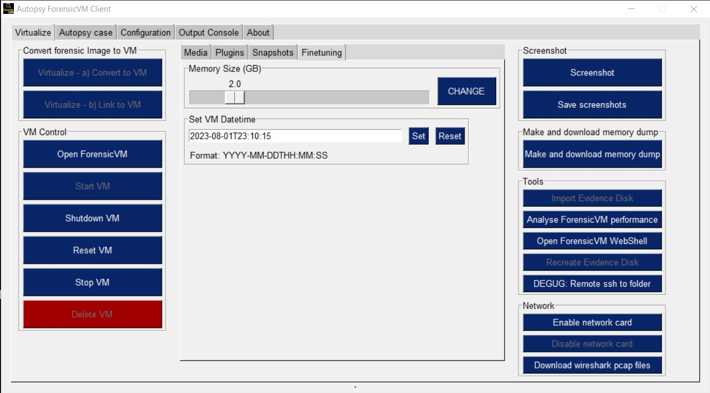

:term:`Fine-Tuning ForensicVM`
======================

The conversion of a forensic image into a ForensicVM generates a configuration file in the background. This file encompasses various configuration parameters for the forensic virtual machine, such as memory size, attached disks, :term:`UEFI` boot options, and more. The "Fine-Tuning" section within the Autopsy ForensicVM Client interface facilitates adjustments to certain parameters—currently, the ForensicVM's memory size and its start date & time.

:term:`Modifying Memory Size`:
  
1. Navigate to the "Fine-Tuning" section in the interface.
2. Use the slider to adjust the memory size as desired.
3. Click the "Change" button to save your selection.
4. For the changes to take effect, shut down the ForensicVM and then start it again. 

.. note:: 

   Merely restarting the VM will not apply the memory adjustments. It's imperative to shut down and then start the VM afresh.

:term:`Setting the VM Date & Time`:

1. Enter the desired date and time in the format YYYY-MM-DD **T** HH:MM:SS. Note the **T** divider between the date and time components.
2. Press the "Set" button to save the new start date & time for the VM.
3. Again, to apply this change, shut down and then start the ForensicVM.

Below is an illustration showcasing both the memory size adjustment slider and the VM date & time setting option:

.. raw:: latex

   \FloatBarrier

   Fine-Tuning memory size and setting ForensicVM start date & time

.. raw:: latex

   \FloatBarrier
