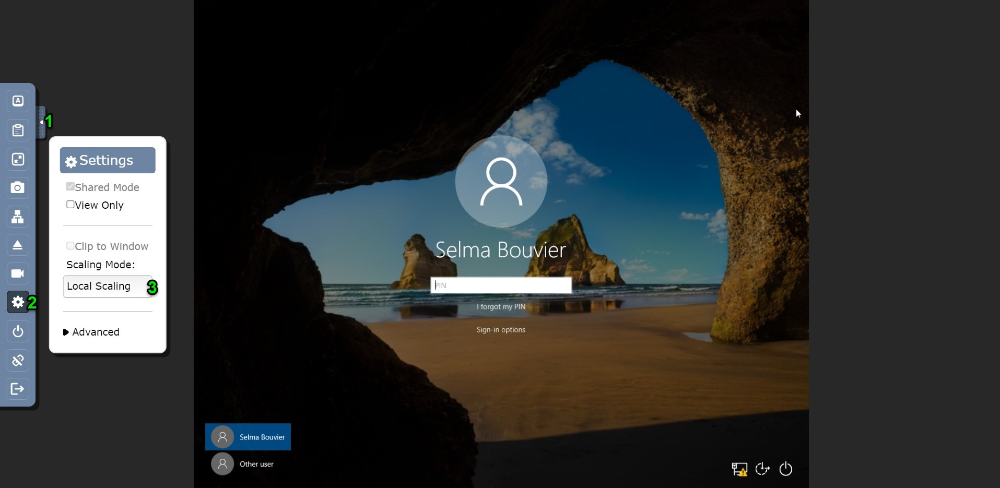

=====================
Getting Started
=====================

Installing ForensicVM
=========================

Before you can use ForensicVM, you must first install the software on your system. To do this, follow the steps outlined in the :ref:`Installation and Setup`.

Navigating the Interface
============================

Your first step is run the ForensicVM Client Plugin in Autopsy Software. The main interface will open. You manage this by reight clicking the datasource and choosing "Run Ingest Modules". After this it will open the main the Forensic Client Plugin main program interface.

.. figure:: img/infographics_0000.jpg
   :name: Change-me
   :alt: Change-me

   Change-me

Autopsy ForensicVM Client Plugin: A Comprehensive Interface Guide
------------------------------------------------------------------

The Autopsy ForensicVM Client Plugin serves as a pivotal hub for forensic analysts. This interface is designed for interactive engagement with forensic images, subsequently allowing users to transform these images into a forensic virtual machine (ForensicVM). Here's a breakdown of its primary functionalities on the Autopsy ForensicVM Client Plugin main interface:

.. figure:: img/infographics_0001.jpg
   :name: Autopsy ForensicVM Client Plugin
   :alt: Autopsy ForensicVM Client Plugin

   Autopsy ForensicVM Client Plugin Main

Main Toolbar Overview (1)
**************************

1. **Configuration**:
    
    - Prior to exploring the main functionalities, it's paramount to configure the plugin's settings. This preliminary setup is generally executed during the :ref:`Installation and Setup`.

2. **Virtualize Tab**:
    
    This tab houses the primary operations. Specifically, users can:

    - **Control the ForensicVM**: Open webscreen console, Start, Stop, Shutdown, Reset, or Delete.
    - **Manage Media**: Organize manage media relevant to forensic analysis.
    - **Manage Plugins**: Run individual plugins.
    - **Handle Snapshots**: Capture and revert the ForensicVM to various states.
    - **Capture Screenshots**: Record specific instances or frames within the ForensicVM.
    - **Memory Management**: Generate and retrieve memory dumps, vital for observing real-time operations within the ForensicVM.
    - **Virtual Evidence Disk Management**: Import and regenerate the virtual evidence disk, accumulating all potential pieces of evidence.
    - **Network Management**: Toggle network cards on or off, and capture pcap (packet capture) files for granular network investigations.
    - **ForensicVM Customization**: Modify the starting date/time, reallocate memory, among other settings.
    - **Performance Analysis**: Employ Netdata for comprehensive metric analysis of the ForensicVM's operations.
    - **Troubleshooting**: Secure an SSH connection to the ForensicVM machine, connecting directly to its remote directory. Additionally, avail an equivalent webshell for an internet-based SSH interaction with the server.

3. **Autopsy Case**:
    
    - This tab displays the Autopsy case details, including the extant case tags (utilized for case folder creation) and the generated UUID. This UUID is unique and becomes the name for the foundational directory of the forensic virtual machine.

4. **Output Console**:
    
    - This console captures all system messages. It's a valuable tool for debugging or ascertaining the final state of operations.

5. **About**:

    - Contains copyright details pertaining to the ForensicVM Client.

Secondary Toolbar Overview (2)
********************************

1. **Media Management**:

    This tab facilitates access to auxiliary virtualization functions:

    - **Media** - Oversee media operations. Upload ISO files to the server and manage actions such as insert, eject, and delete.
    - **Plugins** - Choose and execute a specific plugin. Introduce new forensic administrators, bypass passwords, reset activations, and navigate security protocols to delve into user profiles.
    - **Snapshots** - Take and revert the ForensicVM to various points in time.
    - **Finetuning** - Adjust memory capacity and define the initial start date.

Main Panel Overview (3)
*************************

    Based on the selected tab option, the main panel showcases different functionalities. For instance, when the **Media** tab is chosen, the corresponding list or form materializes in this space. Action buttons are located at the bottom. Among these, enabled buttons signify available actions, while disabled ones represent currently unavailable actions. These buttons toggle between enabled and disabled based on the ForensicVM machine's status or existence.

Notification Area (4)
**********************

    The notification area serves as the designated space for displaying notifications, warnings, and error pop-ups, tailored to specific events. Whenever there's a need to apprise the user or when the system requires user interaction, a pop-up emerges in this area, seeking the user's attention or input.

Convert Forensic Image to VM (5)
**********************************

These two buttons facilitate the transformation of the forensic image into a forensic virtual machine:

- **Virtualize - a) Convert to VM**: 
    This option converts the forensic image into a forensic virtual machine by copying it onto the forensicVM hypervisor server.
    
- **Virtualize - b) Link to VM**: 
    This option establishes a link between the remote forensic virtual machine and the local forensic image.

For both methods, the remote forensicVM integrates an overlay of information. This includes additional drivers and outcomes from the execution of security plugins or actions taken by forensic investigators on the machine. Importantly, this approach ensures the preservation of the original forensic image's integrity.

VM Control (6)
***************

Manage essential actions for the forensic virtual machine:

- **Start**: Power on the forensic virtual machine.
- **Stop**: Cease the operation of the forensic virtual machine.
- **Shutdown**: Gracefully power down the forensic virtual machine.
- **Reset**: Restart the forensic virtual machine.
- **Delete**: Remove the forensic virtual machine entirely.

Screenshot Management (7)
**************************

    Manage the screenshots taken during your forensic investigations:

    - **Screenshot**: Capture the current view of the forensic virtual machine, providing a visual record of its state at that moment.
  
    - **Save Screenshots**: Compile and download all captured screenshots into a single ZIP file, allowing for easy storage and transfer.

Make and Download a Memory Dump (8)
************************************

Engage with the active memory data of the forensic virtual machine:

- **Make Memory Dump**: Generate a snapshot of the forensicVM's current memory state, capturing active processes, and other runtime details.

- **Download Memory Dump**: Retrieve the created memory dump for further analysis, facilitating deeper investigations using tools such as:
  
  - The Volatility plugin within the Autopsy software.
  - External utilities like Volatility 3.0.
  - Rekall: Another powerful framework for memory forensics.
  - MemProcFS: Useful for live RAM analysis and incident response.
  - Redline: Offers a user-friendly interface for in-depth memory and file analysis.

Tools (9)
***********

Use auxiliary tools for various forensic operations:

- **Import evidence disk into autopsy**:
    Import a virtual disk allowing forensic investigators to collect and gather potential evidence. This option lets you import the disk as a vmdk disk into Autopsy for reporting purposes.

- **Recreate evidence disk**:
    Delete and recreate the evidence disk. 

.. warning:: 

   This is a destructive action. Ensure to import the current evidence disk into Autopsy if it contains gathered evidence.

- **Analyze ForensicVM performance**:
    Utilize the Netdata software to pinpoint server bottlenecks, optimize server performance, and determine the root cause of any ForensicVM server issues.

- **Open ForensicVM Webshell**:
    Initiate an SSH-over-internet webshell connection to the server.

- **DEBUG: remote ssh to the folder**:
    Access an SSH shell inside the ForensicVM image folder, allowing edits and testing of the ForensicVM start script. 

.. note:: 

  This is primarily used for debugging purposes.

Network (10)
*************

Manage network settings and operations:

- **Enable network card**:
    For security reasons, the network is disabled by default. Given that a machine could be compromised by malware, use this option with caution. When enabled, an internet firewall activates, blocking traffic to the local network but permitting internet access. Additionally, all traffic is recorded in the pcap (packet capture) file format.

- **Disable network card**:
    Deactivates the network card and saves a pcap file with all captured traffic to the server.

- **Download Wireshark pcap files**:
    Download all generated pcap files as a zip file, enabling investigators to analyze captured network traffic using tools like Wireshark or other network traffic analysis software.

ForensicVM Webscreen Console
-----------------------------

The webscreen console, developed on the HTML5 VNC technology known as NoVNC, provides a visual and interactive gateway to the virtual screen of the remote ForensicVM. Alongside basic interactions, it also offers an array of ForensicVM control options to augment the forensic investigation process. To access this feature-rich console, select the **Open ForensicVM** option. Delve deeper for more details:

Webscreen Console Main Area
****************************

The following figure elucidates the available options:

.. figure:: img/infographics_0002.jpg
   :alt: Overview of the ForensicVM Webscreen Console

   Overview of the ForensicVM Webscreen Console functionalities.

- **(1) Control bar open icon**: By clicking on this icon, users can unveil the auto-hiding control bar that seamlessly overlays the main screen, bestowing access to an assortment of functionalities.
- **(2) Notification area**: Strategically positioned at the top, this zone is dedicated to presenting error, notification, and warning messages.
- **(3) Main screen**: Serving as the primary interface of the webscreen, during the boot sequence, users can hit the ESC key to dive into the BIOS or UEFI. This permits modifications to pivotal settings, with a prime focus on the boot device, especially when initiating a boot from an ISO.

ForensicVM Webscreen Console Control Toolbar
**********************************************

Upon clicking the control bar open icon, users are presented with the Control Toolbar, illustrated below:

.. figure:: img/infographics_0003.jpg
   :name: control-toolbar-overview
   :alt: Overview of the Control Toolbar in ForensicVM Webscreen Console

   Overview of the Control Toolbar in ForensicVM Webscreen Console

The Control Toolbar facilitates the following actions:

- **Show Extra Keys**: Displays icons representing frequently-used key combinations such as Ctrl+Alt+Del and the Windows key. Clicking these icons sends the corresponding key inputs to the ForensicVM.
- **Clipboard**: Enables basic data transfer between the user's environment and the ForensicVM, provided the QEMU agent is installed on the virtual machine.
- **Fullscreen**: Expands the ForensicVM webscreen to occupy the entire display area.
- **Take a Screenshot**: Captures the current view of the remote ForensicVM.
- **Enable or Disable the Network Card**: This function is self-explanatory.
- **Insert or Eject Media**: Facilitates the selection, insertion, and ejection of CD-ROMs or DVDs containing additional forensic tools.
- **Video Recording**: Initiates, terminates, and downloads video recordings at a rate of 30 frames per minute.
- **Settings**: Provides access to several webscreen console preferences. Notably, users can adjust the scaling mode. Setting it to "Local Scaling" ensures the remote display fits the browser window perfectly.
- **Power**: Offers control over the ForensicVM's power states, including shutdown, stop, and reset actions.
- **Disconnect**: Ends the current webscreen session.
- **Logout**: Signs the user out of the ForensicVM server.

Adjusting Screen Scaling: Local Scaling
----------------------------------------

If you find that the screen appears cropped or that certain parts of the interface aren't fully visible, you can adjust the scaling settings for a more optimal viewing experience. Here's a comprehensive guide to making those adjustments:

**Steps to Adjust Screen Scaling:**

1. **Reveal the Control Bar**:
   - **Control Bar Open Icon**: The control bar is typically hidden to provide a cleaner viewing area. By clicking on this icon, you'll reveal a set of controls that overlay the main screen. These controls grant access to various functionalities.

2. **Access Scaling Settings**:
   - **Definitions Icon**: Once the control bar is visible, locate and click on the definitions icon. This action will lead you into the settings or preferences area, where you can manage various aspects of the ForensicVM interface.

3. **Modify Scaling Mode**:
   - **Scaling Mode Adjustment**: Inside the settings, find the option labeled **"Scaling mode."** From the available choices, select **"Local Scaling."** This adjustment ensures the interface perfectly fits within your screen, displaying all elements in their entirety.

   A visual representation showcasing the process of adjusting the webscreen scaling to "Local Scaling" for an optimized, full-screen experience.

ForensicVM Server Web Control Interface
----------------------------------------

For enhanced collaboration, remote forensic investigators have the capability to log into a dedicated web interface. This platform not only facilitates shared control of the remote web interface but also empowers multiple investigators to access the same ForensicVM simultaneously. This multi-user functionality enables diverse investigative actions such as capturing screenshots, collecting potential evidences onto the evidence disk, and initiating video recordings.

.. figure:: img/infographics_0004.jpg
   :alt: A visual representation of the ForensicVM Server Web Control Interface

   A visual representation of the ForensicVM Server Web Control Interface

Interface Breakdown:

- **(1) VM Control Options**: 
    * **Start**: Power on the ForensicVM.
    * **Stop**: Power off the ForensicVM.
    * **Shutdown**: Properly shut down the ForensicVM, ensuring all processes are terminated correctly.
    * **Reset**: Reboot the ForensicVM.
    * **Browse**: Launch the ForensicVM's web console, offering a visual interface to the VM.

- **(2) Notification Area**: A dedicated space where various system communications such as messages, warnings, and error alerts are displayed.

- **(3) Server Management and Utilities**:
    * **Server Status (Netdata)**: Provides real-time performance metrics and monitoring using Netdata.
    * **Shell (webshell)**: Access to an SSH-over-web interface, allowing for direct server interactions.
    * **List VM**: Refresh and display the list of existing virtual machines on the server.
    * **Logout**: Facilitates logging out of the web interface, ensuring secure closure of sessions.

Next Steps
============

After familiarizing yourself with ForensicVM, you may want to explore more advanced topic. Refer to the respective sections in this documentation for more information.
