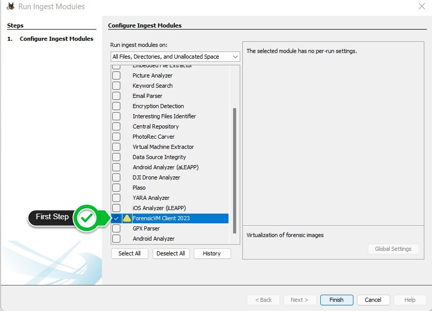
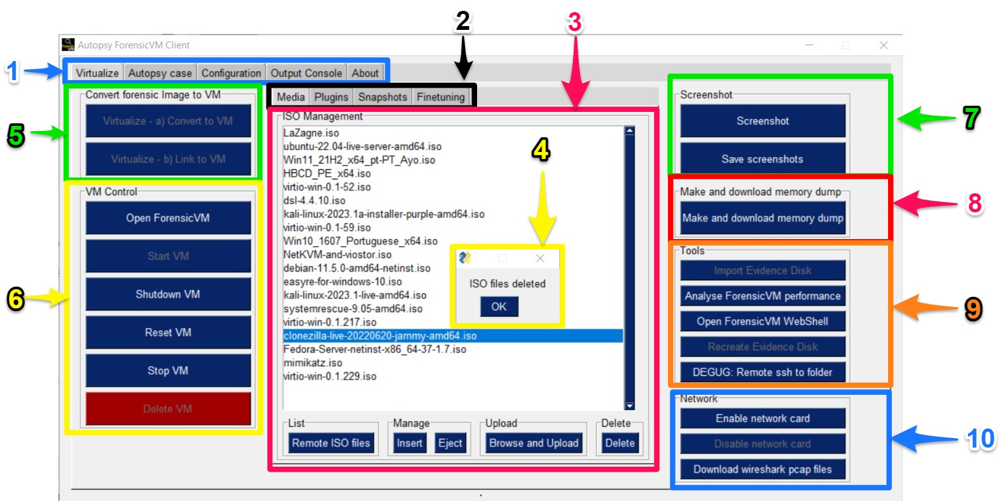
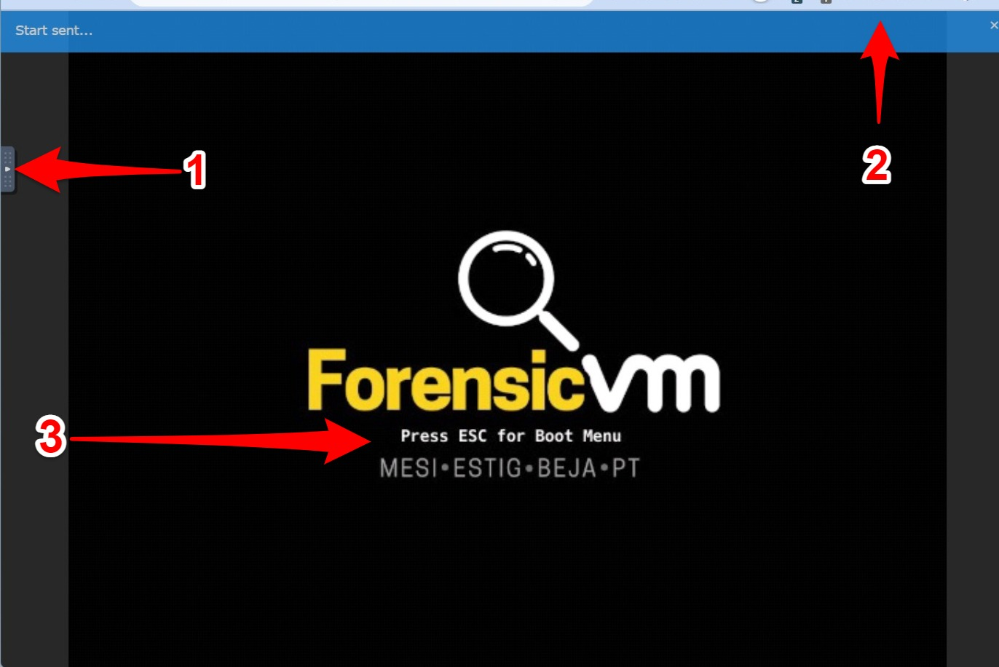
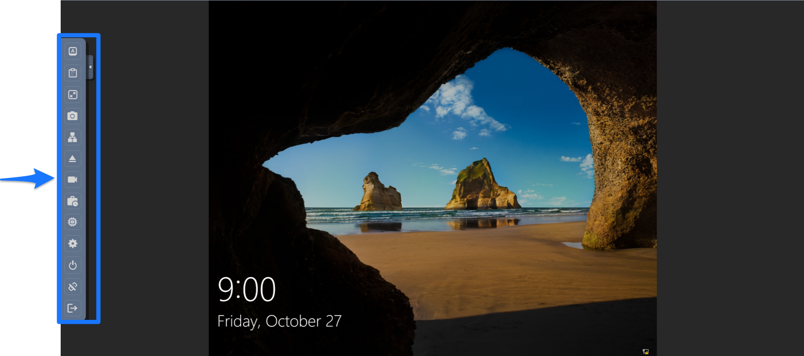
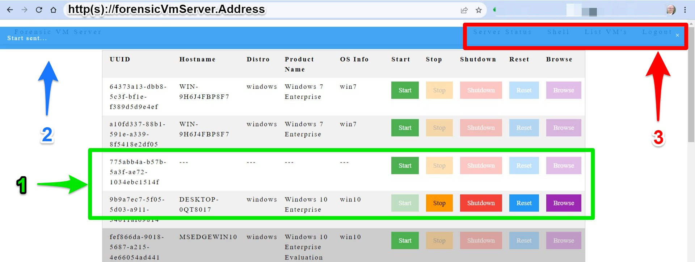

=====================
Getting Started
=====================

.. warning::

   Author: Please update this! Make an program overview with screenshots with legends that show every function in a infographic

This section provides an overview of the initial steps to start using ForensicVM.

Installing ForensicVM
=========================

Before you can use ForensicVM, you must first install the software on your system. To do this, follow the steps outlined in the :ref:`Installation and Setup`.

Navigating the Interface
============================

Your first step is run the ForensicVM Client Plugin in Autopsy Software. The main interface will open. You manage this by reight clicking the datasource and choosing "Run Ingest Modules". After this it will open the main the Forensic Client Plugin main program interface.

   Change-me

Autopsy ForensicVM Client Plugin: A Comprehensive Interface Guide
------------------------------------------------------------------

The Autopsy ForensicVM Client Plugin serves as a pivotal hub for forensic analysts. This interface is designed for interactive engagement with forensic images, subsequently allowing users to transform these images into a forensic virtual machine (ForensicVM). Here's a breakdown of its primary functionalities on the Autopsy ForensicVM Client Plugin main interface:

   Autopsy ForensicVM Client Plugin Main

Main Toolbar Overview (1)
===========================

1. **Configuration**:
    
    - Prior to exploring the main functionalities, it's paramount to configure the plugin's settings. This preliminary setup is generally executed during the :ref:`Installation and Setup`.

2. **Virtualize Tab**:
    
    This tab houses the primary operations. Specifically, users can:

    - **Control the ForensicVM**: Start, Stop, Shutdown, Reset, or Delete.
    - **Manage Media**: Organize manage media relevant to forensic analysis.
    - **Manage Plugins**: Run individual plugins.
    - **Handle Snapshots**: Capture and revert the ForensicVM to various states.
    - **Capture Screenshots**: Record specific instances or frames within the ForensicVM.
    - **Memory Management**: Generate and retrieve memory dumps, vital for observing real-time operations within the ForensicVM.
    - **Virtual Evidence Disk Management**: Import and regenerate the virtual evidence disk, accumulating all potential pieces of evidence.
    - **Network Management**: Toggle network cards on or off, and capture pcap (packet capture) files for granular network investigations.
    - **ForensicVM Customization**: Modify the starting date/time, reallocate memory, among other settings.
    - **Performance Analysis**: Employ Netdata for comprehensive metric analysis of the ForensicVM's operations.
    - **Troubleshooting**: Secure an SSH connection to the ForensicVM machine, connecting directly to its remote directory. Additionally, avail an equivalent webshell for an internet-based SSH interaction with the server.

3. **Autopsy Case**:
    
    - This tab displays the Autopsy case details, including the extant case tags (utilized for case folder creation) and the generated UUID. This UUID is unique and becomes the name for the foundational directory of the forensic virtual machine.

4. **Output Console**:
    
    - This console captures all system messages. It's a valuable tool for debugging or ascertaining the final state of operations.

5. **About**:

    - Contains copyright details pertaining to the ForensicVM Client.

Secondary Toolbar Overview (2)
==============================

1. **Media Management**:

    This tab facilitates access to auxiliary virtualization functions:

    - **Media** - Oversee media operations. Upload ISO files to the server and manage actions such as insert, eject, and delete.
    - **Plugins** - Choose and execute a specific plugin. Introduce new forensic administrators, bypass passwords, reset activations, and navigate security protocols to delve into user profiles.
    - **Snapshots** - Take and revert the ForensicVM to various points in time.
    - **Finetuning** - Adjust memory capacity and define the initial start date.

Main Panel Overview (3)
=======================

Based on the selected tab option, the main panel showcases different functionalities. For instance, when the **Media** tab is chosen, the corresponding list or form materializes in this space. Action buttons are located at the bottom. Among these, enabled buttons signify available actions, while disabled ones represent currently unavailable actions. These buttons toggle between enabled and disabled based on the ForensicVM machine's status or existence.

Notification Area (4)
=====================

The notification area serves as the designated space for displaying notifications, warnings, and error pop-ups, tailored to specific events. Whenever there's a need to apprise the user or when the system requires user interaction, a pop-up emerges in this area, seeking the user's attention or input.

   Change-me

   Change-me

   Change-me

Next Steps
============

After familiarizing yourself with ForensicVM, you may want to explore more advanced topic. Refer to the respective sections in this documentation for more information.
