=====================
Installation and Setup
=====================
This section will guide you through the steps necessary to install and set up ForensicVM on your system.

AutopsyVM Client Plugin Installation
####################################

Introduction
************

The AutopsyVM client plugin is a valuable addition to Autopsy, enhancing its functionality for digital forensics. Follow the steps below to install the plugin.

Step 1: Download ForensicVM.exe Setup File
******************************************

Download the latest version of the ForensicVM.exe setup file from the [AutopsyForensicVM GitHub Releases](https://github.com/nunomourinho/AutopsyForensicVM/releases) page. Navigate to the "Assets" section and download the setup file.

Step 2: Run the ForensicVM.exe Setup
************************************

Run the ForensicVM.exe setup file to begin the installation process. The setup consists of four steps:

1. Welcome Screen: Displays an introduction to the installation process.
2. Component Installation: Proceed with the default settings. Do not make any changes.
3. Plugin Location: Specify the location where the AutopsyVM client plugin will be installed. Typically, this does not require any changes.
4. Install: Click the "Install" button to start the installation process.

Step 3: Complete the Installation
*********************************

Follow the on-screen instructions to complete the installation. Once the installation is finished, you can proceed with using the AutopsyVM client plugin in Autopsy.

Step 4: Verify the Installation
*******************************

To verify the successful installation of the AutopsyVM client plugin, open Autopsy and check if the plugin is available and functional.

Screenshots
***********

Here are the screenshots that illustrate the installation process:

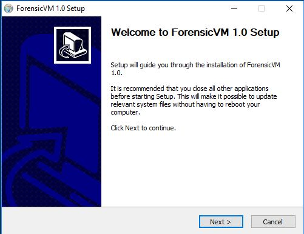

   Welcome Screen

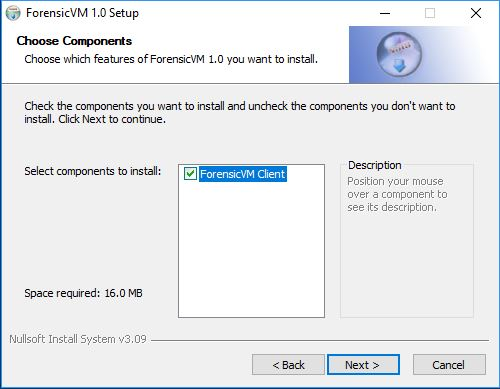

   Component Installation

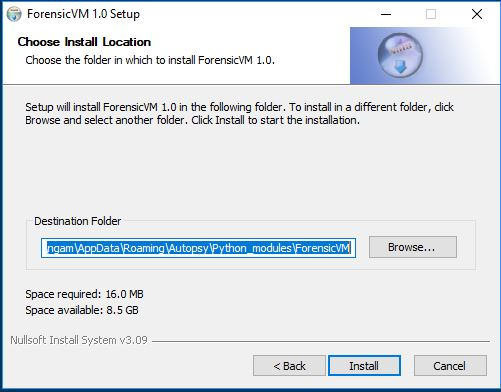

   Plugin Location

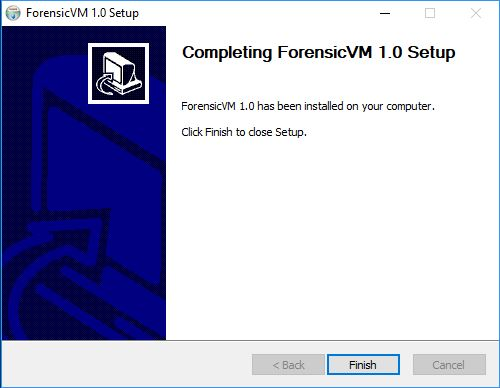

   Finish Screen

Initial Setup
##############
After successfully installing ForensicVM one needs to configure the AutopsyVM plugin. The initial configuration is composed of the following steps:

Step 1: In Autopsy: Add a new data source to Autopsy. This new data source is the forensic image that we need to convert to a forensicVM
*****************************************************************************************************************************************
 #. Add datasource
 #. Specify a new hostname
 #. Next

 .. figure:: img/setup_0001.jpg
    :alt: Add data source
    :align: center

    Add a new data source to Autopsy

Step 2: Select your Disk Image
******************************
 #. Select the option disk image or VM FIle
 #. Next

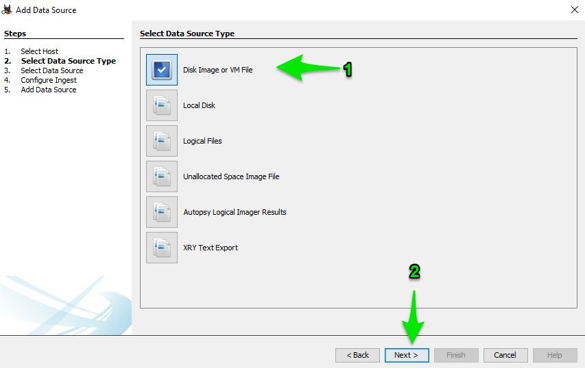

   Disk Image

Step 3: Select your forensic image
***********************************
 #. Browse for your forensic image, select it
 #. Click Next

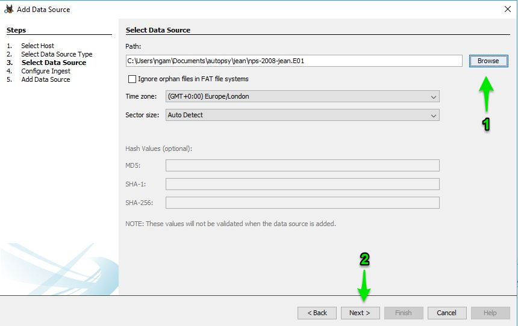

   Forensic Image Selection

Step 4: Run the ForensicVM client plugin
****************************************
 #. Deselect all other plugins
 #. Select the forensicVM Client plugin
 #. Click next

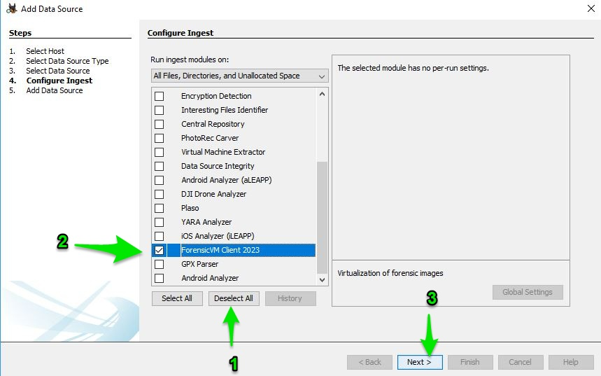

   Select Datasource

Step 5: Open your forensicVM Server web address in the admin. Ex: https://<ip-or-web>:port/admin
*************************************************************************************************
 #. Enter user and password
 #. Click the login button

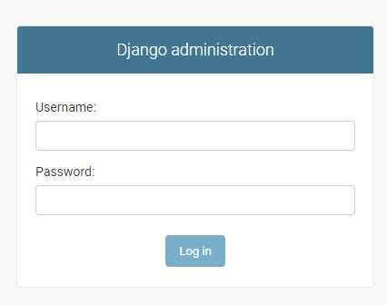

   Configure inject - Select ForensicVM Client plugin

Step 6: Add  a new user
************************
 #. Enter user, password and password confirmation dialogues
 #. Click SAVE

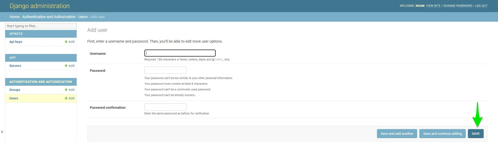

   Add user

Step 7: Add  a new api key to the user
***************************************
 #. Click the add button on the api keys
 #. Select the user
 #. Click the plus sign

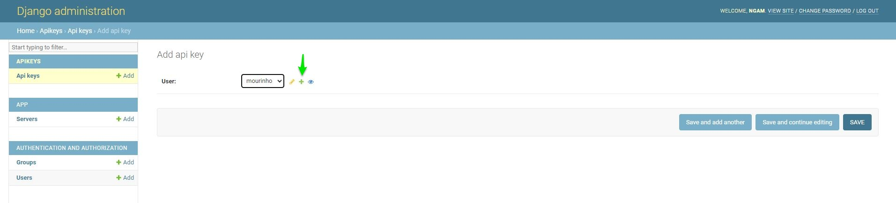

   Add API key to user

Step 8: Copy the user API key
******************************
 #. Select the newly created API key
 #. Press CTRL + C or copy it using the right mouse button and select copy

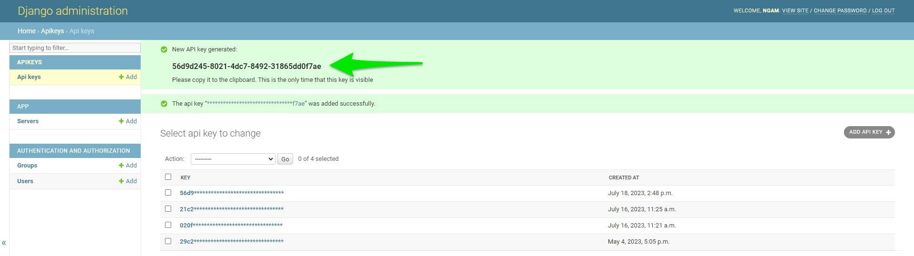

   Copy user API key

Step 9: Paste the user API key
*******************************
 #. Put the mouse on the Forensic API field
 #. Press CTRL + V or paste it using the right mouse button and select paste

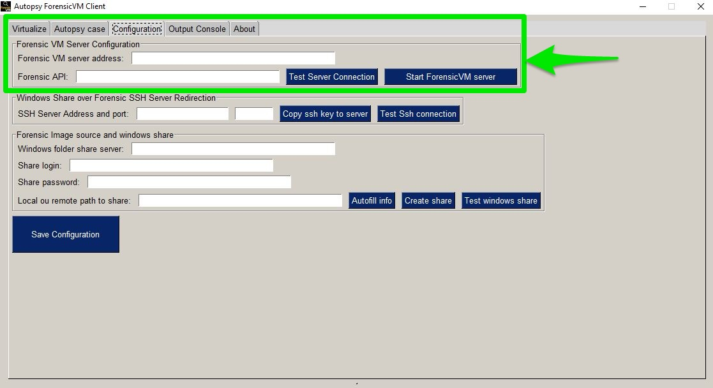

   Paste the user API key

Step 10: Fill and test the Forensic VM Server configuration
************************************************************
 #. Put the mouse on the Forensic VM server address. Fill in the information with your server address
 #. Click the Test Server Connection to test if API and server address are correct

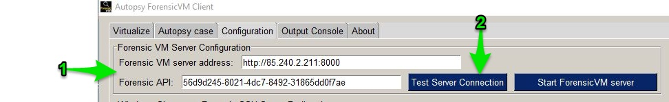

   Fill and test forensic VM Server Configuration

Step 11: Forensic VM Server configuration test success
*******************************************************
 #. If all pieces of information are correct and if the server is online you should see a connected successfully dialog box.
 #. If there are any problems, you should see a red error dialogue. Please check and correct the field values.

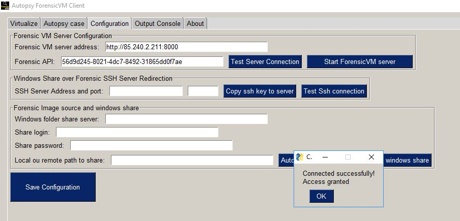

   Forensic VM server connection test

Step 12: Configure Windows Share over Forensic SSH Server Redirection
**********************************************************************
 The way that forensicVM Server access the forensic images is by making a reverse ssh connection to your computer and accessing a local share via the internet. The reverse ssh connection is in need to make a safe Windows share access. You should configure now the forensicVM server SSH address and port number:
 #. Please fill in the SSH Server Address and port number.
 #. Press the button to copy the ssh key to the server

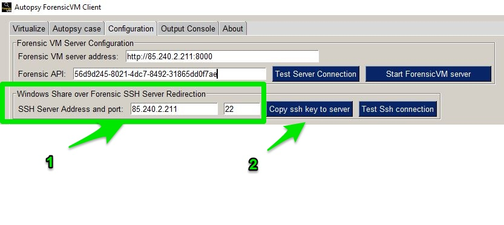

   Configure and copy the ssh key to the server

Step 13: Windows Share over Forensic SSH copy ssh key status
*************************************************************
 #. If the configuration is correct you should see a dialog stating that a Public key added to authorized keys
 #. If not, you should see an error dialogue or a dialogue stating that the ssh public key is already present on the remote server

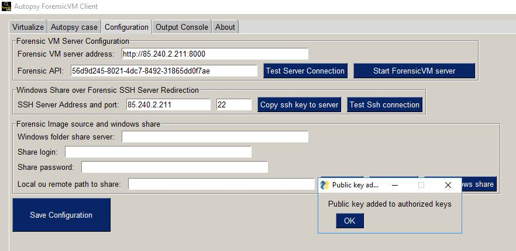

   Copy ssh key status

Step 14: Testing Windows Share over Forensic SSH Server Redirection
********************************************************************
 #. Click the Test Ssh connection button
 #. If the configuration is correct you should see a dialog stating that the connection was successful
 #. If not, you should see an error dialogue

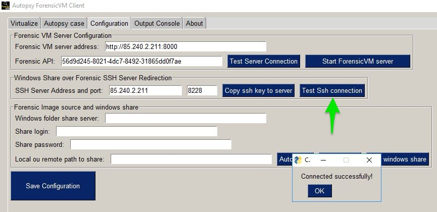

   Test windows share over ssh

Step 15: Configure windows share over ssh
******************************************
 #. Press the Autofill info button to autofill the Windows share information with the Share login and local and the remote path to share. This info is extracted from the forensic image's current path.

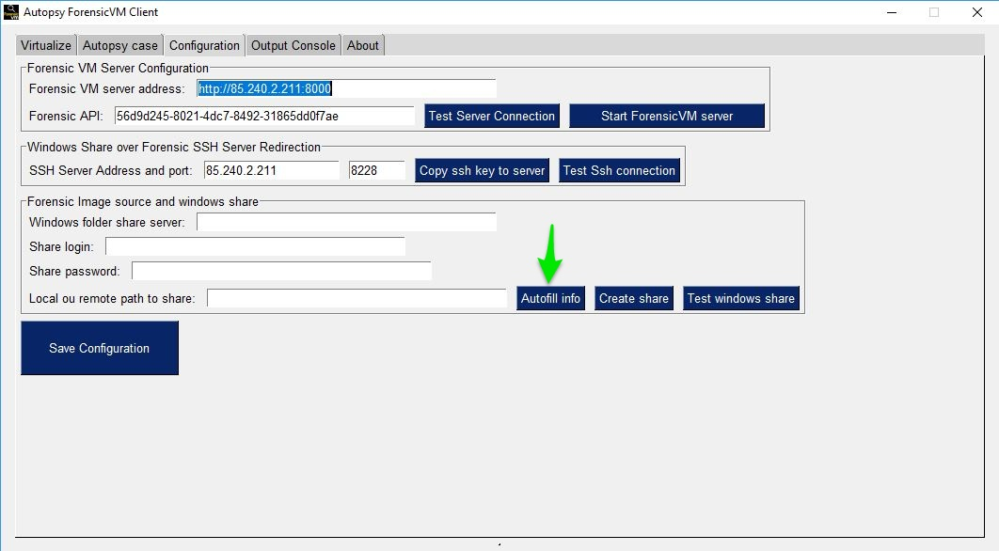

   Configure windows share over ssh

Step 16: Configure the share login and the share password
**********************************************************
 #. The share login and share password is a Windows local user and is password. It does not need to be an Administrator account. It can be a regular user. It also does not need to exist, since it is created if it does not exist when the user presses the create share button.

.. figure:: img/setup_0016.jpg
   :alt: Configure the share login and the Share password
   :align: center

   Share login and the share password configuration

Step 17: Create Share Button
*****************************
 #. After filling in the share login and password please press the create share button.

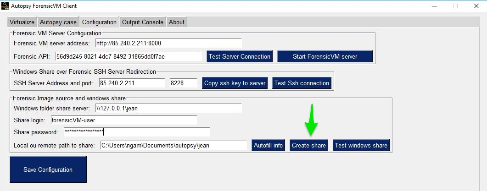

   Create share button

Step 18: Create a share Dialog
*******************************
 #. After pressing the create share button a command window will open. This will try to create the local user with the defined password. 

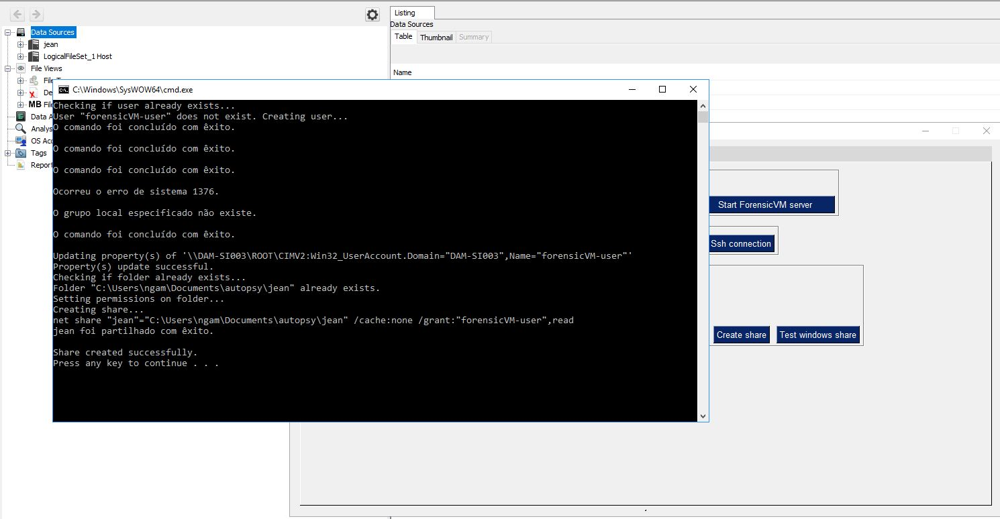

   Create a share command window

Step 19: Testing the forensicVM image Windows share over ssh
*************************************************************
 #. Press Test Windows share button to test if it is possible to connect to the Windows share from the server using a reverse ssh connection. If all is ok you will be presented with a Windows alert stating that the connection was successful

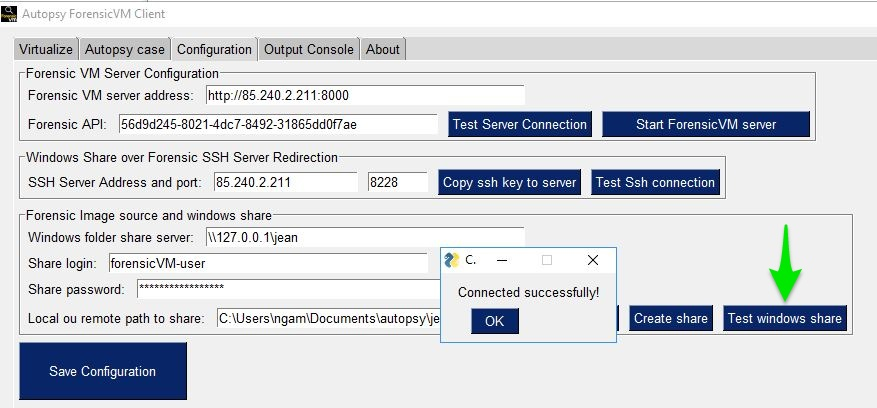

   Testing the forensicVM image Windows share over ssh

.. CAUTION::
   Ensure to use a secure Windows username and password for your share. Although this share is protected over the internet by your SSH private key, on the Windows network, your username and password could be a potential vulnerability. We recommend a dedicated, strong username and password for your share, which can be reused for multiple forensic image shares if necessary.

.. NOTE::
   Please configure your firewall to allow local access to your Windows shares. You can restrict the Windows share to be accessible only by your own computer. If needed, please seek assistance from your system administrator to perform this task.
   
