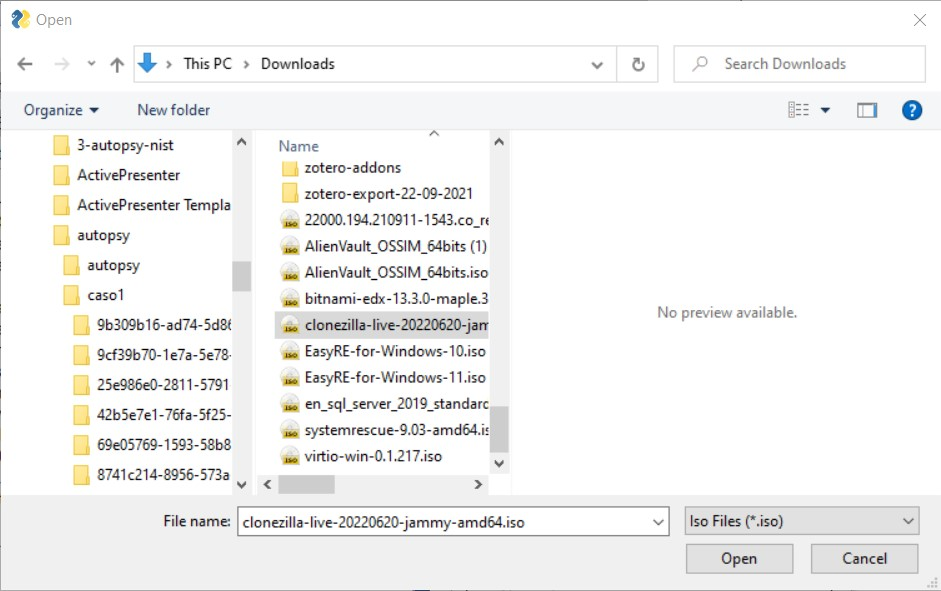

Media Management in ForensicVM: Leveraging ISOs for Enhanced Forensic Investigations
====================================================================================

In forensic investigations, the ability to access and utilize a wide array of specialized tools is of utmost importance. Different cases present unique challenges and often require specific utilities or software to effectively extract, analyze, or visualize evidence. ISO files, serving as encapsulations of entire file systems, are adept at housing a myriad of these specialized tools, thereby ensuring forensic professionals are always equipped with the right utilities.

The management and utilization of ISO files within ForensicVM is precisely tailored to meet the multifaceted demands of modern forensic investigations. Herein, a meticulously crafted procedure allows investigators to seamlessly navigate, upload, select, insert, eject, delete, and even boot from these ISO files. This integration ensures that forensic experts are never bound by just the in-built tools in ForensicVM, offering the flexibility to dynamically introduce and employ auxiliary resources as the situation demands.

From a safety vantage point, employing ISOs within a virtual domain like ForensicVM comes with its set of undeniable perks:

1. **Network Isolation**: Leveraging tools from ISOs eliminates the need for network connectivity. This not only curtails risks associated with internet connectivity but also guarantees that neither evidence nor the operating environment is inadvertently compromised owing to network-centric threats or malware.

2. **Protective Shield**: Operating tools within ForensicVM's virtual periphery ensures the host system and its network remain insulated from looming threats. Any potentially malignant operations remain confined to the virtual environment, thereby preserving the sanctity of the primary forensic setup.

3. **Evidence Preservation**: Operating in a controlled ambit significantly reduces risks associated with evidence contamination or inadvertent alterations. The sacrosanct nature of evidence remains unchallenged, a pivotal aspect for its admissibility in legal arenas.

ForensicVM's adeptness at ISO management not only broadens the forensic toolkit available to investigators but also accentuates the safety, security, and integrity quotient of the investigative process. This section unravels the nuances of these operations, offering insights into harnessing the full might of ISOs in your forensic pursuits.

In the realm of digital forensics, every tool and capability at an investigator's disposal can be the difference between uncovering critical evidence or hitting a dead end. ISO files, in particular, offer a versatile medium to house a myriad of investigative utilities. With ForensicVM, managing and utilizing these ISO files becomes a straightforward endeavor, optimizing both efficiency and efficacy. Here's an overview of the key operations:

- **Browse and Upload ISO**: Discover how to navigate the interface to select and upload essential ISO files to the ForensicVM environment.

- **Select ISO / Web Select CD-ROM**: Instructions on choosing the right ISO file or CD-ROM from the Autopsy ForensicVM Client Plugin or from the web interface.

- **List Remote ISO Files**: Get an overview of all ISO files stored remotely on the ForensicVM server.

- **Insert ISO / Web Insert CD-ROM**: Learn how to virtually insert an ISO file or CD-ROM for access within the virtualized forensic image,  from the Autopsy ForensicVM Client Plugin or from the web interface.

- **Eject ISO / Web Eject CD-ROM**: Step-by-step guidance on safely ejecting a mounted ISO file or CD-ROM, from the Autopsy ForensicVM Client Plugin or from the web interface.

- **Delete ISO**: Understand how to remove ISO files that are no longer needed, ensuring a clutter-free workspace.

- **Bootable Media**: Dive into the specifics of booting from an ISO or CD-ROM, a critical capability for certain forensic tasks.

Proceed to the relevant subsections for detailed instructions and best practices to make the most of the media management features in ForensicVM.

Browse and Upload ISO
------------------------

**Select the Media Panel and click the "Browse and Upload" Button**

To Upload and ISO to the ForensicVM Server you should previously had to download or prepare the iso file. So locate this file on your disk and:

1) Click on The Media Panel Separator on the Autopsy VM ForensicVM Client Plugin
2) Click the "Browse and Upload" Button

.. figure:: img/upload_iso_0001.jpg
   :alt: Change
   :align: center
   :width: 600

   Change

**Select the ISO file to upload**

Browse your computer and select the ISO file to upload

   Change

**Sucess Message**

The upload can take some time. There is no upload progress for ISO files. Please wait until you see this sucess message:

   Change

.. note:
   
   The Autopsy ForensicVM Client Plugin may become not responsive at this stage. This is normal. Please wait until the upload is finished,

**Verify that the uploaded ISO is in the ISO Magement list**

Your uploaded ISO with your investigation tools is now uploaded to the server and is ready to be used:

.. figure:: img/upload_iso_0004.jpg
   :alt: Change
   :align: center
   :width: 600

   Change

Discover how to navigate the interface to select and upload essential ISO files to the ForensicVM environment.

Select ISO / Web Select CD-ROM
---------------------------------

Instructions on choosing the right ISO file or CD-ROM from the Autopsy ForensicVM Client Plugin or from the web interface.

List Remote ISO Files
------------------------

Get an overview of all ISO files stored remotely on the ForensicVM server.

Insert ISO / Web Insert CD-ROM
--------------------------------

Learn how to virtually insert an ISO file or CD-ROM for access within the virtualized forensic image,  from the Autopsy ForensicVM Client Plugin or from the web interface.

Eject ISO / Web Eject CD-ROM
------------------------------

Step-by-step guidance on safely ejecting a mounted ISO file or CD-ROM, from the Autopsy ForensicVM Client Plugin or from the web interface.

Delete ISO
------------

Understand how to remove ISO files that are no longer needed, ensuring a clutter-free workspace.

Bootable Media
----------------

Dive into the specifics of booting from an ISO or CD-ROM, a critical capability for certain forensic tasks.

