Media Management in ForensicVM: Leveraging ISOs for Enhanced Forensic Investigations
====================================================================================

In forensic investigations, the ability to access and utilize a wide array of specialized tools is of utmost importance. Different cases present unique challenges and often require specific utilities or software to effectively extract, analyze, or visualize evidence. ISO files, serving as encapsulations of entire file systems, are adept at housing a myriad of these specialized tools, thereby ensuring forensic professionals are always equipped with the right utilities.

The management and utilization of ISO files within ForensicVM is precisely tailored to meet the multifaceted demands of modern forensic investigations. Herein, a meticulously crafted procedure allows investigators to seamlessly navigate, upload, select, insert, eject, delete, and even boot from these ISO files. This integration ensures that forensic experts are never bound by just the in-built tools in ForensicVM, offering the flexibility to dynamically introduce and employ auxiliary resources as the situation demands.

From a safety vantage point, employing ISOs within a virtual domain like ForensicVM comes with its set of undeniable perks:

1. **Network Isolation**: Leveraging tools from ISOs eliminates the need for network connectivity. This not only curtails risks associated with internet connectivity but also guarantees that neither evidence nor the operating environment is inadvertently compromised owing to network-centric threats or malware.

2. **Protective Shield**: Operating tools within ForensicVM's virtual periphery ensures the host system and its network remain insulated from looming threats. Any potentially malignant operations remain confined to the virtual environment, thereby preserving the sanctity of the primary forensic setup.

3. **Evidence Preservation**: Operating in a controlled ambit significantly reduces risks associated with evidence contamination or inadvertent alterations. The sacrosanct nature of evidence remains unchallenged, a pivotal aspect for its admissibility in legal arenas.

ForensicVM's adeptness at ISO management not only broadens the forensic toolkit available to investigators but also accentuates the safety, security, and integrity quotient of the investigative process. This section unravels the nuances of these operations, offering insights into harnessing the full might of ISOs in your forensic pursuits.

In the realm of digital forensics, every tool and capability at an investigator's disposal can be the difference between uncovering critical evidence or hitting a dead end. ISO files, in particular, offer a versatile medium to house a myriad of investigative utilities. With ForensicVM, managing and utilizing these ISO files becomes a straightforward endeavor, optimizing both efficiency and efficacy. Here's an overview of the key operations:

- **Browse and Upload ISO**: Discover how to navigate the interface to select and upload essential ISO files to the ForensicVM environment.

- **Select ISO / Web Select CD-ROM**: Instructions on choosing the right ISO file or CD-ROM from the Autopsy ForensicVM Client Plugin or from the web interface.

- **List Remote ISO Files**: Get an overview of all ISO files stored remotely on the ForensicVM server.

- **Insert ISO / Web Insert CD-ROM**: Learn how to virtually insert an ISO file or CD-ROM for access within the virtualized forensic image,  from the Autopsy ForensicVM Client Plugin or from the web interface.

- **Eject ISO / Web Eject CD-ROM**: Step-by-step guidance on safely ejecting a mounted ISO file or CD-ROM, from the Autopsy ForensicVM Client Plugin or from the web interface.

- **Delete ISO**: Understand how to remove ISO files that are no longer needed, ensuring a clutter-free workspace.

- **Bootable Media**: Dive into the specifics of booting from an ISO or CD-ROM, a critical capability for certain forensic tasks.

Proceed to the relevant subsections for detailed instructions and best practices to make the most of the media management features in ForensicVM.

Uploading an ISO to the ForensicVM Server
-----------------------------------------

When conducting a forensic investigation, specialized tools are often required to aid in the extraction or analysis of data. Many of these tools are conveniently bundled into ISO files. With ForensicVM, you can seamlessly upload these ISO files, making them readily accessible for your investigation tasks. Here's a step-by-step guide to doing so:

**Step 1: Access the Media Panel**

- Navigate to the Autopsy VM and locate the ForensicVM Client Plugin.
- Click on the Media Panel Separator.

**Step 2: Initiate the ISO Upload**

- Click the "Browse and Upload" button.

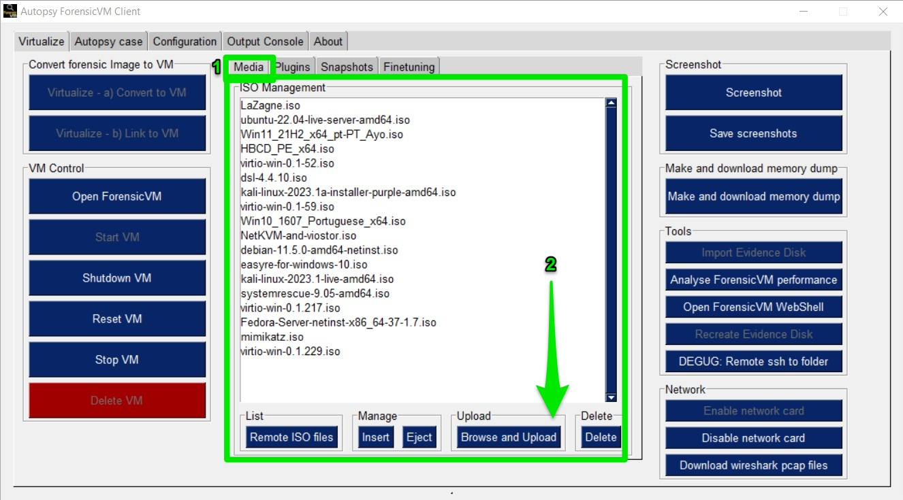

   Browse and Upload

**Step 3: Locate and Select the ISO File**

- Browse your computer's directories and select the desired ISO file to upload.

.. figure:: img/upload_iso_0002.jpg
   :alt: Locate and Select the ISO File
   :align: center
   :width: 600

   Locate and Select the ISO File

**Step 4: Upload Confirmation**

The upload process might take some time, depending on the size of the ISO file. There's no progress bar available currently, so please be patient and wait for a confirmation message to appear, indicating a successful upload.

.. figure:: img/upload_iso_0003.jpg
   :alt: Upload Confirmation
   :align: center
   :width: 200

   Upload Confirmation

.. note::
   
   During the upload process, the Autopsy ForensicVM Client Plugin might become unresponsive. This is expected behavior. Please wait patiently until the upload completes.

**Step 5: Verify the Uploaded ISO**

Once uploaded, you should be able to see the ISO file listed in the ISO Management section of the ForensicVM server. This ensures your tools are now ready to be utilized in your ongoing investigation.

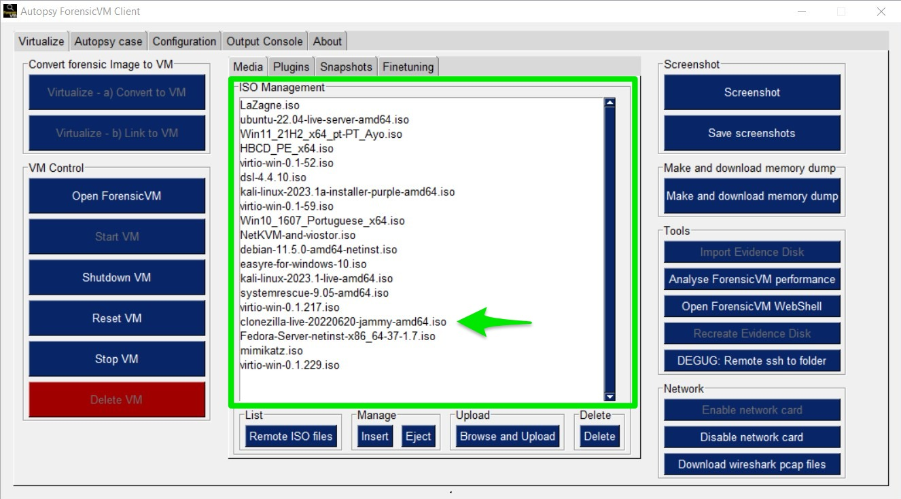

   Verifying the Uploaded ISO

List Remote ISO Files
----------------------

When investigating digital evidence, it's crucial to maintain a catalog of tools and resources available for the task. ForensicVM facilitates this by allowing users to store ISO files remotely on its server. This section outlines the procedures to access and view this list of remotely stored ISO files.

There are two primary methods to view these files:

Using the Autopsy ForensicVM Client Plugin
*******************************************

**Step 1: Access the Media Panel**

- Navigate to the Autopsy VM.
- Click on the **Media Panel Tab**.

**Step 2: View Remote ISO Files**

- Once in the media panel, click on the **Remote ISO Files** button.

**Step 3: Review Available ISO Files**

- The ISO file list will update.
- Browse through the list to review available tools and resources.
- If you find any tools missing or outdated, consider downloading or creating the necessary ISO files, and then upload them to the ForensicVM Server.

.. figure:: img/list_remote_iso_0001.jpg
   :alt: Viewing Remote ISO Files using Autopsy ForensicVM Client Plugin
   :align: center
   :width: 600

   Viewing Remote ISO Files using Autopsy ForensicVM Client Plugin

Method 1: Using the Web Interface
**********************************

**Step 1: Access the Tool Panel**

- On the main screen, click on the **Control Bar** icon to reveal the tool panel.

**Step 2: Open the Media Control Modal Box**

- Within the tool panel, locate and click the **Eject** icon. This action will open the Media Control Modal Box.

**Step 3: View ISO Dropdown**

- Click on the **ISO Dropdown**.
- This dropdown will display a list of all ISO files stored on the ForensicVM server, which can be utilized as virtual CD-ROMs.

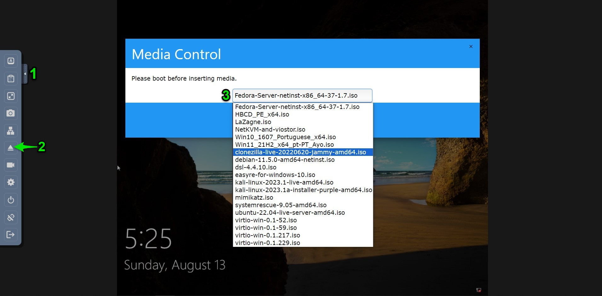

   Viewing Remote ISO Files using the Web Interface

Insert ISO / Web Insert CD-ROM
--------------------------------

Being able to virtually insert an ISO file or CD-ROM into the virtualized forensic image is pivotal during a digital investigation. Different tools and utilities can be loaded on the fly without compromising the integrity of the original image. This flexibility speeds up the forensic workflow and allows investigators to adapt to different scenarios quickly. The following sections guide you on how to accomplish this task using either the Autopsy ForensicVM Client Plugin or the web interface.

Using the Autopsy ForensicVM Client Plugin
********************************************

**Step 1: Access the Media Panel**

- Launch the Autopsy VM.
- Within the interface, click on the **Media Panel Tab**.

**Step 2: Select the Desired ISO File**

- In the media panel, browse through the ISO files.
- Click on the desired ISO file that you wish to insert.

**Step 3: Insert the ISO File**

- Locate and click the **Insert** button. This action will mount the selected ISO file as a virtual CD-ROM within the ForensicVM environment.
- Upon successful insertion, a success popup will appear, confirming the action.

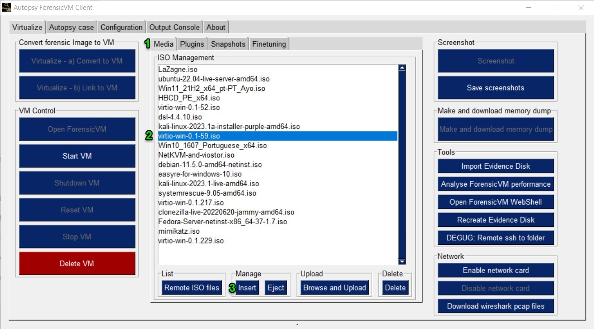

   Inserting ISO using the Autopsy ForensicVM Client Plugin

Using the Web Interface
*************************

**Step 1: Access the Tool Panel**

- From the main screen, identify and click on the **Control Bar** icon. This will reveal the tool panel.

**Step 2: Navigate to the Media Control Modal Box**

- Inside the tool panel, find and click on the **Eject** icon. Activating this icon will present the Media Control Modal Box.

**Step 3: Select from the ISO Dropdown**

- Within the Modal Box, locate and click the **ISO Dropdown**.
- This dropdown will display all ISO files saved on the ForensicVM server.
- Scroll and click on the desired ISO file or virtual CD-ROM you wish to insert.

**Step 4: Confirm the Insertion**

- After selecting the desired ISO, click the **Insert Media** button.
- This action mounts the chosen ISO as a virtual CD-ROM.
- A success notification will appear, signaling that the insertion was successful.

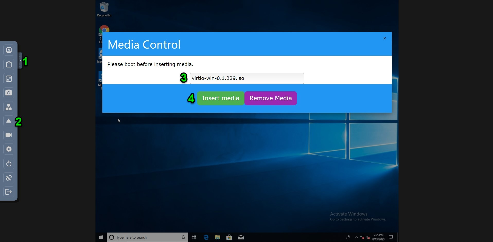

   Inserting ISO using the Web Interface

Run programs and utilities from ISO
-------------------------------------

After successfully uploading and inserting an ISO into the virtualized forensic environment, the next step is to leverage the tools within. This section will guide you through accessing and utilizing the programs and utilities contained in the ISO.

**Step 1: Locate the Virtual CD-ROM Drive**

- Once you've inserted the ISO as a virtual CD-ROM, navigate to your operating system's file explorer or equivalent.
- Locate the virtual CD-ROM drive which should appear similar to a physical CD-ROM drive.
- Open the drive to view its contents.

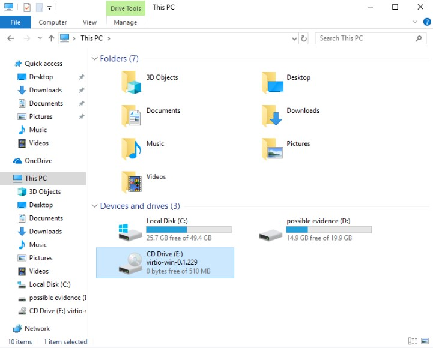

   Locating the Virtual CD-ROM Drive

**Step 2: Identify and Launch the Desired Tool**

- Inside the virtual CD-ROM content, sift through the directories and files to locate the specific program or tool you intend to run.
- Once found, initiate the program or utility. Depending on the nature of the tool, you might have to run it as an administrator or follow specific launch procedures.

.. figure:: img/run_iso_0002.jpg
   :alt: Launching Tools from the ISO
   :align: center
   :width: 600

   Launching Tools from the ISO

**Step 3: Adhere to the Program's Instructions**

- Each forensic tool or utility will have its set of instructions, either embedded within its interface or provided as a separate README file.
- Follow these instructions meticulously to ensure accurate and efficient processing.
- Should your investigation involve extracting or marking potential evidence, utilize the "Possible Evidence" virtual drive. This virtual drive is specially designed within ForensicVM to store and segregate potential pieces of evidence without contaminating the original data.

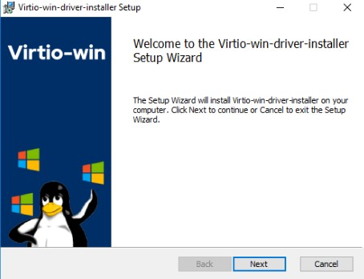

   Using the Program within ForensicVM

Bootable Media
---------------

There are instances during a forensic investigation where analysts may need to interact directly with the operating system or leverage specific tools that necessitate booting into a virtual machine (VM). ForensicVM's virtual CD-ROM drive has a unique characteristic: it can only accept CD-ROM insertions when the VM is running.

The booting process of a CD-ROM involves the following steps:

1. Boot into the operating system or access the BIOS/UEFI screen.
2. Insert the virtual CD-ROM into the drive.
3. Perform a reboot or reset operation.
4. Access the BIOS or UEFI by pressing the "ESC" key.
5. Navigate to the boot device selection menu and confirm your choice.

Method 1: Boot from Virtual CD-ROM Post-OS Bootup (BIOS showcase)
*****************************************************************

**Step 1: Boot into the Operating System**

- Initiate a boot sequence and load the operating system.

.. tip::
   
   While the example showcases a user login, you don't necessarily need to log in. Simply booting into the operating system is sufficient.

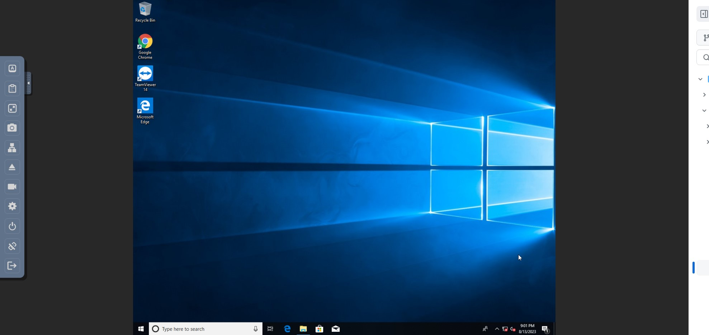

   Operating System Boot Screen

**Step 2: Insert the Virtual Bootable CD-ROM**

- Adhere to the previous guidelines to insert the virtual media into the CD-ROM drive.

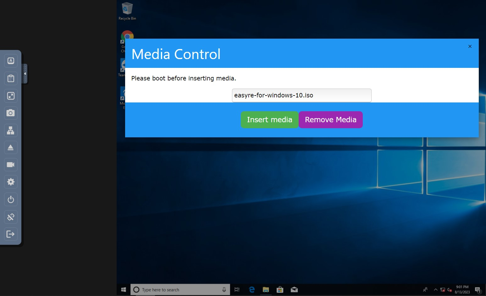

   Inserting Virtual Media

**Step 3: Initiate a System Restart**

- Command the operating system to restart and wait for the BIOS boot screen to emerge.

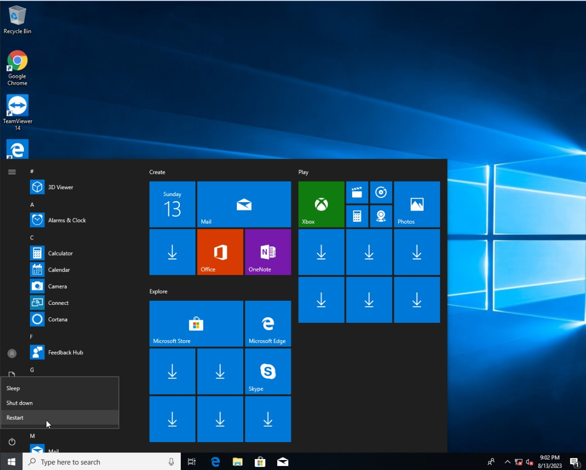

   System Restart

**Step 4: Access Boot Options with "ESC"**

- As the system initializes, press the "ESC" key within a 15-second window to access the boot options.

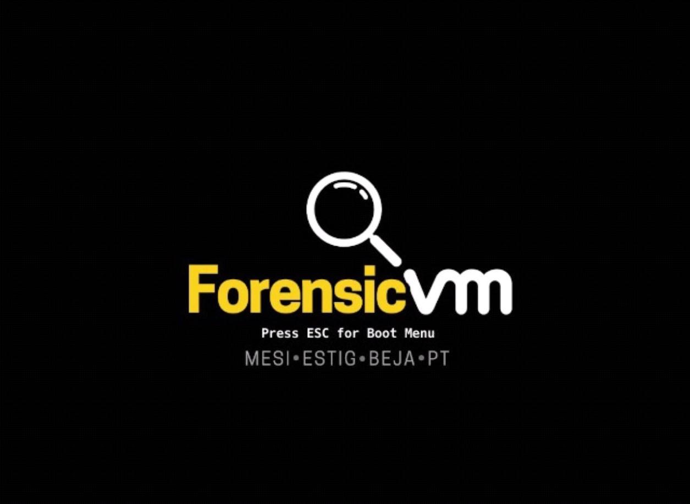

   Boot Options Screen

**Step 5: Opt for the Virtual CD-ROM Drive**

- From the available boot options, select the corresponding number for the virtual CD-ROM or DVD-ROM drive. For instance, in the example given, you'd press "4".

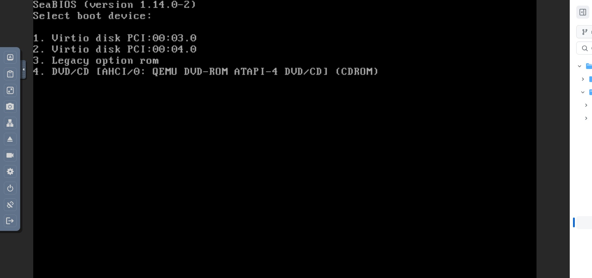

   Selecting Virtual CD-ROM

**Step 6: Boot into the ISO**

- If the operations proceed without hitches, the virtual media will boot. Depending on the media's nature, it might present a selection menu or lead straight to its primary function.

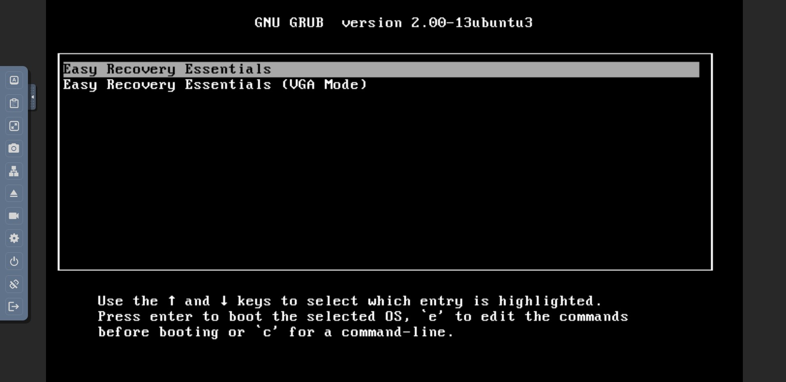

   Booting into ISO

**Step 7: Operate the Booted Tools**

- With the ISO booted, you can now access and employ the forensic tools contained therein, tailoring your investigative approach based on the utilities available.

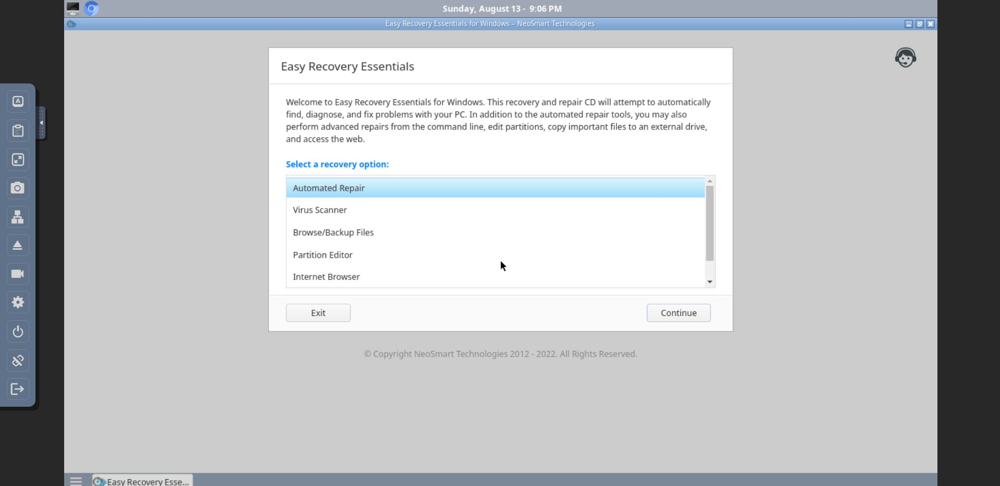

   Accessing Tools from Booted ISO

Method 2: Boot from Virtual CD-ROM at Boot Time (Showcasing UEFI)
******************************************************************

**Step 1: Access the UEFI Boot Options**

- Power on the ForensicVM.
- Rapidly access the web interface and press the "ESC" key to intercept the boot sequence.

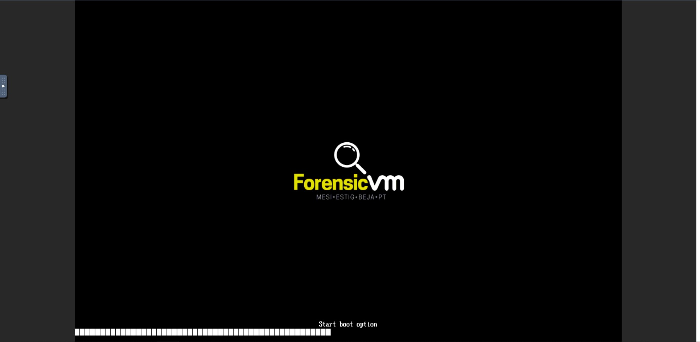

   Accessing UEFI Boot Options

**Step 2: Insert the Bootable ISO into Virtual CD-ROM**

- Load your desired bootable ISO into the virtual CD-ROM. Refer to the previously provided steps if needed.

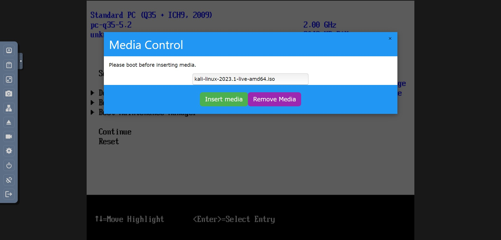

   Inserting Bootable ISO

**Step 3: Acknowledge the Successful Insertion Notification**

- The web console screen should display a "Insert media sent" message, confirming the ISO's successful insertion into the drive.

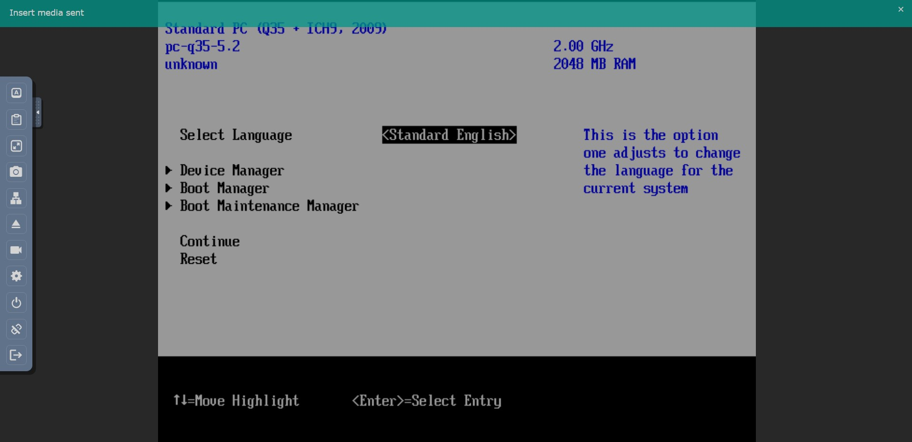

   Successful Insertion Notification

**Step 4: Command a Reset of ForensicVM**

- Trigger a system reset by clicking the "Reset" button. The ForensicVM will undergo a reboot process.

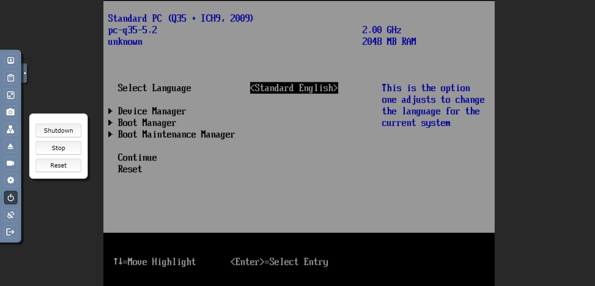

   Resetting ForensicVM

**Step 5: Navigate to UEFI Menu**

- Upon reboot, press the "ESC" key once more. This will usher you into the UEFI menu.

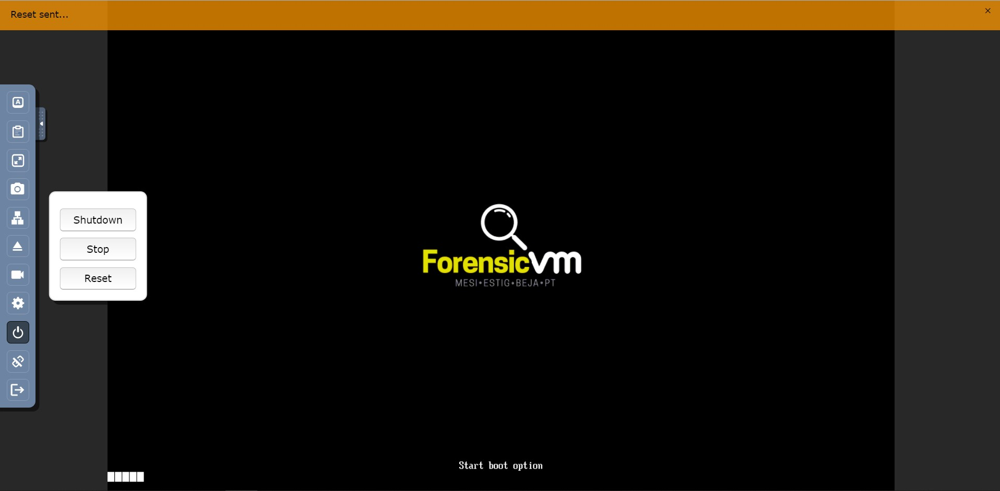

   Accessing UEFI Menu

**Step 6: Opt for "Boot Manager"**

- In the UEFI menu, navigate to the "Boot Manager" using arrow keys and confirm your selection with the <ENTER> key.

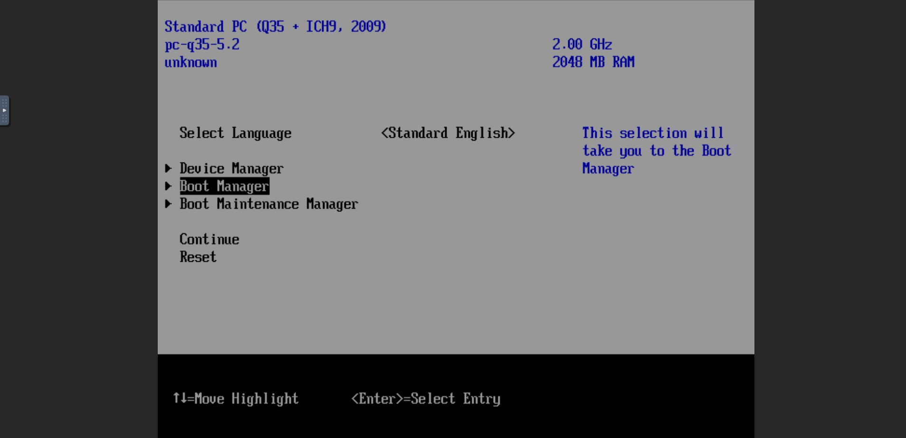

   Selecting Boot Manager

**Step 7: Choose "UEFI QEMU DVD-ROM"**

- From the available options, locate and select "UEFI QEMU DVD-ROM". Use the arrow keys for navigation and confirm with <ENTER>.

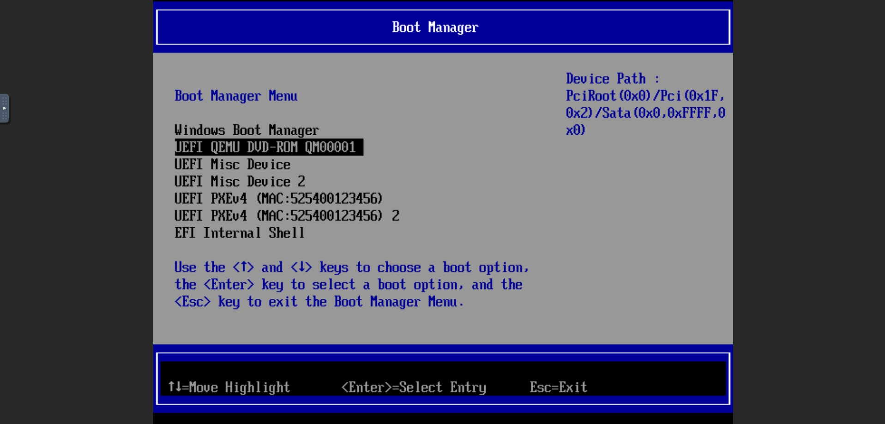

   UEFI QEMU DVD-ROM Option

**Step 8: Await the Virtual CD-ROM Boot Sequence**

- If a selection menu is presented, choose the appropriate option. If not, patiently wait as the ForensicVM initializes the ISO media.

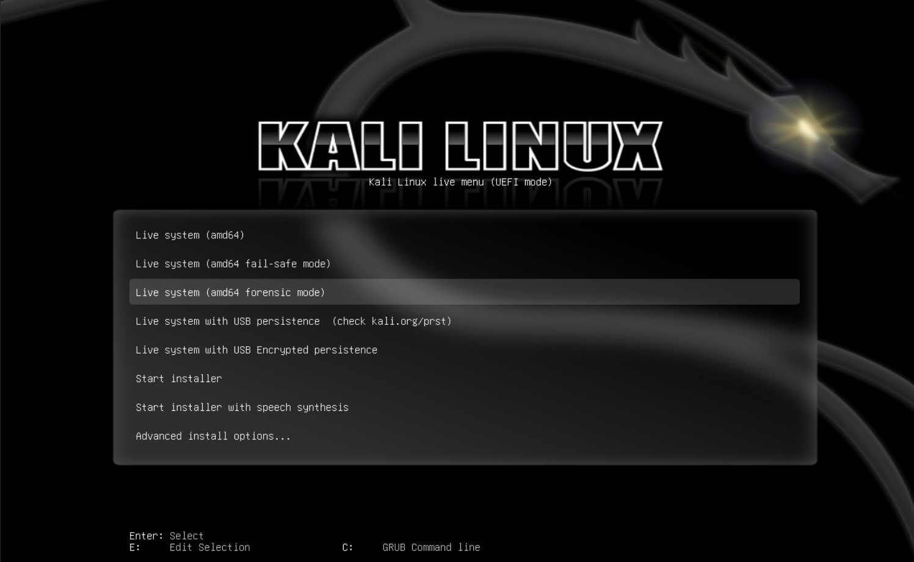

   Virtual CD-ROM Booting

**Step 9: Access and Execute Forensic Tools**

- Once booted, you can now select and run your preferred forensic tools. This example demonstrates utilizing forensic tools from Kali Linux.

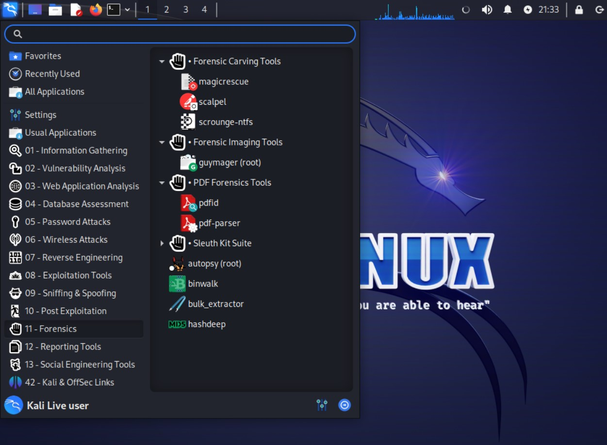

   Kali Linux Forensic Tools

Eject ISO / Web Eject CD-ROM
------------------------------

There are two methods to eject an ISO from the virtual CD-ROM drive:

1. Using the Autopsy ForensicVM Client Plugin interface.
2. Using the web screen interface.

Below are detailed steps for each method:

Method 1: Eject using the Autopsy ForensicVM Client Plugin Interface
*********************************************************************

**Step 1: Activate the "Eject" Function**

- Click on the "Eject" button. A confirmation will appear, indicating that the media has been successfully ejected.

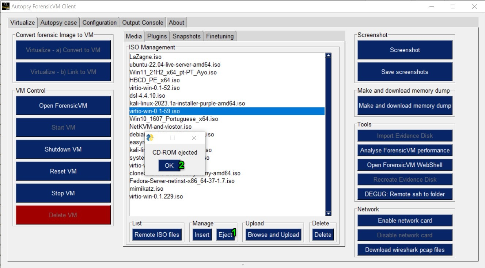

   Ejecting via Autopsy ForensicVM Client Plugin

Method 2: Eject using the Web Screen Interface
************************************************

**Step 1: Access the Web Toolbar**

- Click on the open bar icon. This action will expand the web toolbar for further options.

**Step 2: Initiate the Eject Process**

- Click on the "Eject" icon (depicted with a "2" in the reference image). This will bring up the Media Control Modal Panel.

**Step 3: Finalize the Ejection**

- Click the "Remove Media" button (marked as "3" in the reference image). The media will subsequently be disengaged from the virtual CD-ROM drive.

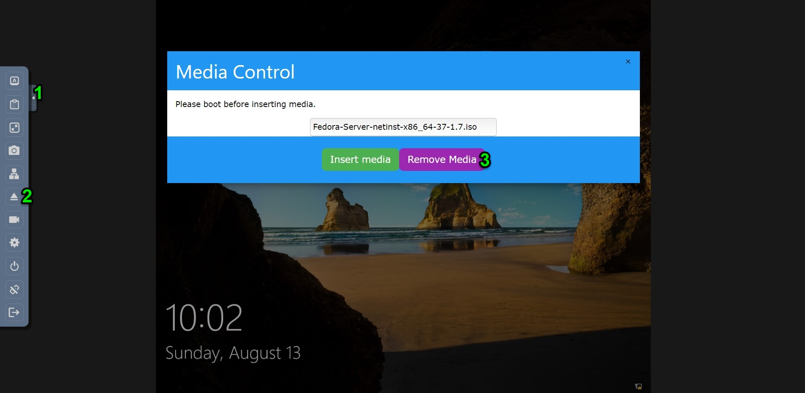

   Ejecting via Web Screen Interface

**Delete ISO Using the Autopsy ForensicVM Client Plugin Interface**
---------------------------------------------------------------------

To delete an ISO file, follow the steps below:

**Step 1:** Navigate to the Media Panel within the Autopsy ForensicVM Client Plugin interface.

**Step 2:** Identify and select the ISO file you wish to delete.

**Step 3:** Click on the "Delete" button associated with the desired ISO file.

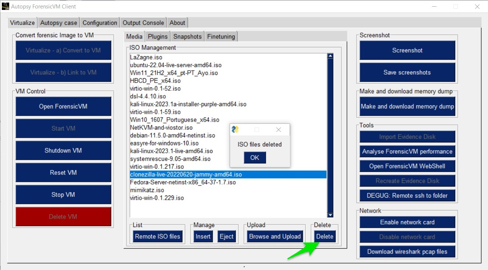

   Deleting an ISO Media

.. warning::

   Deleting an ISO file through this method does not prompt any confirmation dialog. Proceed with caution. It's assumed that users have the original ISO file stored elsewhere (e.g., on their local computer) and can re-upload it if necessary.
