Making, Downloading, and Analyzing a Memory Dump (memory_dump_vm)
=================================================================

Making and download a Memory Dump
*********************************
Making a memory dump refers to the process of capturing the content of a computer's memory (RAM) at a specific moment in time. This snapshot can include various elements, ranging from currently running processes to user credentials and even the contents of open files. The practice is critical for several reasons:

Security Analysis
-----------------
In the realm of cybersecurity, memory dumps have become an essential tool. Here's how they contribute:

- **Uncovering Malware Behavior**: Memory dumps allow security professionals to see what is happening inside the system's memory, including hidden or obfuscated malware activities. By analyzing these dumps, one can reveal the behavior of malicious code, tracking its origin, and how it interacts with the system.
- **Detecting Hidden Processes**: Sophisticated malware often hides from standard detection methods. Memory analysis helps in uncovering these hidden processes, providing a more transparent view of unauthorized activities.
- **Injected Code Analysis**: Attackers may inject malicious code into legitimate processes to conceal their actions. A memory dump helps in identifying these code injections, leading to better understanding and mitigation of such threats.
- **User Credential Analysis**: Sometimes, credentials might be stored in memory. A memory dump could reveal these details, helping in understanding potential security breaches or vulnerabilities.

Forensic Analysis
-----------------
Digital forensic analysts often use memory dumps to investigate suspicious or malicious activities:

- **Timeline Analysis**: Memory dumps can provide a chronological view of the activities that transpired on the device, aiding in reconstructing events leading up to an incident.
- **Data Recovery**: Even if data is deleted or encrypted, remnants might still exist in the system's memory. Analyzing memory dumps may allow the recovery of this vital information.
- **Artifact Analysis**: Various artifacts related to user activities, system interactions, and file usage can be extracted and analyzed from memory dumps, painting a comprehensive picture of user behavior.

Legal Evidence
--------------
In the context of legal proceedings, memory dumps might provide crucial evidence:

- **Computer Usage**: Evidence regarding the usage of specific applications or accessing specific files or websites can be derived from a memory dump.
- **Unauthorized Access**: In cases of hacking or unauthorized access, memory dumps may hold evidence of the intrusion, including the tools used and the data targeted.
- **Intellectual Property Theft**: If there is a suspicion of intellectual property theft, memory dumps can reveal whether sensitive documents were accessed, modified, or transferred.

**Follow the steps below to make and download a memory dump:**

1) Press the "Make and Download Memory Dump" Button
---------------------------------------------------
Press the button labeled "Make and Download Memory Dump" to initiate the process.

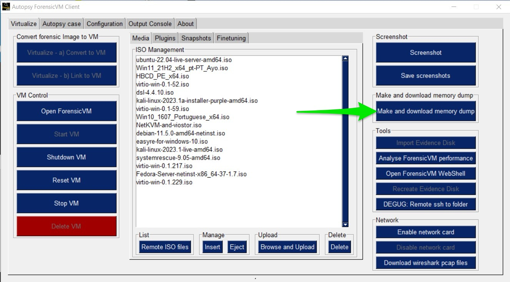

   Press "Make and Download Memory Dump" button

2) Save the Memory Dump on the Default ForensicVM Image Case Path
-----------------------------------------------------------------
Choose the default forensicVM image case path to save the memory dump.

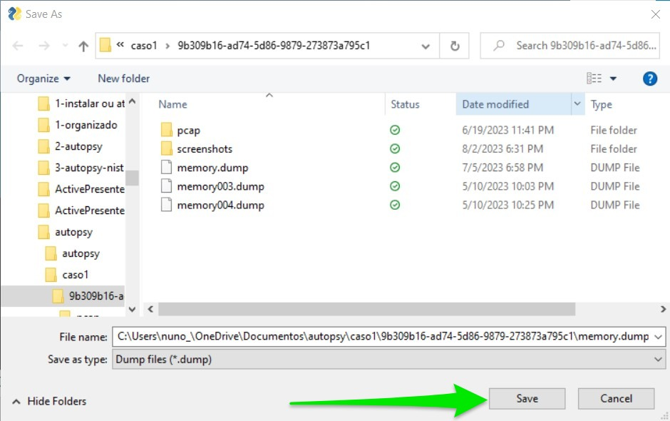

   Save the memory dump

3) Monitor Memory Download Progress with Time Estimation
-------------------------------------------------------
Keep track of the download progress, including an estimated time remaining for the download to complete.

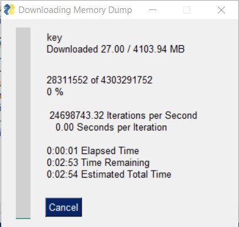

   Memory Download progress

4) Success Message Stating that the Memory was Saved as "memory.dump"
--------------------------------------------------------------------
A success message will appear, stating that the memory was saved as "memory.dump." The explorer will automatically open afterward.

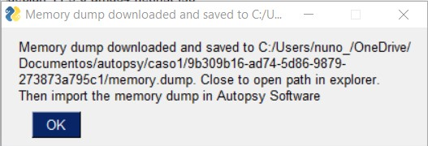

   Success message

5) Windows Explorer Open on the Memory Dump Folder
--------------------------------------------------
The Windows explorer will open automatically, displaying the folder containing the memory dump.

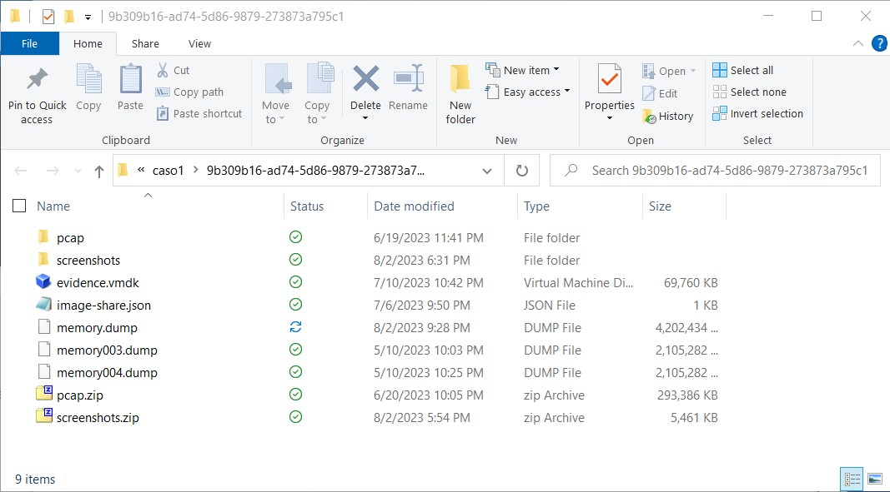

   Windows explorer open on the memory dump folder

Importing and Analyzing a Memory Dump in Autopsy
************************************************
Analyzing a memory dump can provide critical insights into the state of a system at a particular point in time. Memory dumps may contain valuable information that helps investigators understand what processes were running, what files were open, and even what keys were being pressed.

Autopsy enables an investigator to examine memory dumps by following a series of steps to import and analyze the data. Here's an expanded walkthrough:

**1. Locate the Memory Dump File**
Begin by identifying the file you wish to analyze. This could be a file that you have obtained from a machine you are investigating. Make sure to have the file accessible and note its location on your system.

**2. Prepare Autopsy for Importing the Memory Dump**
Launch Autopsy and create a new case or open an existing one where you want the memory dump to be analyzed. The case structure in Autopsy helps in organizing different data sources and findings related to an investigation.

**3. Add the Memory Dump as a Data Source**
Inside your case, look for an option to add a new data source. This is usually achieved by clicking on the "Add Data Source" button. You'll be guided through a series of prompts to configure the import.

**4. Choose the Host and Data Source Type**
You'll need to select a host, which typically refers to the system from which the memory dump was obtained. Then, choose "Memory Image File (Volatility)" as the Data Source Type, a common format for memory dumps.

**5. Navigate to the Memory Dump File**
Click the "Browse" button and use the file dialog to locate the memory dump file on your system. You may need to paste the exact path if you have copied it earlier.

**6. Configure the Analysis Settings**
This involves setting the timezone, memory profile (which should correspond to the OS of the dumped system), and selecting or deselecting specific plugins. Plugins in Autopsy extend its functionality and can be used to run specific analyses on the data.

**7. Ingest the Memory Dump**
After confirming your settings, Autopsy will begin the process of ingesting the memory dump. This might take a significant amount of time, depending on the size of the dump and the capabilities of your system.

**8. Review the Results and Check for Errors**
Upon completion, review the log to check for any errors or warnings. This is a vital step to ensure that the data was imported correctly and that all selected analyses were performed successfully.

**9. Analyze the Memory Dump**
Finally, you can start analyzing the memory dump. Autopsy provides various tools and views to help you explore the data. You can browse through processes, network connections, registry keys, and more. Look for anomalies or signs of malicious activity.

**10. Tag and Document Findings**
As you proceed with your analysis, make sure to tag any interesting findings. Autopsy provides features to annotate and comment on your discoveries, making it easier to reference them later or include them in your final report.

1) Copy the Path of the Memory Dump from Windows Explorer
--------------------------------------------------------
Start by locating the memory dump file on your system. Open Windows Explorer, navigate to the directory containing the memory dump, right-click on the path, and select "Copy" This action will copy the path's location to your clipboard, allowing you to easily paste it later in the Autopsy software.

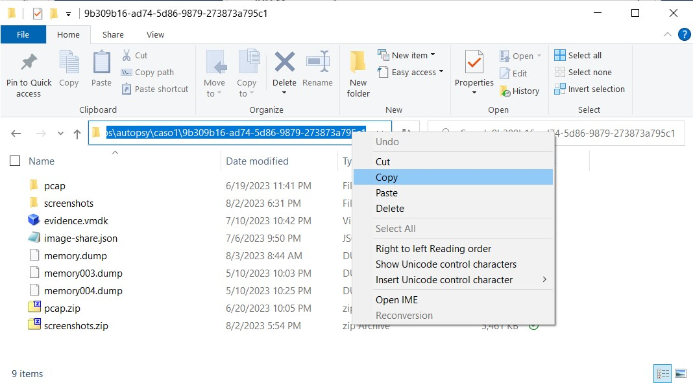

   Copy the path of the memory dump

2) Press the "Add Data Source" Button on the Autopsy Software
-------------------------------------------------------------
Open Autopsy and initiate the process of adding a new data source by pressing the "Add Data Source" button. This button typically resides in the main toolbar.

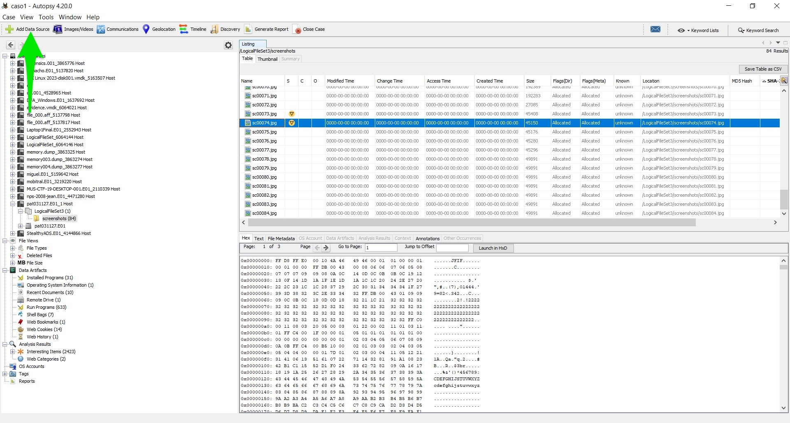

   Press "Add Data Source"

3) Select the Host to Where the Memory Dump Should be Made and Press Next
-------------------------------------------------------------------------
You will be prompted to select a host, which is the computer or device where the memory dump will be analyzed. Choose the appropriate host from the list provided, and then press "Next" to continue.

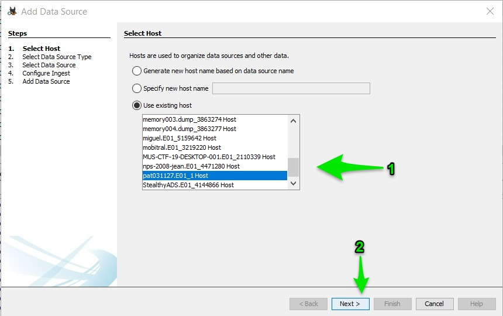

   Select the host

4) Select as Data Source Type the "Memory Image File (Volatility)" and Press Next
--------------------------------------------------------------------------------
In this step, you will specify the type of data you are importing. Select "Memory Image File (Volatility)" from the list of data source types, as this is the appropriate option for memory dumps. Once selected, click "Next."

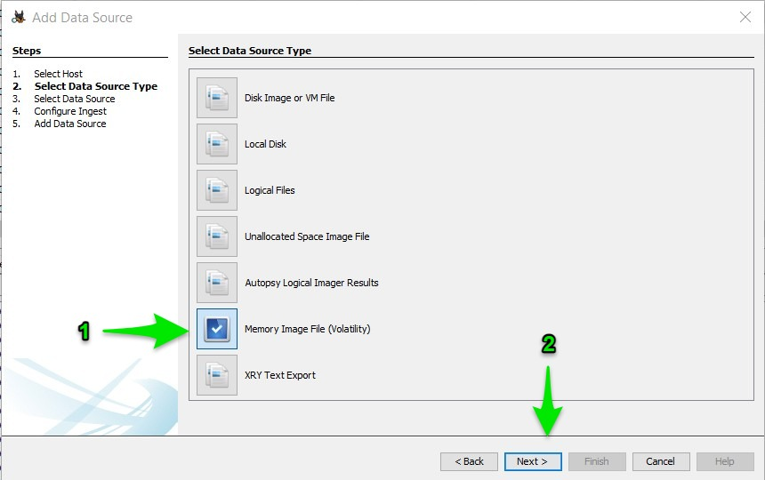

   Select Memory Image File (Volatility)

5) Click the "Browse" Button to Select the Path Where the Memory Dump Is
------------------------------------------------------------------------
A file browser window will appear. Click the "Browse" button, navigate to the location where the memory dump is stored, and select the file. If you copied the path earlier, you could paste it into the file path field to quickly locate the file.

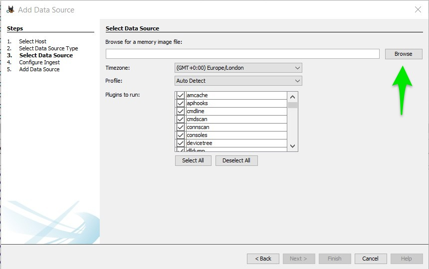

   Click "Browse" button

6) Paste the "memory.dump" Path, Select the memory.dump File, and Press Open
--------------------------------------------------------------------------
Once you have located the "memory.dump" file, select it by clicking on it, then press the "Open" button to confirm your selection.

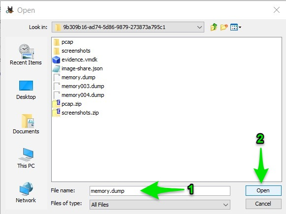

   Paste and select the memory.dump file

7) Configure Timezone, Memory Profile, and Plugins to Run. Press Next
----------------------------------------------------------------------
You will now be asked to configure several settings specific to your analysis. Set the appropriate timezone to match the original system's time setting. Choose the correct memory profile, which should match the operating system of the analyzed machine. Optionally, select any plugins you want to run during the analysis. Click "Next" to proceed.

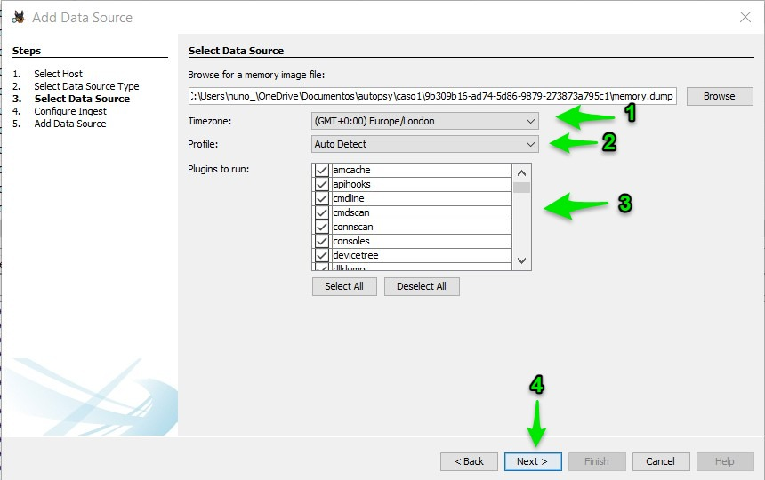

   Configure settings

8) Deselect All Plugins and Press Next
--------------------------------------
Deselect all plugins in this step. Then, press "Next."

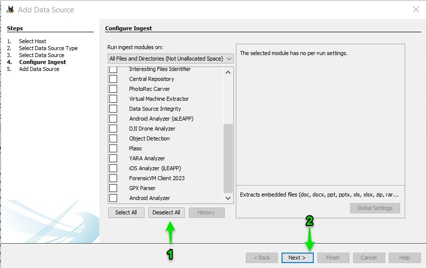

   Deselect plugins

9) Wait Until the Memory Ingest Module is Finished
--------------------------------------------------
This step may take some time, as Autopsy processes the memory dump. Depending on the size of the file and your computer's capabilities, this could take several minutes or even hours. A progress bar or other indicator may be available to monitor the process. Please be patient.

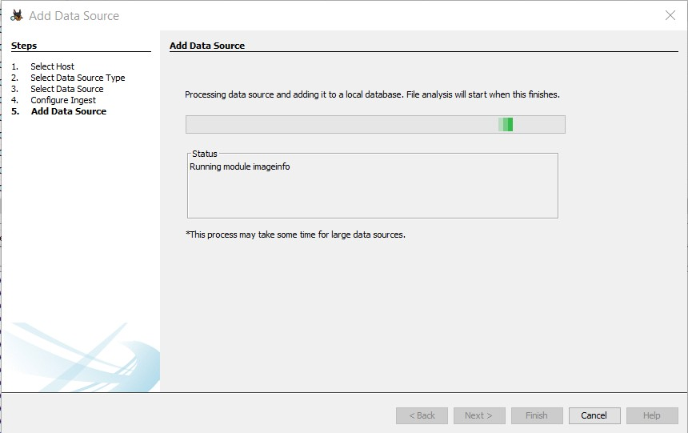

   Ingesting memory

10) Check for Errors and Press "Finish"
--------------------------------------
Upon completion, a dialog will appear, summarizing the process and any issues encountered. Press the "View Log" button to inspect any errors or warnings in detail. Finally, press the "Finish" button to conclude the process and close the dialog.

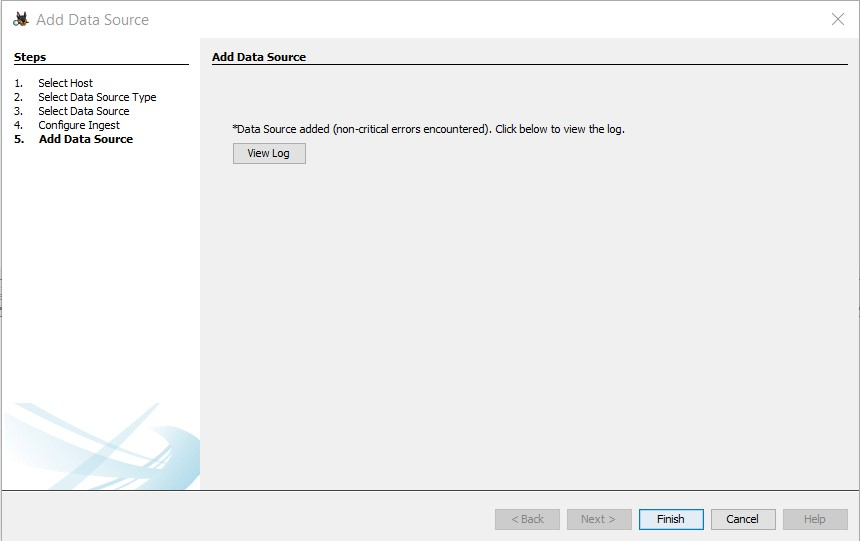

   Press "Finish"

11) Locate the Memory Dump on the Interface and Browse the Results
-------------------------------------------------------------------
With the import process complete, you can now find the imported memory dump within Autopsy's interface. Browse through the results, and use Autopsy's various tools to examine the data. Remember to tag any findings that may be of interest, as these can be critical to your investigation.

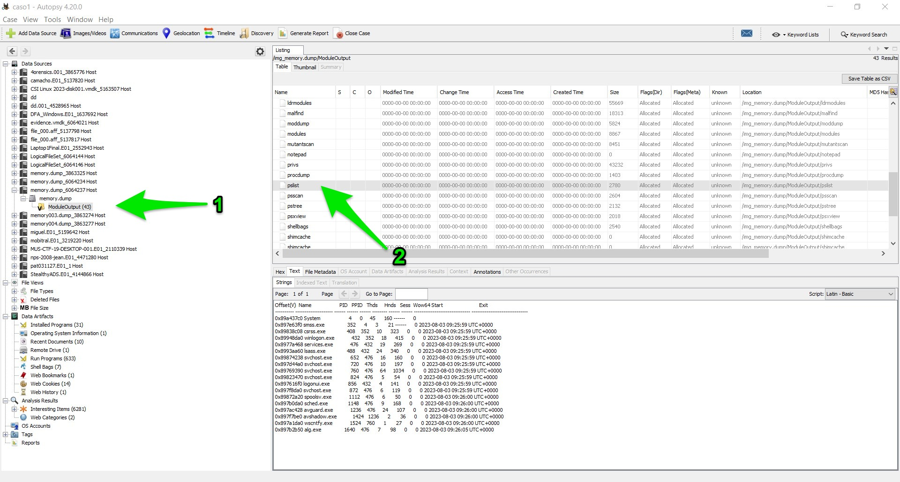

   Locate and browse the memory dump

Aditional Tools to analyse memory dumps
****************************************
Analyzing memory dumps is a vital task in computer forensics, malware analysis, and system diagnostics. Several tools have been developed to support this task. Here's an overview of some widely-used tools other than Autopsy for memory dump analysis:

1. **Volatility**: `Volatility <https://www.volatilityfoundation.org/>`_ is an open-source memory forensics framework. `Documentation <https://github.com/volatilityfoundation/volatility/wiki>`_.

2. **Rekall**: `Rekall <https://github.com/google/rekall>`_ offers a set of features for memory forensics. `Documentation <http://www.rekall-forensic.com/documentation-1/rekall-documentation>`_.

3. **WinDbg**: Microsoft's `WinDbg <https://docs.microsoft.com/en-us/windows-hardware/drivers/debugger/debugger-download-tools>`_ for debugging Windows applications and analyzing memory dumps.

4. **Magnet RAM Capture**: `Magnet RAM Capture <https://www.magnetforensics.com/resources/magnet-ram-capture>`_ is a free tool for capturing physical RAM.

5. **FTK Imager**: AccessData's `FTK Imager <https://www.exterro.com/ftk-imager>`_ for capturing and analyzing memory dumps.

6. **MoonSols DumpIt**: `MoonSols DumpIt <https://web.archive.org/web/20160112114857/http://www.moonsols.com/wp-content/uploads/downloads/2011/07/DumpIt.zip>`_ for creating memory dumps from Windows systems.

7. **Redline**: Provided by FireEye, `Redline <https://fireeye.market/apps?query=memory>`_ offers advanced memory and file analysis capabilities.

8. **MemGator**: A lightweight tool for memory acquisition (information might be found in various forensics forums or specialized sites).

9. **GRR (Google Rapid Response)**: `GRR <https://github.com/google/grr>`_ an incident response framework that includes memory analysis capabilities. `Documentation <https://grr-doc.readthedocs.io/en/latest/>`_.

10. **Belkasoft Evidence Center**: `Belkasoft Evidence Center <https://belkasoft.com/x>`_ includes the ability to analyze computer memory.

11. **X-Ways Forensics**: `X-Ways Forensics <https://www.x-ways.net/forensics/index-m.html>`_ a commercial product with strong memory analysis features.

These tools offer a wide range of capabilities, from capturing memory images to detailed analysis. Depending on the specific requirements of the analysis, an investigator might choose one or several of these tools.

