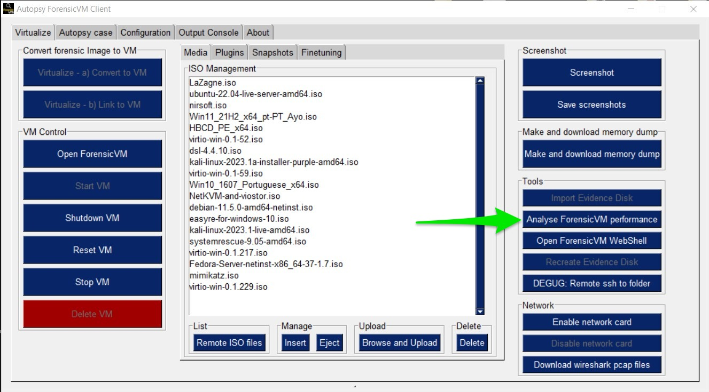
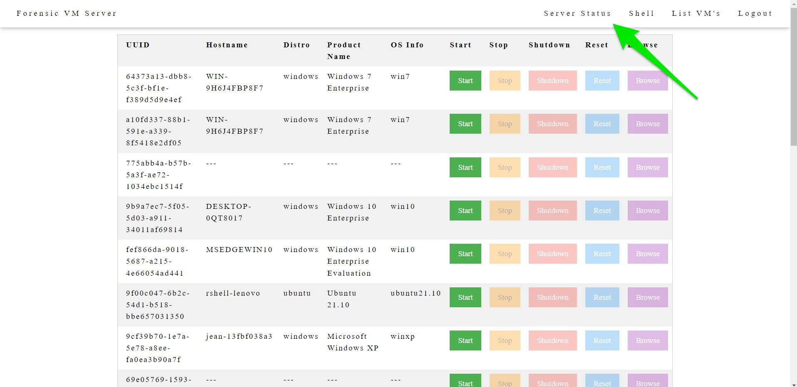
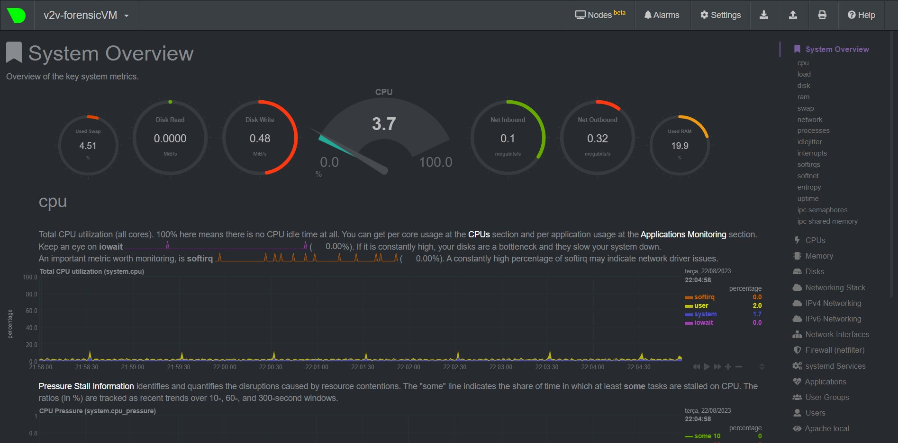

Netdata on ForensicVM Server
============================

Introduction
------------

Netdata is a tool that helps watch over servers and apps in real-time. With ForensicVM Server, Netdata shows how the server is doing and makes sure everything runs smoothly.

Key Points
----------

- **Real-time Look**: Netdata updates every second, helping catch issues fast.

- **Sees Everything**: It checks everything - like how the CPU is used, memory use, disk activity, and how the network is doing.

- **Alerts**: Get warnings if something goes beyond normal levels.

- **Easy-to-Read Charts**: A simple dashboard shows all the info in clear charts.

How to Start with Netdata on ForensicVM Server
----------------------------------------------

**Installation**:

Netdata is already installed on ForensicVM Server.

**How to Use the Netdata Dashboard**:

You can open it from the Autopsy ForensicVM Client Plugin:

   Opening Netdata through Autopsy

Or, use the ForensicVM main web page:

   Opening Netdata from the main page

How Netdata Helps with ForensicVM Server
----------------------------------------

Example of what you see:

   Netdata Dashboard view

- **CPU**: See how much CPU is being used. If it's too much, maybe add more resources.

- **Memory**: Make sure there's enough RAM for all the tasks.

- **Disk Activity**: Make sure the disk isn’t too busy. If it is, tasks might slow down.

- **Network**: Keep an eye on data coming in and out, especially with big files.

- **Alerts**: Set warnings for important things, like if RAM use is very high.

Making Netdata Work for You
---------------------------

- **Set Your Alarms**: Set warnings for things that matter to you.

- **Your Dashboard**: Make a dashboard that shows what's important for your tasks.

- **Connect with Other Tools**: Netdata can send alerts to places like Slack, Twilio, or email.

Netdata is a great helper for those using ForensicVM Server. It watches over things and makes sure all is good. For admins, it's a must-have tool.

.. note::

   To learn more about Netdata, visit the [Netdata website](https://learn.netdata.cloud/).
