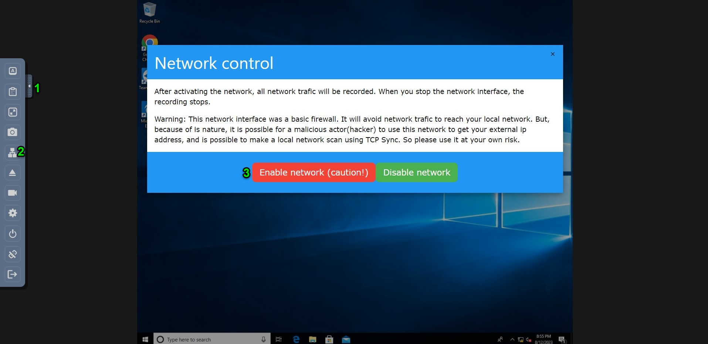

Managing the Network Card to Capture and Analyse Network Traffic
=================================================================

By default, the forensicVM initiates with its network card disabled. This design choice is deliberate, to minimize the potential risks of activating a network card on a possibly compromised virtual forensic machine. Activating such a network card could jeopardize not only your individual computer but the broader network environment.

For many forensic investigations, an active network connection is unnecessary. When evidence is solely contained within a local device, it's recommended to keep the network card deactivated. This approach ensures the machine's safe operation and the security of your enterprise network or domain.

However, in certain situations, there may be a need to activate the network card. For instance, when the forensic virtual machine is deemed safe and requires an internet connection to retrieve cloud-based data—data sourced from cached cloud access credentials like those from OneDrive, Google Drive, Nextcloud, OwnCloud, etc. In such cases, the forensicVM's network card can be enabled. This card has an 
inbuilt firewall designed to block access to identified local networks while permitting internet connections. Additionally, every time the network card is toggled on or off, all inbound and outbound traffic is recorded. This leads to the creation of a Wireshark pcap file for each activation and deactivation event.

.. danger::

   It's paramount to treat the activation of the network card as a method of last    resort. Alternatively, consider using a remotely hosted forensicVM server. The integrity of the firewall isn't foolproof, meaning there's always a risk that malicious software might infiltrate your network. Furthermore, a compromised machine could ping back to an attacker, potentially revealing your external IP address and inadvertently notifying a malicious actor that they are under active investigation!

Enable the Network Card
------------------------

To activate the network card on the forensicVM, there are two methods available. The first method involves using the Autopsy ForensicVM client plugin interface, and the second requires directly interacting with the web screen interface through the network icon.

Enable network card using the Autopsy ForensicVM Client Plugin Interface
**************************************************************************

**Activate Network Card Button**

1. Start the forensicVM machine.
2. Navigate to the Network Panel within the interface.
3. Look for the "Enable network card" button and click on it.

   Enabling the network card through the Autopsy ForensicVM Client interface

**Confirmation of Network Card Activation**

After clicking the button, a popup window will appear to confirm the successful 
activation of the network card.

   Confirmation popup for network card activation

Enable Network Using the Web Screen Interface
************************************************

Activating the network card can also be achieved via the Web Screen Interface. This method allows users to manage network settings without diving into the main software interface. Here's how to enable the network card using the Web Screen Interface:

**Activating Network through Web Screen Interface Steps**

1. Initiate the **Panel Opener (1)** to reveal the available options.
2. Locate and click on the **network icon (2)** to access network settings.
3. Identify and click the red button labeled **Enable network (caution) (3)** to activate the network card.

   Steps to activate the network through the Web Screen Interface 

**Acknowledgement of Successful Activation**

Once the network card is activated, an orange notification will pop up at the top of the screen. This message serves to confirm that the network card has been successfully activated.

   Notification confirming successful activation of the network card 

Reseting the Operating System Network Card
*******************************************

From time to time, due to various reasons such as IP conflicts, connectivity issues, or configuration errors, it might be necessary to reset the network card. Resetting can re-establish a proper connection and can often solve common networking problems. Below are methods to reset the network card in Windows and Linux.

**Windows 10**

In Windows 10, the Network Troubleshooter can assist in diagnosing and resolving common network-related problems.

1. Navigate to the system tray located in the bottom right corner of your screen.
2. Right-click the network icon.
3. From the context menu, select the "Troubleshoot problems" option. The Network Troubleshooter will now start, and it will attempt to diagnose and resolve any detected issues.

.. figure:: img/network_0005.jpg
   :alt: Example of network troubleshoot in Windows 10
   :align: center

   Using the Network Troubleshooter in Windows 10

**Other Windows Versions**

In older versions of Windows, the process might slightly differ. Usually, there's a network troubleshooting tool available but its location or name may vary. Check under "Network and Sharing Center" or within Control Panel for related options.

**Linux**

In Linux, depending on the distribution and the desktop environment, you can manage the network card through the graphical interface. However, for a more universal method:

1. Open a terminal.
2. To disable the network card (assuming it's named `eth0`), type: 
   
   .. code-block:: bash

      sudo ifconfig eth0 down

3. To enable it again, type:

   .. code-block:: bash

      sudo ifconfig eth0 up

.. danger::

   Always proceed with caution when enabling the network, especially on systems that are meant for forensic investigations or are potentially compromised. It's vital to ensure systems and network security and to be aware of the risks involved.

