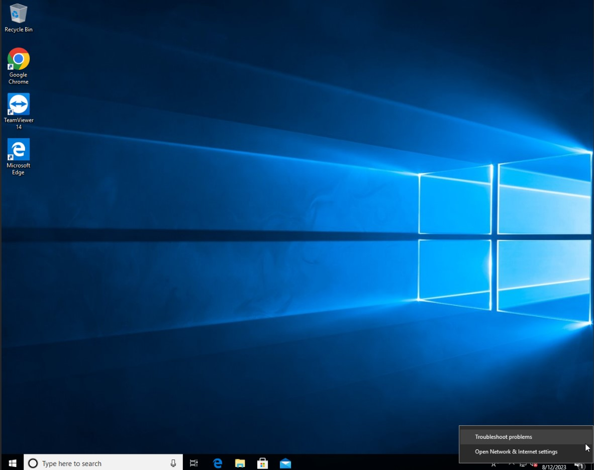

Managing the Network Card to Capture and Analyse Network Traffic
=================================================================

By default, the forensicVM initiates with its network card disabled. This design choice is deliberate, to minimize the potential risks of activating a network card on a possibly compromised virtual forensic machine. Activating such a network card could jeopardize not only your individual computer but the broader network environment.

For many forensic investigations, an active network connection is unnecessary. When evidence is solely contained within a local device, it's recommended to keep the network card deactivated. This approach ensures the machine's safe operation and the security of your enterprise network or domain.

However, in certain situations, there may be a need to activate the network card. For instance, when the forensic virtual machine is deemed safe and requires an internet connection to retrieve cloud-based data—data sourced from cached cloud access credentials like those from OneDrive, Google Drive, Nextcloud, OwnCloud, etc. In such cases, the forensicVM's network card can be enabled. This card has an 
inbuilt firewall designed to block access to identified local networks while permitting internet connections. Additionally, every time the network card is toggled on or off, all inbound and outbound traffic is recorded. This leads to the creation of a Wireshark pcap file for each activation and deactivation event.

.. danger::

   It's paramount to treat the activation of the network card as a method of last    resort. Alternatively, consider using a remotely hosted forensicVM server. The integrity of the firewall isn't foolproof, meaning there's always a risk that malicious software might infiltrate your network. Furthermore, a compromised machine could ping back to an attacker, potentially revealing your external IP address and inadvertently notifying a malicious actor that they are under active investigation!

Enable the Network Card
------------------------

To activate the network card on the forensicVM, there are two methods available. The first method involves using the Autopsy ForensicVM client plugin interface, and the second requires directly interacting with the web screen interface through the network icon.

Enable network card using the Autopsy ForensicVM Client Plugin Interface
**************************************************************************

**Activate Network Card Button**

1. Start the forensicVM machine.
2. Navigate to the Network Panel within the interface.
3. Look for the "Enable network card" button and click on it.

.. figure:: img/network_0001.jpg
   :alt: Enabling the network card through the Autopsy ForensicVM Client interface
   :align: center

   Enabling the network card through the Autopsy ForensicVM Client interface

**Confirmation of Network Card Activation**

After clicking the button, a popup window will appear to confirm the successful 
activation of the network card.

.. figure:: img/network_0002.jpg
   :alt: Confirmation popup for network card activation
   :align: center

   Confirmation popup for network card activation

Enable Network Using the Web Screen Interface
************************************************

Activating the network card can also be achieved via the Web Screen Interface. This method allows users to manage network settings without diving into the main software interface. Here's how to enable the network card using the Web Screen Interface:

**Activating Network through Web Screen Interface Steps**

1. Initiate the **Panel Opener (1)** to reveal the available options.
2. Locate and click on the **network icon (2)** to access network settings.
3. Identify and click the red button labeled **Enable network (caution) (3)** to activate the network card.

.. figure:: img/network_0003.jpg
   :alt: Network Using the Web Screen Interface 
   :align: center

   Steps to activate the network through the Web Screen Interface 

**Acknowledgement of Successful Activation**

Once the network card is activated, an orange notification will pop up at the top of the screen. This message serves to confirm that the network card has been successfully activated.

.. figure:: img/network_0004.jpg
   :alt: Notification of Success
   :align: center

   Notification confirming successful activation of the network card 

Reseting the Operating System Network Card
*******************************************

From time to time, due to various reasons such as IP conflicts, connectivity issues, or configuration errors, it might be necessary to reset the network card. Resetting can re-establish a proper connection and can often solve common networking problems. Below are methods to reset the network card in Windows and Linux.

**Windows 10**

In Windows 10, the Network Troubleshooter can assist in diagnosing and resolving common network-related problems.

1. Navigate to the system tray located in the bottom right corner of your screen.
2. Right-click the network icon.
3. From the context menu, select the "Troubleshoot problems" option. The Network Troubleshooter will now start, and it will attempt to diagnose and resolve any detected issues.

   Using the Network Troubleshooter in Windows 10

**Other Windows Versions**

In older versions of Windows, the process might slightly differ. Usually, there's a network troubleshooting tool available but its location or name may vary. Check under "Network and Sharing Center" or within Control Panel for related options.

**Linux**

In Linux, depending on the distribution and the desktop environment, you can manage the network card through the graphical interface. However, for a more universal method:

1. Open a terminal.
2. To disable the network card (assuming it's named `eth0`), type: 
   
   .. code-block:: bash

      sudo ifconfig eth0 down

3. To enable it again, type:

   .. code-block:: bash

      sudo ifconfig eth0 up

.. danger::

   Always proceed with caution when enabling the network, especially on systems that are meant for forensic investigations or are potentially compromised. It's vital to ensure systems and network security and to be aware of the risks involved.

Collect Network Evidence
-------------------------

Enabling the network card is often crucial for forensic investigations, especially when collecting evidence from cloud services. This is particularly relevant when users have not logged out from a service or when session cookies remain in the browser. Such scenarios allow forensic investigators to trace digital breadcrumbs and gather additional evidence that may be inaccessible from offline forensic images. Below are two illustrative examples:

**Gathering Data from Cloud Services - OneDrive Example**

The following figure demonstrates data extraction from OneDrive, a popular online cloud service.

    Interact with the network and collect cloud evidence from OneDrive

**Gathering Data from Cloud Services - Online Storage Example**

In this next example, an online file storage platform is accessed using cached credentials:

   
    Accessing and extracting data from an online storage using cached credentials

Disable the Network Card
-------------------------

There are two primary methods to deactivate the network card on the forensicVM:

1. Using the Autopsy ForensicVM client plugin interface.
2. Directly interacting with the web screen interface.

Disable Network Card with the Autopsy ForensicVM Client Plugin Interface
**************************************************************************

**Steps to Deactivate Network Card**:

#. Ensure that the forensicVM machine is running.
#. Within the interface, go to the Network Panel.
#. Click on the "Disable network card" button.

    Disabling the network card through the Autopsy ForensicVM Client interface

Using the Web Screen Interface to Disable the Network Card
************************************************************

The Web Screen Interface offers an alternative approach for users who prefer to manage network settings without engaging with the main software interface.

**Steps to Disable Network**:

#. Activate the **Panel Opener (1)** to view more options.
#. Click on the **network icon (2)**.
#. Press the green **Disable network (3)** button to turn off the network card.

   Process to disable the network card using the Web Screen Interface

Download Wireshark pcap Files
------------------------------

**Downloading pcap Files**

To obtain the Wireshark pcap files, follow the instructions below:

1. Click the "Download Wireshark pcap files" button located on the Autopsy ForensicVM client plugin interface.

   .. figure:: img/network_0010.jpg
      :alt: Downloading pcap files
      :align: center

      Downloading pcap files

2. A Windows Explorer window will prompt you to select a save location for the `pcap.zip` file. It's recommended to maintain the default save path, which is typically set to the image case folder.

   .. figure:: img/network_0011.jpg
      :alt: Saving pcap.zip file path
      :align: center

      Saving pcap.zip file path

3. The download progress will be displayed, indicating the time required to complete the download. This duration can vary depending on the size of the `pcap.zip` file.

   .. figure:: img/network_0012.jpg
      :alt: Download progress
      :align: center

      Download progress

4. Once the download is completed, a confirmation pop-up will appear, indicating the successful download and save location.

   .. figure:: img/network_0013.jpg
      :alt: Network pcap downloaded and saved
      :align: center

      Network pcap downloaded and saved

5. The Windows Explorer will automatically open to the default save location of `pcap.zip`.

   .. figure:: img/network_0014.jpg
      :alt: Default pcap.zip path in explorer
      :align: center

      Default pcap.zip path in explorer

6. To decompress the `pcap.zip` file, you can use a program like 7-zip. The extraction can take some time, especially if the pcap files are large.

   .. figure:: img/network_0015.jpg
      :alt: Extracting pcap.zip file using 7-zip
      :align: center

      Extracting pcap.zip file using 7-zip

   .. figure:: img/network_0016.jpg
      :alt: Extraction progress
      :align: center

      Extraction progress

Analyze network traffic in Wireshark
--------------------------------------

Analyzing network traffic is an integral part of digital forensic investigations, especially when attempting to reconstruct a sequence of events or identify malicious activities. Using a tool like Wireshark to analyze traffic from a forensic image virtual machine can provide investigators with a wealth of information. However, this approach comes with its advantages and potential pitfalls.

**Importance of Analyzing Traffic in Forensic Investigations**

1. **Evidence Collection**: Analyzing traffic can reveal communication with suspicious IP addresses, hinting at potential data exfiltration or command-and-control servers.
2. **User Behavior**: Network traffic can provide clues about user behavior, including sites visited, files downloaded, or apps used.
3. **Timestamps**: Traffic analysis can help in reconstructing timelines of events, crucial for correlating actions across different evidence sources.
4. **Detect Malware**: Unusual network traffic patterns can be indicative of malware communication.

**Advantages**

1. **Comprehensive Data View**: Wireshark offers a detailed view of packets, allowing forensic investigators to delve deep into the network interactions.
2. **Filtering and Searching**: With its advanced filtering options, investigators can isolate relevant data quickly.
3. **Decoding Protocols**: Wireshark can decode a vast array of protocols, aiding in understanding the specifics of network conversations.
4. **Visualization**: Graphical features like flow graphs help in visualizing communication patterns.

**Dangers**

1. **Data Overload**: The volume of data in pcap files can be overwhelming, and without proper focus, important details might be missed.
2. **Privacy Concerns**: Analyzing traffic can inadvertently capture personal or sensitive information of innocent users.
3. **Tampered Data**: If the forensic image virtual machine is compromised, the network data might be tampered with, leading to incorrect conclusions.
4. **Misinterpretation**: Without proper expertise, normal traffic can be misinterpreted as malicious or vice versa.

.. note::

   While Wireshark is a powerful tool for forensic investigations, it's essential to approach the analysis with a clear understanding of the goals, the data's context, and the potential pitfalls. Proper training and experience can help in maximizing the benefits of traffic analysis while minimizing risks.
   Given the complexity and subtleties involved in network traffic analysis, it's recommended that forensic investigators continuously update their training and remain informed about the latest techniques and threats in the domain.

After extracting the pcap files, the next step is to analyze the network traffic captured during the period the network card was active. Here's how to proceed:

1. Navigate to the extracted pcap directory. If Wireshark isn't installed on your system, visit wireshark.org to download and install it. Once installed, Wireshark-associated icons will appear next to each pcap file.

2. Double-click the pcap file you wish to analyze.

   .. figure:: img/network_0017.jpg
      :alt: Selecting pcap file for analysis
      :align: center

      Selecting pcap file for analysis

3. The Wireshark interface will open, displaying the captured traffic. Adjust the view settings and apply filters as required based on your forensic goals.

   .. figure:: img/network_0018.jpg
      :alt: Wireshark interface displaying captured traffic
      :align: center

       Wireshark interface displaying captured traffic

4. The following is an example of network traffic analysis with a focus on cloud traffic.

   .. figure:: img/network_0019.jpg
      :alt: Example of analyzing cloud traffic in Wireshark
      :align: center

       Example of analyzing cloud traffic in Wireshark

.. note::

   Analyzing pcap files requires a sound understanding of network traffic patterns and potential security threats. It's crucial to interpret the data accurately to avoid misleading conclusions.
