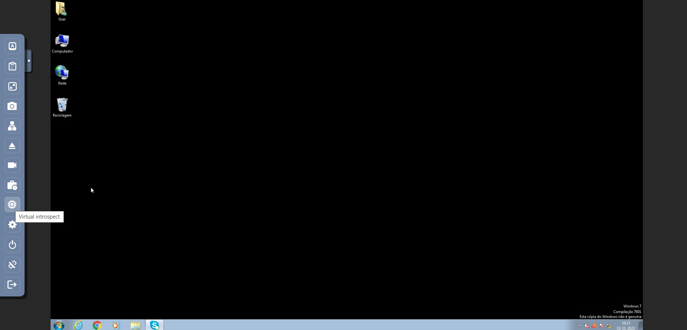
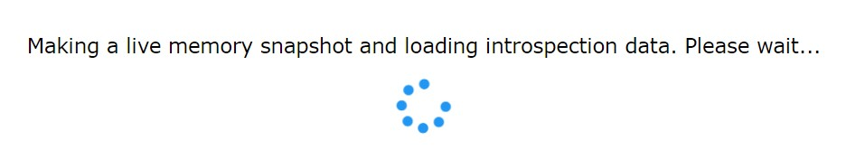
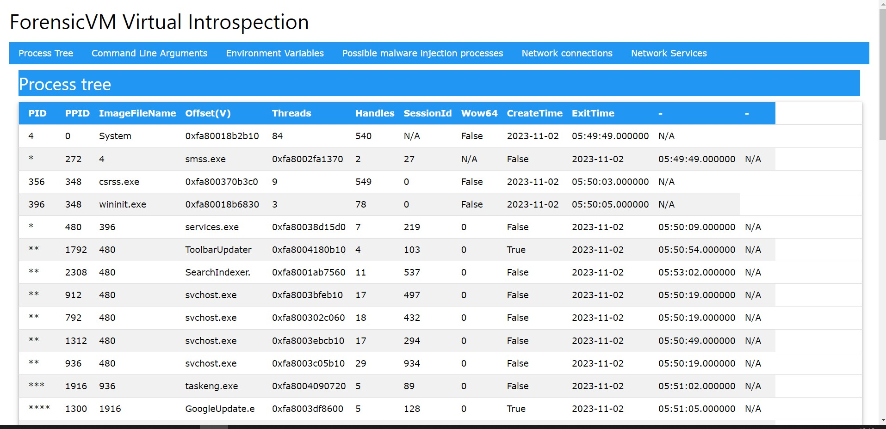
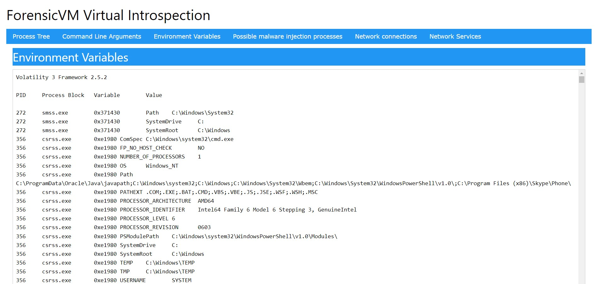
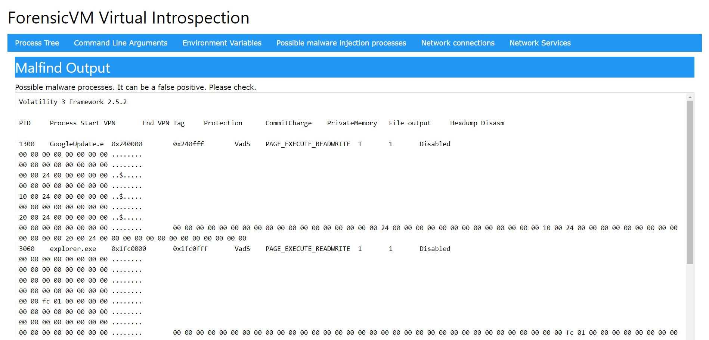
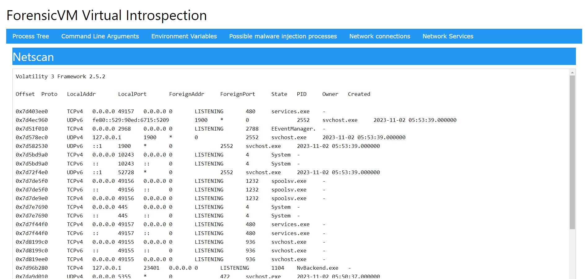
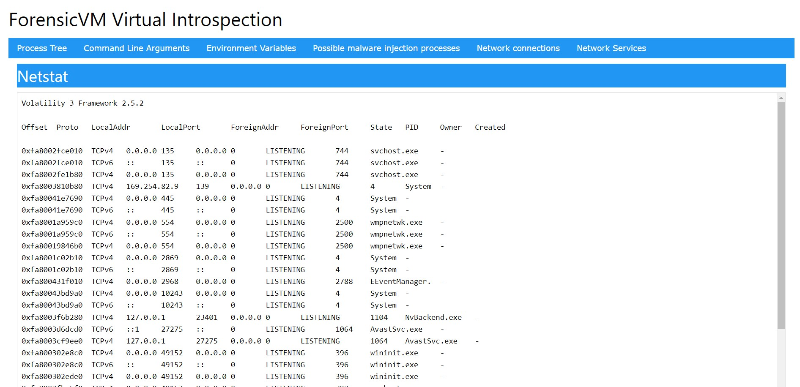
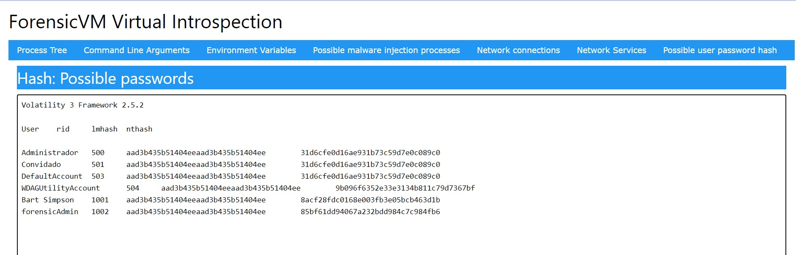
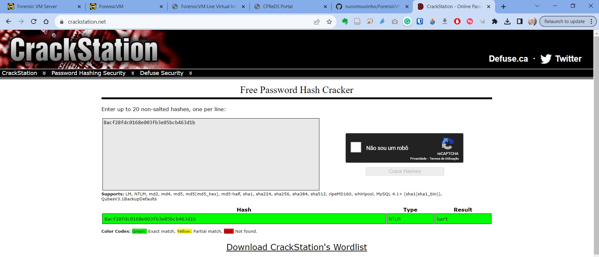

Virtual Introspection
=====================

Virtual introspection, a pioneering feature in ForensicVM, revolutionizes the way forensic analysts, IT professionals, and cybersecurity experts interact with and analyze virtual machines. This tool is indispensable for in-depth digital investigations and cybersecurity assessments, as it provides an exhaustive and unobstructed view into the virtual machine's operating environment. Through virtual introspection, users can meticulously examine real-time processes, command line executions, memory-loaded files, active handles, and the entire system's status, gaining critical insights that are often elusive in traditional analysis.

The power of virtual introspection in ForensicVM is harnessed through the advanced capabilities of QEMU, an esteemed open-source machine emulator and virtualizer. QEMU's sophisticated technology enables the creation of precise memory snapshots of the virtual machine at any given instance. These snapshots encapsulate the VM's exact state at the moment of capture, providing a rich dataset for thorough forensic examination. To analyze these memory snapshots, ForensicVM integrates Volatility 3, a state-of-the-art memory forensics framework known for its robust analytical tools and detailed insights. Volatility 3 processes the captured data, uncovering intricate details about the VM's internal operations and activities.

The integration of virtual introspection in ForensicVM represents a significant leap in virtual machine forensics. It not only simplifies the investigative process but also elevates the depth and quality of the analysis. Whether it's uncovering hidden processes, detecting signs of malware, or exploring system anomalies, virtual introspection equips users with the necessary tools to conduct comprehensive and efficient examinations. This capability is especially crucial in today's digital landscape, where virtual environments are increasingly complex and security threats are constantly evolving.

As the digital world continues to expand and evolve, tools like virtual introspection in ForensicVM become essential for maintaining cybersecurity and understanding the intricacies of virtual systems. Its ability to provide detailed snapshots and in-depth analysis of the Windows operating system makes it an invaluable asset for any professional dealing with digital forensics, cybersecurity, and IT management. By staying ahead with such advanced technologies, ForensicVM ensures that its users are well-equipped to face the challenges of modern digital forensics and cybersecurity.

The current iteration of ForensicVM's virtual introspection is specialized and optimized exclusively for Windows operating systems. This focus is not without its limitations, particularly in its exclusion of Linux operating systems. While the specialized design for Windows ensures that the tool is precisely attuned to the distinct characteristics and complexities of Windows environments, enhancing its effectiveness and accuracy, it does mean that users working with Linux systems are currently unsupported.

**Starting Virtual Introspection:**
To begin virtual introspection, first run the forensicVM until the operating system has fully booted. Then, press the 'Virtual Introspect' button located on the forensicVM web client interface:

.. raw:: latex

   \FloatBarrier

   Screenshot of the Virtual Introspect button in the forensicVM web client

Once you press the button, a progress window will appear. This window will automatically display the results of the introspection process upon completion.

.. raw:: latex

   \FloatBarrier

   Progress window for Virtual Introspection in forensicVM

**Components of ForensicVM Introspection:**
The ForensicVM introspection process comprises seven informative tabs:

1) **Process Tree:** Displays a list of all active processes within the system, providing insight even when the forensicVM is locked on the login screen.

.. raw:: latex

   \FloatBarrier

   Process Tree tab in ForensicVM Introspection

2) **Command Line Arguments:** Shows the commands and arguments that are or were being executed in the system.

.. raw:: latex

   \FloatBarrier

.. figure:: img/vi-0004.jpg
   :alt: Command Line Arguments tab in ForensicVM Introspection
   :align: center
   :width: 500

   Command Line Arguments tab in ForensicVM Introspection

3) **Environment Variables:** Lists the environment variables associated with each running process.

.. raw:: latex

   \FloatBarrier

   Environment Variables tab in ForensicVM Introspection

4) **Possible Malware Injection Processes:** Identifies processes that may have been injected or run with elevated privileges, which could suggest malware activity but also include false positives.

.. raw:: latex

   \FloatBarrier

   Possible Malware Injection Processes tab in ForensicVM Introspection

5) **Netscan Results:** Provides a list of open network connections, which can be indicators of compromise, especially if connections to known malicious sites are detected.

.. raw:: latex

   \FloatBarrier

   Netscan Results tab in ForensicVM Introspection

6) **Netstat:** Shows running network services, with potential signs of compromise if unknown systems are opening ports on the local forensicVM.

.. raw:: latex

   \FloatBarrier

   Netstat tab in ForensicVM Introspection

7) **Possible User Password Hashes:** Displays password hashes found in memory. These hashes can be analyzed further on external platforms like crackstation.com to potentially uncover user passwords.

.. raw:: latex

   \FloatBarrier

   Possible User Password Hashes tab in ForensicVM Introspection

**Example Case:**
An example is provided where the Bart Simpson hash is decoded to reveal the original password, "bart."

.. raw:: latex

   \FloatBarrier

   Example of password hash decoding in ForensicVM

.. raw:: latex

   \FloatBarrier
