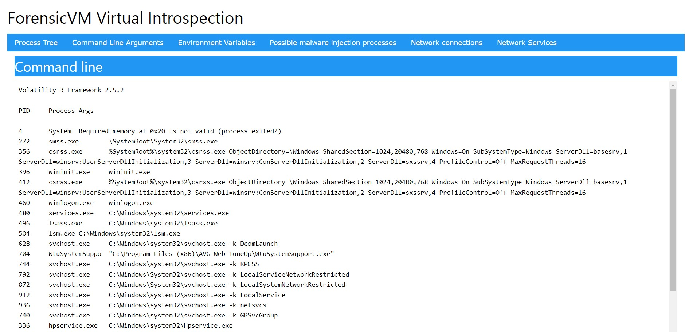

Virtual Introspection
=====================

Virtual introspection enables users to delve into the internal state of a forensicVM. It's a powerful tool for accessing various aspects of the VM's operating state, such as the current processes, the command line being executed, files loaded into memory, active handles, and overall system status.

This functionality is achieved through QEMU's capability to create memory snapshots. These snapshots are then analyzed using Volatility 3, a leading framework for memory analysis.

Currently, virtual introspection is compatible exclusively with Windows operating systems.

**Starting Virtual Introspection:**
To begin virtual introspection, first run the forensicVM until the operating system has fully booted. Then, press the 'Virtual Introspect' button located on the forensicVM web client interface:

.. raw:: latex

   \FloatBarrier

.. figure:: img/vi-0001.jpg
   :alt: Screenshot of the Virtual Introspect button in the forensicVM web client
   :align: center
   :width: 500

   Screenshot of the Virtual Introspect button in the forensicVM web client

Once you press the button, a progress window will appear. This window will automatically display the results of the introspection process upon completion.

.. raw:: latex

   \FloatBarrier

.. figure:: img/vi-0002.jpg
   :alt: Progress window for Virtual Introspection in forensicVM
   :align: center
   :width: 500

   Progress window for Virtual Introspection in forensicVM

**Components of ForensicVM Introspection:**
The ForensicVM introspection process comprises seven informative tabs:

1) **Process Tree:** Displays a list of all active processes within the system, providing insight even when the forensicVM is locked on the login screen.

.. raw:: latex

   \FloatBarrier

.. figure:: img/vi-0003.jpg
   :alt: Process Tree tab in ForensicVM Introspection
   :align: center
   :width: 500

   Process Tree tab in ForensicVM Introspection

2) **Command Line Arguments:** Shows the commands and arguments that are or were being executed in the system.

.. raw:: latex

   \FloatBarrier

   Command Line Arguments tab in ForensicVM Introspection

3) **Environment Variables:** Lists the environment variables associated with each running process.

.. raw:: latex

   \FloatBarrier

.. figure:: img/vi-0005.jpg
   :alt: Environment Variables tab in ForensicVM Introspection
   :align: center
   :width: 500

   Environment Variables tab in ForensicVM Introspection

4) **Possible Malware Injection Processes:** Identifies processes that may have been injected or run with elevated privileges, which could suggest malware activity but also include false positives.

.. raw:: latex

   \FloatBarrier

   Possible Malware Injection Processes tab in ForensicVM Introspection

5) **Netscan Results:** Provides a list of open network connections, which can be indicators of compromise, especially if connections to known malicious sites are detected.

.. raw:: latex

   \FloatBarrier

.. figure:: img/vi-0007.jpg
   :alt: Netscan Results tab in ForensicVM Introspection
   :align: center
   :width: 500

   Netscan Results tab in ForensicVM Introspection

6) **Netstat:** Shows running network services, with potential signs of compromise if unknown systems are opening ports on the local forensicVM.

.. raw:: latex

   \FloatBarrier

.. figure:: img/vi-0008.jpg
   :alt: Netstat tab in ForensicVM Introspection
   :align: center
   :width: 500

   Netstat tab in ForensicVM Introspection

7) **Possible User Password Hashes:** Displays password hashes found in memory. These hashes can be analyzed further on external platforms like crackstation.com to potentially uncover user passwords.

.. raw:: latex

   \FloatBarrier

.. figure:: img/vi-0009.jpg
   :alt: Possible User Password Hashes tab in ForensicVM Introspection
   :align: center
   :width: 500

   Possible User Password Hashes tab in ForensicVM Introspection

**Example Case:**
An example is provided where the Bart Simpson hash is decoded to reveal the original password, "bart."

.. raw:: latex

   \FloatBarrier

.. figure:: img/vi-0010.jpg
   :alt: Example of password hash decoding in ForensicVM
   :align: center
   :width: 500

   Example of password hash decoding in ForensicVM

.. raw:: latex

   \FloatBarrier
